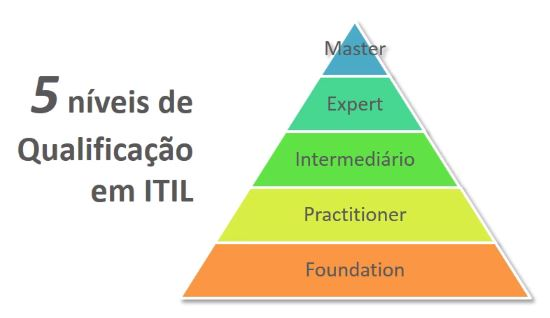

## Objetivos do Curso
+ Definir o que é ITIL, para que ele existe e quais são as **vantagens** que ele oferece;
+ Conhecer **conceitos, terminologias** e **princípios**;
+ Conhecer as **funções** relacionadas ao **ciclo de vida** dos serviços de TI - Central de Serviços, por exemplo;
+ Conhecer os **processos apresentados na ITIL quanto ao ciclo de vida** dos serviços de TI;
+ Conhecer **tecnologias** que podem servir como ferramentas e técnicas para os processos ITIL.

## Conteúdo Programático do Curso
Estudaremos neste curso todos os tópicos do **currículo oficial** ITIL Foundation que além de lhe tornarem um profissional melhor, vão garantir o conhecimento necessário para passar no exame ITIL Foundations. Os conteúdos abordados serão distribuídos como nos 9 módulos abaixo:

## Módulo 1: Apresentação e Introdução à ITIL

No primeiro módulo é apresentada uma visão geral do curso e sua estrutura e também o esquema de certificações ITIL, ou seja, dando ao aluno os subsídios necessários para criar uma trilha nas certificações ITIL. Portanto:

+ Apresentação do curso;
+ Esquema de Certificações ITIL, aqui serão abordadas a relevância, as dificuldades e as características gerais das certificações;
Introdução à ITIL.

## Módulo 2: Introdução ao Gerenciamento de Serviços

Veremos também, no segundo módulo, conceitos relacionados aos serviços, aos papéis dos serviços e processos, assim como as competências em gerenciamento de serviços. Vamos entender, por exemplo, quais são os tipos de provedores de serviço, quais são os serviços existentes e quais são as partes interessadas ou stakeholders. Veremos nesse módulo, o conjunto de bases necessárias para prosseguir em nossos estudos:

+ Conceitos de serviços;
+ Papéis em serviços e processos;
+ Competências em gerenciamento de serviços.

## Módulo 3: Introdução ao Ciclo de Vida do Serviço da ITIL

No terceiro módulo listaremos todos os processos relacionados à ITIL e entenderemos as relações entre os estágios que formam o ciclo de vida do serviço. Trabalharemos também os 5 livros da ITIL, os quais são compostos por princípios, processos e direcionamentos gerais. Veremos:

+ Noções gerais do ciclo de vida do serviço;
+ Introdução às principais publicações ITIL;
+ Processos ITIL.

## Módulo 4: Estratégia de Serviço
No quarto módulo vamos trabalhar o conteúdo do primeiro livro da ITIL, que é o primeiro estágio do ciclo de vida, a Estratégia de Serviço. Os tópicos do livro abordados na aula serão:

+ Alinhamento entre negócio e TI;
+ Principais conceitos;
+ Processos importantes para a realização da prova Foundations;
+ Ferramentas.

## Módulo 5: Desenho de Serviço
Dando continuidade, iremos trabalhar o segundo livro e o segundo estágio do ciclo de vida do serviço, o Desenho de Serviço. Os tópicos do livro abordados na aula serão:

+ Princípios e conceitos;
+ Processos, construção de serviços;
+ Ferramentas, pacotes e desenhos de serviço que serão aplicados ao projeto.

## Módulo 6: Transição de Serviço
Já no sexto módulo, Transição de Serviço, iremos abordar os processos selecionados que cairão na a prova de certificação, as ferramentas ligadas à transição e o gerenciamento de mudanças e projetos

+ Processos importantes para a prova Foundations;
+ Ferramentas ligadas a transição;
+ Mudanças & Projetos.

## Módulo 7: Operação de Serviço
No sétimo módulo falaremos sobre Operação de Serviço. Nessa etapa vamos conhecer a central de serviços no modelo ITIL, é na Operação de Serviço que entregaremos valor para o cliente. Os tópicos do livro abordados serão:

+ Princípios;
+ Processos;
+ Funções;
+ Ferramentas para operação.

## Módulo 8: Melhoria Contínua de Serviço (MCS)
No oitavo módulo iremos entender a definição de "qualidade" segundo a ITIL. Também, existe um processo na Melhoria Contínua de Serviços que será tratado nessa aula junto com seus principais conceitos.

+ Princípios e conceitos;
+ Processo de 7 etapas.

## Módulo 9: Encerramento
Pro fim, realizaremos uma aula de encerramento, na qual mostraremos como adquirir e realizar sua prova de certificação online.

+ Aula de encerramento do curso;
+ Screencast com dicas para comprar e realizar a prova online.

 

## 1.1 Níveis

Em relação às certificações em ITIL existem como possibilidades 5 níveis, sendo que o primeiro o "Foundations" e o mais avançado o "Master". Abaixo inserimos uma imagem ilustrativa para melhor compreensão da divisão e hierarquia das qualificações.

 

## Nível Foundation
Não há pré-requisito e acumula 2 créditos. *Apenas para o exame Foundation é possível fazer um curso não credenciado*.

 

## Nível Practitioner
Deve se ter o *Foundation* e acumula 3 créditos. Serve para profissionais que estão buscando a adoção na prática do ITIL e precisa ter feito um curso certificado.

 

## Nível Intermediário

Neste nível existem caminhos que podemos seguir. Cada um dos cinco módulos de **Ciclo de Vida** acumula 3 créditos e cada um dos quatro módulos de **Habilidades** acumula 4 créditos. Para se tornar um ITIL Expert precisa-se de 22 pontos somados, mas ao chegar aos 17 pontos pode-se fazer uma prova que vale 5 pontos, levando assim ao *ITIL Expert.

Na imagem abaixo são listadas as Provas de nível intermediário baseadas no **ciclo de vida da ITIL**, cada uma das provas da figura vale 3 pontos de crédito que auxiliam para avançar ao próximo nível.

 

Abaixo são exibidas as provas existentes no nível intermediário voltadas para habilidades. A aprovação em cada uma das provas acumula 4 créditos.

 

 

## Exame Nível ITIL Foundation
**São 40 questões** de múltipla escolha a serem respondidas em **60 minutos**, para a aprovação é necessário **acertar 26**, no mínimo, ou seja, 65% da prova. É um exame de fundamentos.

 

## Nível Expert
Para se tornar elegível é necessário acumular 22 créditos.

 

## Nível Master
Voltada aos profissionais de nível Expert que desejam comprovar suas habilidades em ITIL com apresentação de case para uma banca. Existe um mínimo de 5 anos de experiência para que se possa ser ITIL Master.

Por que se tornar um Profissional Certificado ITIL?
+ Certificações super **valorizadas**  pelo mercado, com mais de **650.000** profissionais pelo mundo e 60 mil no Brasil. Hoje é uma das certificações mais comum, mas ainda assim é importante para o currículo e para colocação em empresas. É um atestado do conhecimento no vocabulário básico do ITIL;

+ Amplia suas **chances de contratação** no mercado de TI;

+ Desenvolve **habilidades** e melhora o **desempenho** do profissional por meio dos estudos para a prova;

+ **Reconhecimento formal** dos conhecimentos, possibilitando comprová-los para o mercado.

 

## 1.2 O que é ITIL: 

A ITIL é um conjunto de publicações das **melhores práticas** para gerenciamento de TI e é propriedade da AXELOS. É também o **framework** mais utilizado para gerenciamento de serviços de TI em todo o mundo, ela oferece orientações sobre como fornecer **serviço de ti** para entregar mais valor ao projeto abordando processos, funções e outras ferramentas.

A ITIL surgiu como o acrônimo de **Information Technology Infrastructure Library**, mas hoje refere-se apenas a marca. Ela surgiu há mais de **20 anos**, passou por três edições, sendo a revisão da última delas lançada em 2011.

A ITIL não é apenas uma norma que deve ser seguida da forma que aparece, é um guia de práticas que podem ser **adotadas** e **adaptadas** a organizações conforme a necessidade.

 

## [Exercício] Nível de Qualificação

De acordo com o que vimos em aula, a ITIL apresenta 5 níveis de qualificação, sendo o nível Foundation o primeiro nível. Isso é correto?

- [ ] A) A ITIL apresenta 3 níveis de qualificação, sendo o nível Foundation o primeiro nível, seguido dos níveis CAPM e PMP.

- [ ] B) ITIL Foundation abrange todos os níveis de qualificação.

- [ ] C) Além do nível Foundation, a ITIL apresenta também os níveis ITIL V2, ITIL V3, ITIL V4 e ITIL V5.

- [x] D) Além do nível Foundation, a ITIL apresenta também os níveis Practitioner, Intermediário, Expert e Master.
  > As certificações em ITIL disponíveis são, em sequência, Foundation. Practitioner, Intermediário (e suas respectivas trilhas), Expert e Master.

 

## [Exercício] Pré-requisitos

Lembrando o que aprendemos, para a certificação ITIL Foundation é exigido do candidato alguns pré-requisitos. Correto?

- [x] A) Não existe requisito para a certificação ITIL Foundation. 
  > Pode buscar por uma certificação ITIL Foundation aquele que tiver interesse, sem pré-requisitos, bastando apenas a vontade de obter novos conhecimentos e também seguir a carreira.

- [ ] B) Para a certificação ITIL Foundation é preciso que o candidato seja PMP. 
  > Alternativa incorreta

- [ ] C) Para a certificação ITIL Foundation é preciso graduação em TI. 
  > Alternativa incorreta

- [ ] D) Não existe requisito para a certificação ITIL Foundation e o exame é gratuito. 
  > Alternativa incorreta

 

## [Exercício] Exame Foundation

Aprendemos no curso que o exame de certificação ITIL Foundation consiste de 40 questões para serem respondidas em 60 minutos. Verdade?

- [ ] A) O exame ITIL Foundation consiste de 40 questões de multipla-escolha, para serem respondidas em 60 minutos, sendo que para aprovação é necessário acertar 32 questões (80%).

- [x] B) O exame ITIL Foundation consiste de 40 questões de multipla-escolha, para serem respondidas em 60 minutos, sendo que para aprovação é necessário acertar 26 questões (65%). 
  > As questões são objetivas e a estatística é de 85% de aprovação entre os candidatos na América do Sul.

- [ ] C) O exame ITIL Foundation consiste de 60 questões de multipla-escolha, para serem respondidas em 40 minutos, sendo que para aprovação é necessário acertar 39 questões (65%).

- [ ] D) O exame ITIL Foundation consiste de 60 questões de multipla-escolha, para serem respondidas em 40 minutos, sendo que para aprovação é necessário acertar 48 questões (80%).

 

## [Exercício] Certificação ITIL® Foundation

Sabemos que o profissional certificado comprova informalmente seus conhecimentos em ITIL a partir de uma certificação em fundamentos. Você concorda? Confira as alternativas:

- [ ] A) A certificação é uma comprovação informal. 
  > Incorreta.

- [ ] B) A certificação é uma comprovação informal se não for apresentada junto com a comprovação de 2.000 horas de experiência. 
  > Incorreta.

- [ ] C) A certificação é uma comprovação é formal, mas exige do profissional comprovação de graduação em TI. 
  > Incorreta.

- [x] A certificação é uma comprovação formal.  
  > A obtenção de um certificado representa uma sólida evidência do sucesso de formação. Ilustra o quão competente e valioso é o profissional nesse sentido

  Uma comprovação formal de conhecimento em ITIL®.

 

## [Exercício] Definição de ITIL®

Qual seria a melhor definição para ITIL?

- [ ] A) A ITIL é um conjunto de publicações das melhores práticas para gerenciamento de projetos. 
  > Alternativa incorreta

- [ ] B) A ITIlL é um conjunto de normas que devem ser seguidas ordenadamente. 
   > Alternativa incorreta

- [ ] C) ITIL é um conjunto de publicações das melhores práticas para gerenciamento de serviços de TI, de propriedade do PMI. Além de ser o Framework mais utilizado para gerenciamento de serviços de TI em todo o mundo. 
  > Alternativa incorreta

- [ ] D) ITIL é um conjunto de publicações das melhores práticas para gerenciamento de serviços de TI, de propriedade da AXELOS. Além de ser o Framework mais utilizado para gerenciamento de serviços de TI em todo o mundo. 
  > ITIL é o modelo de referência para processos de TI, se adequa a todas as áreas de atividade independente de tecnologia e fornecedor, é baseada nas melhores práticas, além de possuir Checklist testado e aprovado.

ITIL® é um conjunto de publicações das melhores práticas para gerenciamento de serviços de TI, de propriedade da AXELOS. É, também, o framework mundialmente mais utilizado para gerenciamento de serviços de TI.