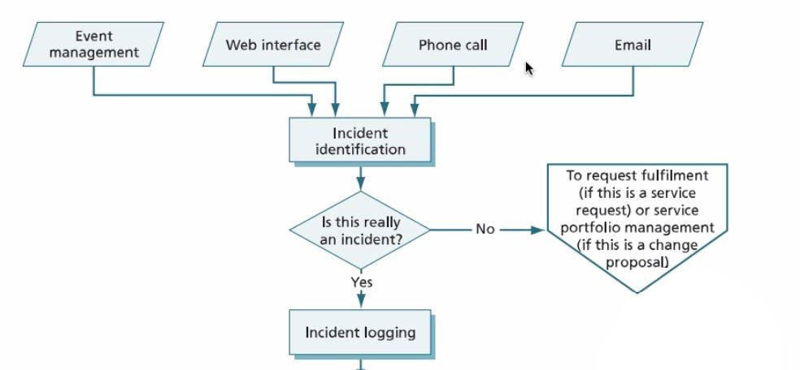
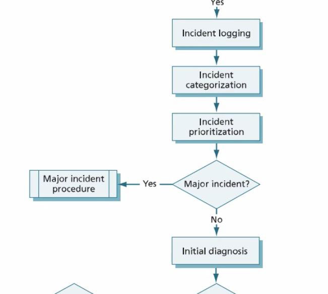
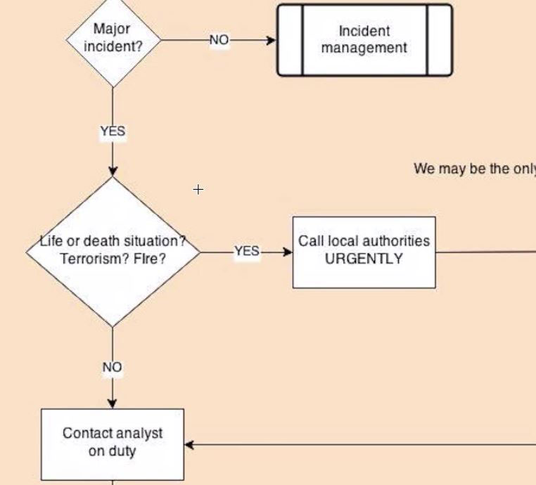
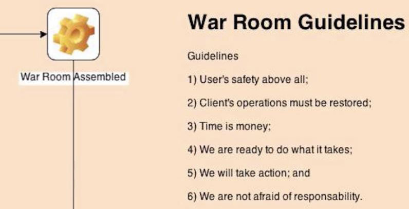

# Gerenciamento de Incidente, eventos e comprimento de requisição

 

## Operação de Serviço

Vamos começar a entender o que é a **Operação de Serviço**, estágio do ciclo de vida do gerenciamento de TI. É nesta etapa que o cliente vai se manifestar dentro do projeto, é o momento no qual o usuário e o cliente podem ver valor em tudo o que está sendo construído, transicionado e desenhado para com os Serviços prestados a eles.

Neste módulo nós estudaremos os **propósitos da Operação de Serviço e os seus Objetivos**, também veremos quais são as **visões da TI** ou o que é a TI para os diferentes grupos relacionados ao serviço, por fim, vamos conhecer os **processos e os conceitos básicos** relacionados a esta operação.

### Propósitos 

Então, dando início ao nosso estudo, vamos agora conhecer os propósitos do estágio de Operação de Serviço. O primeiro propósito é o de  **possibilitar a oferta dos serviços** e o seu respectivo gerenciamento por meio de processos específicos. Ora, de um lado temos os **processos de gerenciamento de serviços de TI**, de outro temos os próprios **Serviços**. Quando falamos de serviços, estamos nos referindo a uma operação. E uma operação é contínua, uma vez que o serviço se torna ativo, ele não tem prazo para acabar. Mas com a ajuda destes processos, os serviços podem ser ofertados para o cliente por um tempo indeterminado. No Gerenciamento das Operações de Serviço, vamos entender quais são os serviços oferecidos para os clientes, por meio dos processos, e como vamos entregar valor para os usuários por meio deste serviço.

### Objetivos

Para a Operação de Serviço, um dos principais objetivos é **oferecer os serviços aos clientes e usuários** a partir de processos que sustentem a operação. É também atender Incidentes, requisições de serviço e gerenciar problemas. 

Incidentes podem ser entendidos como interrupções não planejadas na oferta de qualquer serviço. A compreensão do que é um **Incidente** é de suma importância para quem quer ser aprovado na prova de certificação da ITIL. Nós temos que lembrar que **incidente** é diferente de um problema. Um problema pode dar razão para um incidente e pode ser, por exemplo, a falha de um servidor que pode causar vários incidentes, como a interrupção da oferta de um serviço. **Incidente é a falha na oferta de serviços e o problema é a falha no servidor, que causa a proliferação de Incidentes.** Portanto, ao resolver um problema, nós solucionamos os Incidentes.

Outro objetivo é **gerenciar a infraestrutura de TI** tanto para o cliente como para a própria TI. Temos que pensar em como vamos manter nossa Central de Serviços ativa e operacional, temos que pensar no bem-estar dos nossos funcionários e na infraestrutura de onde eles vão operar.

Também é preciso **sustentar os demais estágios do ciclo de vida** por meio da oferta de dados e informações sobre a operação. Mudanças começarão a surgir a partir deste processo. Porque não podemos melhorar nosso serviço continuamente sem possuir os dados e informações da operação, como poderemos aumentar a oferta de um serviço sem saber como ele está sendo ofertado no mercado? Por isso, é importante darmos atenção aos dados que surgirem durante a operação.

## Balanço na Operação de Serviço

Agora vamos falar um pouco mais sobre as visões da TI. Consideramos que existe diferença entre as visões **Interna** e **Externa**,  para a visão interna, nós entendemos a TI para a TI, ou seja, o que é a TI para a empresa prestadora de serviços? A resposta é **tecnologia**. Para a visão externa, pelos olhos de quem está comprando nosso produto, a TI é um **serviço**. Para o cliente, não faz sentido saber todos os detalhes do que é cada parte e peça do serviço, para ele o que faz diferença saber se o programa ou software está funcionando corretamente, se está online ou offline. Então, nós temos que dar atenção para o que o cliente precisa, pois o cliente, geralmente, não possui o mesmo conhecimento da TI que nós. Para melhor atender as expectativas do comprador, temos que apresentar o produto de forma que ele possa entender.

Outro conceito é a **Estabilidade** *versus* a **Agilidade**. Temos que descobrir como manter o que já está funcionando e ao mesmo tempo atender as novas necessidades sem deixar buracos na operação. Uma forma bem fácil de visualizar esta ideia é imaginar um pedaço de tecido, quando puxamos suas extremidades,  se ele tem pouca elasticidade, ele começa a romper-se em alguns pontos. Assim funciona a operação, quando queremos expandir demais sem adicionar mais recursos, começam a surgir falhas nos processos que já existiam. Portanto, a empresa não só deve ter **estabilidade** em seus processos, mas também **agilidade** para aproveitar novas oportunidades quando elas aparecem. Encontrar o meio termo entre as duas características é essencial para o sucesso da organização. 

Mais um conceito que devemos levar em consideração é a comparação entre um time **Reativo** e uma equipe **Proativa**. Os dois são parte integrante de uma organização madura no mercado. É necessário que exista um time reativo que possa resolver os problemas que forem encontrados por usuários e uma equipe proativa, capaz de encontrar os problemas antes deles surgirem para o público, seja por meio de programas de monitoramento seja por meio de testes.

Quando pensamos em **Qualidade** em oposição a **Custo**, precisamos entender o que o cliente está disposto a pagar pela qualidade desejada. Por exemplo, na requisição do serviço, o cliente solicita que o produto seja um carro, com 4 rodas, 4 portas e uma direção e ar-condicionado. Mas, ele não especificou se quer um carro popular ou uma BMW. Então, para que não hajam dúvidas nem problemas durante a entrega do produto final, é essencial que seja definido o quanto o cliente se dispõe a pagar pelo produto e dessa forma entregar a qualidade relativa ao valor desejado.

## Valor Agregado ao Negócio

É neste momento que a TI entrega valor para o negócio. É nessa etapa que o cliente requisita um serviço e vai ser atendido quanto aos serviços ofertados. Quando o serviço está em processo interno, seja de produção ou de transferência, o cliente não tem acesso a ele, logo não pode ver valor. Mas, quando o serviço chega até o cliente, ele começa a enxergar o valor do produto. Por exemplo, um serviço de televisão por assinatura, enquanto não chegar no receptor do cliente, nada do que vem antes agregar algum valor para ele. Por isso essa etapa é tão importante. 

No caso de provedores de serviço, é na operação que o cliente será atendido, então o foco da entrega de valor deve ser na operação. Quando vendemos um software como um serviço, temos que oferecer o suporte ao cliente. Um serviço vendido em formato de software, geralmente, é vendido com cobrança mês-a-mês e o suporte ao serviço dura enquanto a assinatura do serviço estiver ativa.

E, mesmo para o cliente interno, é na operação do serviço que o valor vai ser percebido, quando o setor de TI oferecer um bom atendimento para os outros setores. Por exemplo, um funcionário da empresa chega em sua mesa e liga seu computador. mas a máquina simplesmente não funciona. A primeira coisa que ele vai fazer é entrar em contato com o setor de TI e baseado em como o setor opera a solução, aquele funcionário verá maior ou menor valor no serviço prestado.

Por fim, é na operação de serviços que níveis de serviço serão mantidos, que a capacidade será entregue e a disponibilidade será garantida. Seguindo o mesmo exemplo do computador que não liga, se em nossa organização nos comprometemos em resolver qualquer problema com as máquinas em até 1 hora, independente da causa, se exceder este tempo, nós estamos quebrando o acordo de disponibilidade de Serviço.

 

## Gestão de Incidentes Graves

Nesta aula veremos um fluxo relacionado a um incidente grave. Em tela, vemos o único fluxo disponível nas publicações da ITIL sobre incidentes graves. Incidentes graves estão relacionados à queda generalizada de serviços, internet por exemplo. São eventos não previstos e que se ocorrerem podem colocar a empresa em maus lençóis.

Você pode fazer seu próprio fluxo com base neste, utilizando ferramentas como a Lucid Chart ou outras de mercado. Em tela, o fluxo, conforme publicação Service Operation, da ITIL.

 

 

A partir de um determinado gatilho, eventos, pode ser iniciado o processo de gerenciamento de incidentes. Este incidente pode ser grave ou não, mas independente disso ainda não sabemos o status daquele incidente. Enquanto percorremos o fluxo iremos determinar qual a gravidade daquele incidente. Se por ventura houver um pedido por parte do usuário quanto a um serviço existente na base de conhecimento da organização, aquele chamado será uma requisição de serviços, não será um incidente. Precisamos prestar atenção nisso!

 

 

Determinando que temos um incidente, faremos o registro do mesmo. Em seguida, categorizaremos o mesmo. Feito isso, devemos fazer a priorização do incidente com base em contratos e ainda outros elementos. Neste ponto é que será determinada a gravidade daquele incidente.

Percebemos, ao ler as publicações oficiais, como é pobre a bibliografia oficial quanto incidentes graves. Do momento em que identificamos o incidente, iremos então determinar se precisamos escalar aquele incidente horizontal ou verticalmente, se será escalonamento funcional ou hierárquico. 

Foi possível oferecer uma solução de contorno para aquele incidente? Ótimo. Isso significa o fim daquele incidente? Não. Começará então o trabalho do gerente de problemas, que irá garantir que o telefone pare de tocar e resolva de vez o problema - indo além da solução de contorno.

## Fluxo de Incidentes Graves do **Professor Aranha**

Vamos agora conhecer o fluxo de incidentes graves de um cliente global atendido pelo professor. Este trabalho foi feito para uma grande corporação. O fluxo inicia-se pela identificação do incidente, passando pelo registro do incidente, sua categorização e a determinação se o incidente é grave ou não.

A partir da identificação da gravidade do incidente, então movemo-nos em direção ao fluxo de incidentes graves. A primeira pergunta a ser feita é: estamos lidando com um incidente que coloque em risco a vida de colaboradores? Imediatamente acionaremos as autoridades.

Neste cliente havia uma conexão direta entre a central de serviços e as fábricas do cliente, que poderiam usar a central de serviços como forma de pedido de socorro. Assim seria atualizado o registro daquele incidente e tentaríamos notificar também o supervisor responsável, buscando deixar uma mensagem de voz caso não seja possível contatá-lo diretamente.

 

 

Tentaremos sempre alcançar o próximo líder disponível para que os líderes da organização, do cliente, assumam a responsabilidade pelo incidente. Tentaremos por um número limitado de vezes, de acordo com o fluxo, o qual você pode tomar como inspiração para seus próprios fluxos.

Uma vez que seja aceita a responsabilidade pelo incidente grave por parte dos líderes da organização cliente, estes deverão montar uma sala de guerra para lidar com a situação. Enquanto isso o analista segue na linha e mantém o incidente aberto até sua resolução ou atualização. Podemos conferir na imagem abaixo orientações quanto a sala de guerra:

 

 

Precisamos estar prontos para fazer o que tem de ser feito, por isso é importante determinarmos quais ações deverão ser tomadas pelo comitê de incidentes graves. Estas orientações serão dadas na forma de regras e papeis para a sala de guerra. Lembrando aqui que é importante ter o papel de gerente de incidente grave apontado.

É sempre importante localizar no cliente o responsável pelo incidente dentro da organização contratante.

 

## Processos de Operação de Serviços

conversaremos sobre todos os processos da área de **Operação de Serviços** que serão cobrados na sua prova de certificação Foundation. Esse processos são: 

### Processos

- **Gerenciamento de Incidente**: é o processo que serve para auxiliar-nos a oferecer uma resposta rápida em casos de incidentes, diminuindo quaisquer perdas, tanto para a empresa quanto para o cliente.

- **Gerenciamento de Evento**: esse processo mantém em vista o monitoramento dos eventos e das rotinas, assim como a modificação de eventos programados e eventos não programados ( que não são considerados necessariamente incidentes, apenas por não serem programados).

- **Cumprimento de Requisição**: é o processo que tem relação com a solicitação de serviços já catalogados e mudanças já esperadas. Por exemplo a solicitação da segunda via de algum documento é uma requisição de serviço já esperado.

- **Gerenciamento de Problema**: o gerenciamento de problema serve para lidar com casos em que um problema desencadeia vários incidentes menores e acaba tomando grandes proporções.

- **Gerenciamento de Acesso**: é responsável por regular as permissões  e os acessos às informações. Está vinculado à segurança da informação e define quem pode acessar informações específicas dentro da empresa.

### Processo: Gerenciamento de Incidente

O processo tem como objetivos, em primeiro lugar, **diminuir o impacto de interrupção não planejadas** e inesperadas e, dessa forma, restabelecer os níveis de serviço o mais rápido possível. Seu objetivo é **normalizar a operação**, em caso de incidentes, esse processo é o que toma a linha de frente para resolver a situação.

**Operação normal** é aquilo que foi estabelecido dentro dos acordos de nível de serviço e operacionais. Por exemplo, se acordado que um site deverá ser mantido 99,9% do tempo online, qualquer incidente que cause uma queda abaixo dessa porcentagem deverá ser normalizado por meio do processo.

Por sua vez, o **incidente** é a interrupção não planejada de um serviço de TI ou redução no nível de serviço. Mesmo que um item de configuração ou serviço apresente uma falha ou uma queda na qualidade não percebida pelo cliente, isso também é considerado incidente. Exemplos de incidentes comuns são: tela de erro, falta de conexão, falta de energia elétrica, sistema não salva os cadastros criados.

### Conceitos Fundamentais

- **Modelo de incidentes**: é um fluxo padrão para o gerenciamento de incidentes. Faz parte do modelo saber como proceder quando o usuário ligar, isto é, catalogar um **passo-a-passo para incidentes específicos.** Os itens que devem estar presentes no modelo de incidentes são:
1)  Passo-a-passo;
2) Nome e telefone de quem pode ajudar;
3) Limites de tempo do atendimento;
4) Escalação horizontal ou vertical, orientações.

- **Limites de tempo**: existindo um modelo de incidentes, vamos aplicar limites de tempo para dar as respostas e para soluções de contorno. "Quanto tempo um usuário pode esperar para que o incidente seja normalizado?"

- **Incidentes graves**: são os *major incidents* que estudamos na disponibilidade e continuidade de serviço. O dono do processo e do serviço devem ser acionados para lidar com esse tipo de incidente devido ao seu tamanho e sua capacidade de interferir em várias áreas.

### Atividades do Gerenciamento de Incidentes

A lista abaixo contem o fluxo padrão de medidas a serem aplicadas para normalizar a situação em caso de incidentes. São elas:

1. **Identificação**: os incidentes devem ser identificados antes de impactarem os usuários ou clientes, o monitoramento pró-ativo de eventos é fundamental para isso.
2. **Registro**: detalhar data, horário, fonte de identificação do incidente e outros dados e informações. Sem esses dados não é possível estudar a causa dos incidentes.
3. **Classificação (Categorização)**: definir se o que está em pauta é um incidente ou requisição de serviço, para isso, faz-se necessário verificar se ele está presente ou não no catálogo de serviços.
4. **Priorização**: pode ser definida a prioridade levando em conta o **impacto** que o incidente tem no negócio ou sua **urgência**. A urgência é medida pela velocidade que se espera que o incidente seja contornado.
5. **Diagnóstico inicial**: é feito a partir da **central de serviços**, pode ser por telefone, e-mail ou chat. Diferentes níveis de serviço podem ser acordados para cada fonte de identificação, se o diagnóstico inicial não for efetivo (incidente novo, por exemplo), é feito o **escalonamento**.
6. **Escalação**: no caso do atendente ser impossibilitado de ajudar um usuário a resolver o incidente registrado, ele pode fazer uma **escalação funcional** ou uma **escalação hierárquica** para que outros times resolvam o incidente baseando-se em sua especialidade.
7. **Investigação e diagnóstico**: falhas precisam ser investigadas e diagnosticadas. Após o diagnóstico, faz-se necessário recorrer à escalação funcional ou à hierárquica.
8. **Resolução e recuperação**: Independentemente de quem resolver o incidente, a **central de serviços** administra o seu encerramento. Ela deve ser o **ponto único de contato**, pois, a **identificação** da situação ocorreu justamente na **central de serviços** e a resolução deverá ser encerrada também por ela.

 

## Processo: Gerenciamento de Evento

Vamos abordar o **Processo: Gerenciamento de Evento**. Esse é o processo que busca detectar eventos na infraestrutura da organização, lembrando que **nem todo evento é um incidente**.

### Objetivos

Os principais objetivos da aplicação desse processo são:

- **Detectar eventos** como: indisponibilidade, travamento de banco de dados, acessos de usuários, compras e saídas de usuários. Todos esses eventos podem ser monitorados e gerenciados pelo processo;
- **Possibilitar a automação das operações** como o gerenciamento dos incidentes, o cumprimento de requisições de serviço. Um exemplo utilizado em aulas anteriores é  o atendimento online automatizado por meio de chat;
- Determinar ações padrão e controles adequados para todos os eventos, por exemplo: quando o usuário faz *login* e quando efetua uma compra, quais são as respostas da infraestrutura frente a essas ações padrões tomadas pelos usuários?;
- Medir desempenho, manter um log de eventos e possibilitar também a identificação de incidentes a partir de eventos negativos. Um monitoramento bem feito irá nos ajudar a detectar ocorrências na estrutura de TI.

### Conceitos Fundamentais

- **Evento**: é qualquer ocorrência na infraestrutura da TI, relacionada diretamente ou não com serviços. As ocorrências, contudo, precisam ter relevância para o gerenciamento dos serviços. Gerenciar absolutamente todos os eventos é desnecessário. Aomonitorar e controlar os eventos iremos ter bases para monitorar e controlar incidentes, diminuindo os possíveis prejuízos causados por eles.

- **Alerta**: Imagine que um website está com mais de 10 mil acessos simultâneos e o mesmo tem capacidade para suportar apenas 5 mil. Nesse caso o **alerta** permite que o gerente de capacidade e disponibilidade amplie a largura da banda momentaneamente para evitar incidentes como a queda do site e os prejuízos que isso acarretaria. 

### Escopo do Processo

O **Gerenciamento dos eventos** pode ser empregado tanto em **itens de configuração** como em aspectos físicos. Por exemplo, a segurança do acesso de uma sala de servidores ou **questões ambientais** como um ar-condicionado que para de funcionar, a sala onde ficam os ativos começar a super-aquecer, etc.  Fazem parte do escopo  a **segurança** em geral e o funcionamento de **atividades corriqueiras**.

### Tipos de Evento

Os principais tipos de eventos que podem ocorrer, para a ITIL são:

- **Operação regular**: são registros do monitoramento do padrão de atividades, isto é, como elas regularmente se comportam;

- **Execução de rotina efetuada por usuário**: são eventos rotineiros como o *login* e o *logout* de clientes em um site de vendas online;

- **Eventos incomuns**: são eventos que podem se tornar incidentes. Por exemplo, em uma loja virtual, um elevado número de clientes não consegue concluir a compra e isso simboliza um evento incomum que pode ser verificado a partir da **operação regular**.

 

## Processo: Cumprimento de Requisitos

O processo **Cumprimento de Requisição** é responsável por toda requisição de serviços** que devem ser cumpridas. Desde a segunda via de faturas até a ativação de um novo canal ou de um serviço mais elaborado, como a instalação de uma nova máquina.

###Objetivos

O principal objetivo desse processo é permitir que os usuários possam encontrar uma forma de ter suas demandas atendidas, não só pelo "cumprimento de requisição", mas pelo processo inteiro de gerenciamento dessa requisição. A requisição do serviço surge da existência do serviço e do fato de ele estar listado no catálogo para que o cliente possa solicitá-lo.

### Conceitos Fundamentais

- **Requisição de Serviço**: pode ser a solicitação de informações ou oferta de reclamações, geralmente são **requisições de serviços** pre-determinados, e isso ocupa a maior parte dos atendimentos de uma **central de serviços**. As **requisições de serviço podem e devem ser automatizadas** sempre que possível. Por exemplo, a troca de senha de alguma conta ou a instalação de um novo *software* pode ser feita em uma página "self-service". Pode existir um **processo de gerenciamento de requisições** que não deve ser confundido com **gerenciamento de incidentes**, apesar de serem registrados em um mesmo formulário. Além disso, existe a possibilidade de ocorrer a **necessidade de escalação** de uma **requisição** e o time que atende requisições é o mesmo que atende incidentes.

- **Modelo de Requisição**: assim como modelos de incidentes, é normal existirem modelos de requisição. Por exemplo: a requisição de instalação de software, a aprovação de instalação (fluxo paralelo), a instalação pela Central e o encerramento pela Central com contato telefônico. 

 

## [Exercício] Operação de Serviço

É na Operação de Serviço que o cliente vai poder se manifestar dentro do projeto, é o momento no qual o usuário e o cliente podem ver valor em tudo o que está sendo construído, transicionado e desenhado para com os Serviços prestados a eles. São funções da Operação de Serviço:

- [ ] A) Gerenciamento de operações de TI e controle de custos.

- [ ] B) Gerenciamento de liberação e implantação e central de serviços.

- [x] C) Central de serviço e gerenciamento técnico.
  > A operação de serviço inclui os seguintes processos: gerenciamento de evento, gerenciamento de incidente, cumprimento de requisição, gerenciamento de problema e gerenciamento de acesso. A operação de serviço inclui as seguintes funções: central de serviço, gerenciamento técnico, gerenciamento de operações de TI e gerenciamento de aplicativo. Embora estes processos e funções estejam associados com a operação de serviço, a maioria dos processos e funções tem atividades que ocorrem em múltiplas etapas do ciclo de vida do serviço

- [ ] D) Central de serviços de avaliação da mudança.

 

## [Exercício] Falta de Comunicação

Dentro da Operação de Serviço, a falta de comunicação pode resultar em atraso na escalada de problemas. O que mais podemos dizer sobre comunicação dentro da organização?

- [ ] A) A falta de comunicação pode resultar em atraso na escalada de problemas. Podendo ser reduzida a carga horária do colaborador.

- [x] B) Na Operação de Serviço, a boa comunicação entre pessoal de TI, usuários e clientes pode prevenir vários problemas.
  > Assim como em diversos tipos de processos, situações, etc., a falta de comunicação se torna fator determinante para a mitigação de riscos ou, na ausência de um plano eficaz de comunicação, gera-se uma maximização desses riscos.

- [ ] C) A falta de comunicação pode resultar em atraso na consequência de problemas.

- [ ] D) O excesso de comunicação pode resultar em atraso na escalada de problemas.

Gerenciamento de evento e gerenciamento de problema.