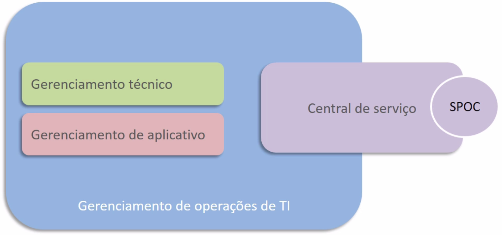
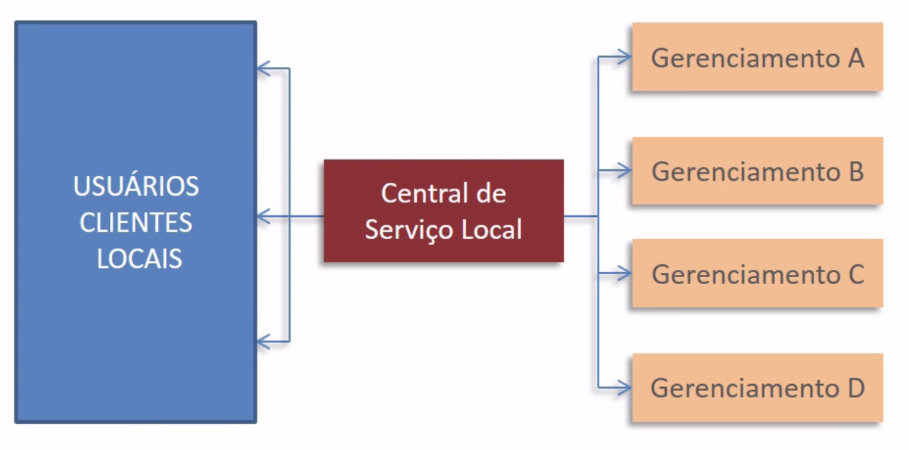
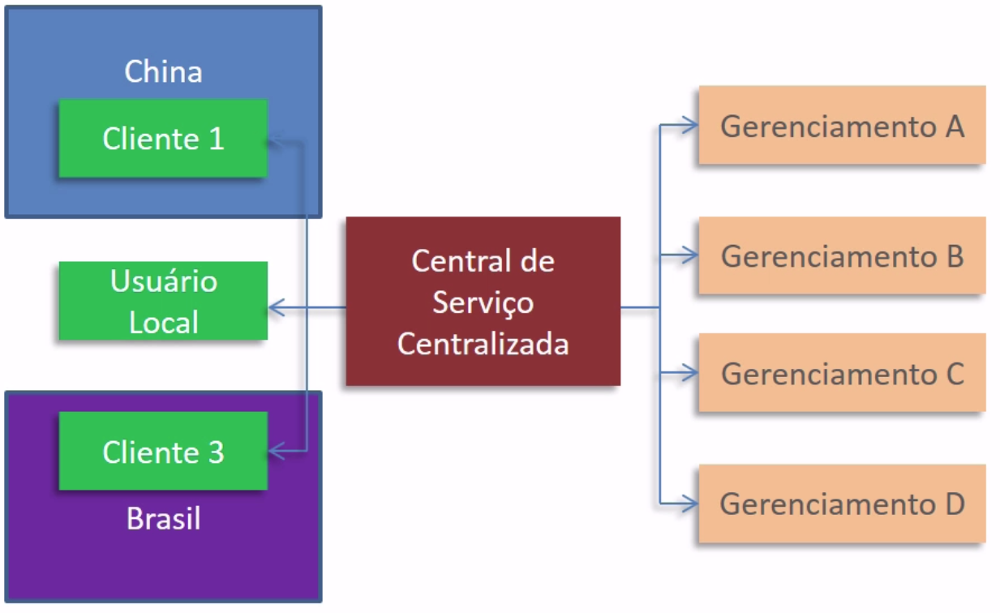

# Gerenciamento de problemas e de acesso

 

## Processo: Gerenciamento de Problema

Vamos abordar o **Processo: Gerenciamento de Problema**, que é gerenciar a causa-raiz dos incidentes frente aos serviços de TI. Ele vai tentar, sempre, normalizar a operação, buscando encontrar uma solução para contornar o que está trancando a operação. Temos duas possibilidades de solução, a primeira é a definitiva, que trabalha pra resolver o problema e a segunda é de contorno, que trabalha para encontrar uma forma de continuar a operação dando a volta no problema. As duas formas vão ser ofertadas dentro do campo do Gerenciamento de Problemas. 

### Objetivos

Este processo traz como objetivo o **estudo de incidentes de forma que as suas causas-raiz possam ser compreendidas**. As vezes, os problemas podem ser resolvidos ainda na etapa do gerenciamento de incidentes, mas na maior parte das vezes, quem é responsável por encontrar a solução definitiva é o gerente de Problemas. Mesmo que um analista de incidente venha a conseguir resolver o incidente na hora do chamado de suporte, o incidente ainda terá que percorrer um modelo de solução de problema. Dessa forma o time de gerenciamento de Problemas terá um *insight* (percepção) no caso deste mesmo problema se apresentar em outra situação. Logo, podemos entender que outro objetivo é **eliminar os problemas**.

Também, é responsabilidade do time de gerenciamento de problemas, **eliminar incidentes** frutos de problemas que tenham a sua causa-raiz já conhecida. Além disso, é responsabilidade também **diminuir o impacto de problemas (incidentes)**, que não podemos resolver. Se não existem os meios para resolver o problema, podemos padronizar uma solução de contorno do problema, para que este padrão passe ser usado nas próximas vezes que o problema aparecer.

>O gerenciamento de problemas pode ser dividido em duas frentes, **Reativo** ou **Pró-ativo**.

O gerenciamento de problemas Reativo é aquele que acontece somente quando o incidente, ou problema, nasce. Já o gerenciamento de problemas Pró-ativo é aquele que busca as soluções antes de os problemas "estourarem".

### Conceitos fundamentais

- **Problema** - É o que **motiva um incidente**, dando causa a ele. Se os computadores não ligam por falta de energia, por exemplo, "não ligar" é o incidente e "falta de energia" é o problema. E problemas podem sustentar mais de um tipo de incidente e, geralmente, levam a mudanças. Quando temos um problema em que já encontramos a solução, esta resolução está, na maior parte das vezes, ligada a mudanças. **Um incidente nunca vai se transformar em problema**, inclusive,  o gerenciamento de incidentes é feito pelo dono de processo e o de problemas é resolvido por outra pessoa. Lembrando que deve haver um registro de incidentes e outro para o problemas.

- **Solução de Contorno** - É uma maneira de continuar o trabalho sem resolver o problema, mudando o percurso do projeto um pouco, isto é, mudamos os meios para alcançar o mesmo fim. Um exemplo de contorno seria, caso a internet via cabo está fora do ar temporariamente, utilizar um roteador de sinal 4G para funções vitais do negócio até o retorno da internet padrão;

- **Erro conhecido** - É um registro de todo aquele erro já resolvido ou contornado pela organização. Por exemplo, tivemos várias quedas de internet e foi descoberto que a causa era o mau funcionamento no poste de distribuição de rede da região. Este tornou-se um problema conhecido, logo, as próximas vezes que uma queda de internet acontecer em massa, será primeiro investigado o funcionamento dos distribuidores de rede. Ainda assim, **mesmo que o problema seja conhecido, nem sempre ele está automaticamente resolvido**;

- **Modelo de Problema** - Assim como temos modelos para requisições de serviço e incidentes, temos os **modelos para resolução de problemas**. Um fluxo simples que ajude a padronizar a abordagem para o gerenciamento de problemas;

- **Banco de Dados de Erros Conhecidos (BDECs)** - Reúne informações sobre incidentes, sobre os erros conhecidos e as respectivas soluções de contorno, problemas, diagnósticos e mais. Isso ajuda os Gerentes de Problemas a encontrar e resolver as complicações da operação.

Um exemplo de modelo de problema passo-a-passo é o seguinte:

1. Identificação;
2. Registro;
3. Classificação (categorização);
4. Priorização;
5. Investigação e diagnóstico;
6. Identificação de solução de contorno;
7. Resolução de problema;
8. Encerramento;
9. Revisão de problema grave.

 

## Processo: Gerenciamento de Acesso

Veremos o **Processo: Gerenciamento de Acesso**. Esse processo está relacionado com a **autorização de utilização de serviços** para usuários e seus perfis, portanto, também está ligado ao **Gerenciamento de segurança da informação**.

### Objetivos

- **Permitir o acesso** e utilização a um determinado grupo de serviços para usuários autorizados;
- **Prevenir acesso** de usuários não autorizados;
- **Tornar operacional** o processo de  "gerenciamento da segurança da informação".

### Conceitos Fundamentais

- **Acesso**: faixa de serviços utilizáveis por determinado perfil de usuário.

- **Identidade**: é a identificação de cada usuário e de seu respectivo perfil para **garantir seu acesso** a serviços específicos ou**impedir o acesso** aqueles usuários não autorizados.

- **Privilégios**: é o "poder" que determinado usuário tem ao acessar informações. Por exemplo: "Pode ler, mas não pode editar, pode editar, mas não pode excluir".

### Atividades do Gerenciamento de Acesso

Atividades que configuram um "modelo padrão" que pode, e deve, ser utilizado. São elas:

1. Requisição de acesso (ou serviço);
2. Verificação;
3. Acesso ou restrição de acesso;
4. Monitoramento do status da identidade;
5. Log e rastreamento de acesso;
6. Restrição de direito ou deleção.

 

## Funções na Operação de Serviço

Vamos analisar as **Funções na Operação de Serviço**, as funções são papéis exercidos por equipes e que colocam em bom andamento os processos do gerenciamento operacional e suas atividades. Existem 4 funções principais em ITIL, as quais trabalharemos nesta aula.

- Central de serviço;
- Gerenciamento de operações de TI;
- Gerenciamento técnico;
- Gerenciamento de aplicativo.

Estas funções relacionam-se de forma que a **central de serviço** é a única responsável pelo contato com o cliente (nível 1), seja o cliente requisitando um serviço ou relatando um incidente. A partir desse primeiro atendimento da central, conforme for a necessidade do caso, poderá redirecionar o cliente ao setor de **gerenciamento técnico** ou ao setor de **gerenciamento de aplicativo** (ambos nível 2).

Esse esquema de relação entre as funções, explicado no trecho anterior, está imerso dentro do **gerenciamento de operações de TI**, como representado na figura abaixo:

 

 

### Central de Serviço

É o grupo de trabalho que vai atuar em diversos tipos de serviços e também irá assumir para si diversos processos da ITIL. **O time vai oferecer serviços**, seja por sistemas automatizados seja pelo atendimento direto ao usuário. 

Os **objetivos** da central de serviço são, acima de tudo, satisfazer o usuário ou o cliente. Mas, pensar apenas em serviços leva o foco para o âmbito técnico e acaba sendo prejudicial para todas as partes. A central também atende requisições de serviço e o usuário de forma geral.

As **principais responsabilidades** assumidas pela **central de serviço** são: manter os sistemas de gerenciamento de informação e conhecimento alimentados e diagnosticar adequadamente os incidentes para facilitar soluções de contorno, oferecer informações em tempo hábil para as partes interessadas sobre serviços e infraestrutura, ser o primeiro e único ponto de contato entre usuário e TI, manter registros que permitam estudo de volumes de atendimentos, incidentes, requisições e assim por diante

A **central de serviço** agrega valor ao negócio por **ampliar a satisfação dos usuários** e isso pode significar uma maior satisfação por parte dos clientes externos. Além da central ser, acima de tudo, uma função comunicacional é um dos pilares para o sucesso de qualquer negócio. A partir da **central de serviço** os incidentes e problemas são atendidos de forma célere, o que diminui o impacto negativo destes para o negócio.

Quanto à estrutura, a **central de serviço** pode ser **Local**, existindo uma estrutura que atende os clientes dentro da própria empresa, como exemplificado na imagem abaixo:

 

 

Ou a Central de Serviço pode ter uma estrutura **Centralizada**, dessa forma, a central de serviços atende mais de uma empresa e, por isso, é necessário que ela esteja centralizada em um local específico em que só ela opera. Como exemplificado na imagem a seguir:

 

 

Com o uso da tecnologia é possível que a central trabalhe com ambas as configurações: 

- **Central de Serviços Virtual**: a central de serviços virtual terá times espalhados em diferentes locações, como pessoas trabalhando de suas casas para compor esse grupo de trabalho, então, o espaço existente é estritamente virtual, sem uma locação física centralizada. Contudo isso não fere o princípio da central de serviços de ser o **ponto único de contato**.

- **Central de Serviços Siga o Sol**: é caracterizada por uma equipe que opera 24 horas por dia e, para isso, ela é composta de várias equipes que mantêm-se revesando no trabalho para manter a operação. A central de serviço operar 24 horas por dia permite que ela atenda clientes que estão em diversas partes do mundo fazendo o contato com os grupos especializados também em outras partes do mundo.

### Gerenciamento Técnico

É mais uma função da Operação de Serviço, ela é formada, de forma geral, por **especialistas em infraestrutura de TI**. É possível que existam vários grupos como time de servidor, BD, redes e assim por diante. Essa função existe para **suportar a infraestrutura de TI** e viabilizar a prestação de serviços.

No **gerenciamento técnico** devemos buscar o **balanceamento de recursos**, pois é preciso equilibrar recursos de infraestrutura com recursos humanos e com as habilidades necessárias para sustentar essa infraestrutura de TI.

### Gerenciamento de Aplicativo

Em analogia com o **gerenciamento técnico**, pode ser entendido como braço técnico para **softwares** ligados a **serviços**, por exemplo, uma folha de pagamentos. Ele colabora com incidentes, problemas e questões ligadas a aquisição e manutenção de **aplicativos**. Muitos donos de serviços atuam com o **gerenciamento de aplicativos**.

### Gerenciamento de Operações de TI

São as pessoas que cuidam da infraestrutura para a própria TI  - isto é, a TI da TI - fazendo o **controle de operações de TI** e o **gerenciamento das instalações**, que possuem as seguintes características:

- Controle de Operações: são os operadores que vão rodar serviços de rotina e apoiar as tarefas essenciais. Uma equipe local de atendimento que, por exemplo, fornece suprimentos e instalação de máquinas.

- Gerenciamento de Instalações: cuida desde a manutenção do ar condicionado da sala de servidores até o espaço físico onde eles estão instalados, cabos, internet...

 

## [Exercício] Gerenciamento de Problema

Gestão de Problemas é fundamental na ITIL! Este processo traz como um de seus objetivos, o estudo de incidentes de forma que as suas causas-raiz possam ser compreendidas. O que é verdadeiro para o processo Gerenciamento de problema?

- [ ] A) Gerencia o ciclo de vida de todos os problemas.

- [ ] B) Atua sobre incidentes apenas depois que eles ocorrem.

- [ ] C) Minimiza o impacto dos incidentes que não podem ser evitados.

- [x] D) Previne proativamente a ocorrência de incidentes e atua para encerrar causas de incidentes.
  > O processo Gerenciamento de Problema é responsável por gerenciar o ciclo de vida de todos os problemas. Previne de maneira proativa a ocorrência de incidentes e minimiza o impacto do que não pode ser evitado.

 

## [Exercício] Proteger a Confidencialidade

Como andam os estudos? Esperamos que bem! O processo que ajuda a proteger a confidencialidade, a integridade e a disponibilidade de ativos, por meio da garantia de acesso ou modificação:

- [ ] A) Gerenciamento de serviço.

- [x] B) Gerenciamento de acesso.
  > O Gerenciamento de Acesso é o processo responsável por permitir que os usuários façam uso de serviços, dados ou outros ativos de TI. Esse processo ajuda na proteção e confidencialidade, além da integridade e a disponibilidade de ativos os permitindo somente a usuários autorizados, obedecendo a política de segurança da informação.

- [ ] C) Gerenciamento de configuração.

- [ ] D) Gerenciamento de autorização.

 

## [Exercício] Identificar um Usuário

Como sabemos pelas nossa aulas mais recentes, o nome utilizado para identificar unicamente um usuário, pessoa ou papel é conhecido, em ITIL®, como:

- [ ] A) Cargo

- [ ] B) Função

- [x] C) Identidade
  > Identidade é o nome utilizado para caracterizar individualmente um usuário, pessoa ou papel. Utilizado para designar a concessão de direitos. Um exemplo de identidade pode ser um o nome de usuário de um sistema, por exemplo “administrador01”.

- [ ] D) Usuário no sistema.

Nome utilizado para identificar unicamente um usuário, pessoa ou pape é conhecido, em ITIL®, como **Identidade**

 

## [Exercício] Ponto Único de Contato

É o grupo de trabalho que vai atuar em diversos tipos de serviços. Ponto único de contato entre o provedor de serviço e os usuários é conhecido como:

- [x] A) A central de serviço
  > É o ponto único e centralizado de contato entre o provedor de serviço e os usuários. Pode gerenciar incidentes, requisições/ chamados e também a comunicação com os usuários.

- [ ] B) O funil de serviço

- [ ] C) O intermedíario

- [ ] D) A chamada

A Central de Serviços.

 

## [Exercício] Acrônimo OMS

Como vimos nas nossas últimas aulas, OMS é o acrônimo para:

- [ ] A) Ordem de manutenção de serviço.

- [x] B) Objetivo de manutenção de serviço.
  > O tempo esperado em que um item de configuração fica indisponível devido à atividade de manutenção planejada.

- [ ] C) Objetivo de mudança de serviço.

- [ ] D) Organização de manutenção de serviço.