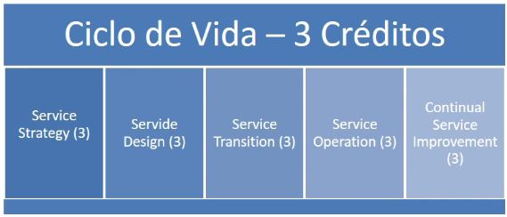
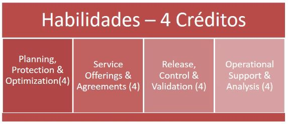

## 1.1 Níveis

Em relação às certificações em ITIL existem como possibilidades 5 níveis, sendo que o primeiro o "Foundations" e o mais avançado o "Master". Abaixo inserimos uma imagem ilustrativa para melhor compreensão da divisão e hierarquia das qualificações.

 

## Nível Foundation
Não há pré-requisito e acumula 2 créditos. *Apenas para o exame Foundation é possível fazer um curso não credenciado*.

 

## Nível Practitioner
Deve se ter o *Foundation* e acumula 3 créditos. Serve para profissionais que estão buscando a adoção na prática do ITIL e precisa ter feito um curso certificado.

 

## Nível Intermediário

Neste nível existem caminhos que podemos seguir. Cada um dos cinco módulos de **Ciclo de Vida** acumula 3 créditos e cada um dos quatro módulos de **Habilidades** acumula 4 créditos. Para se tornar um ITIL Expert precisa-se de 22 pontos somados, mas ao chegar aos 17 pontos pode-se fazer uma prova que vale 5 pontos, levando assim ao *ITIL Expert.

Na imagem abaixo são listadas as Provas de nível intermediário baseadas no **ciclo de vida da ITIL**, cada uma das provas da figura vale 3 pontos de crédito que auxiliam para avançar ao próximo nível.

 

Abaixo são exibidas as provas existentes no nível intermediário voltadas para habilidades. A aprovação em cada uma das provas acumula 4 créditos.

 

 

## Exame Nível ITIL Foundation
**São 40 questões** de múltipla escolha a serem respondidas em **60 minutos**, para a aprovação é necessário **acertar 26**, no mínimo, ou seja, 65% da prova. É um exame de fundamentos.

 

## Nível Expert
Para se tornar elegível é necessário acumular 22 créditos.

 

## Nível Master
Voltada aos profissionais de nível Expert que desejam comprovar suas habilidades em ITIL com apresentação de case para uma banca. Existe um mínimo de 5 anos de experiência para que se possa ser ITIL Master.

Por que se tornar um Profissional Certificado ITIL?
+ Certificações super **valorizadas**  pelo mercado, com mais de **650.000** profissionais pelo mundo e 60 mil no Brasil. Hoje é uma das certificações mais comum, mas ainda assim é importante para o currículo e para colocação em empresas. É um atestado do conhecimento no vocabulário básico do ITIL;

+ Amplia suas **chances de contratação** no mercado de TI;

+ Desenvolve **habilidades** e melhora o **desempenho** do profissional por meio dos estudos para a prova;

+ **Reconhecimento formal** dos conhecimentos, possibilitando comprová-los para o mercado.
