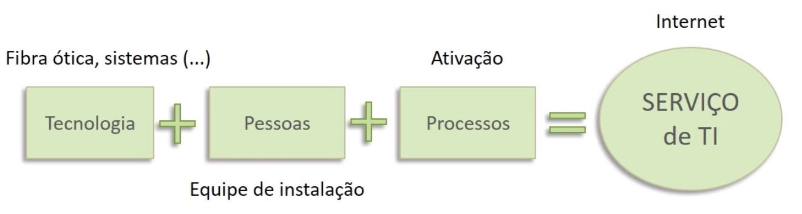
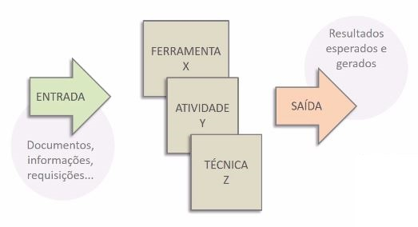
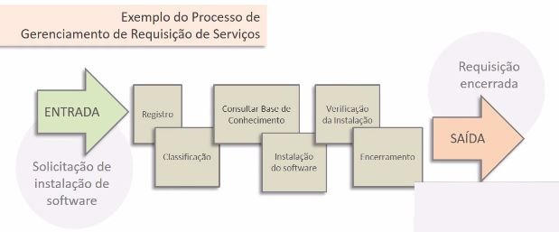
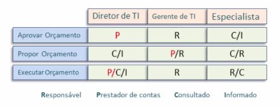

# Gerenciamento dos Serviços de TI

Nesta etapa vamos estudar o Gerenciamento dos Serviços.

Vamos começar a entender as **definições básicas** de gerenciamento de serviços e a diferença entre **gerenciamento de serviços** e **gerenciamento de serviços de TI**.

Vamos verificar conceitos sobre **processos** e **funções** e também exemplos práticos que nos ajudarão a compreendê-los melhor;

Vamos buscar entender os papéis no gerenciamento de serviços e também os **papéis** genéricos que poderemos aplicar em qualquer processo;

Também conheceremos a Matriz **RACI**, que é a representação gráfica do relacionamento entre **atividades, tarefas** e **pessoas**: "quem é responsável por cada tarefa?", "quem é o proprietário da tarefa?", "quem é o consultado?". Essas perguntas são respondidas e explicadas por meio da Matriz RACI;

Além disso tudo, vamos estudar algumas **competências e habilidades** relacionadas ao gerenciamento de serviços de TI.

 

## Partes Interessadas
São todas as partes que tem algum relacionamento com o serviço que está sendo prestado e que podem afetar e serem afetados pelo serviço, por exemplo, grupos de trabalho.

 

## Equipes de TI
As equipes de TI são grupos de trabalho que entregam valor por meio da utilização dos processos estudados nesse curso, além disso, são os componentes das equipes que irão performar os processos da Gestão de Serviços em TI, essas pessoas criarão os resultados e construirão as entregas para os clientes. Portanto:

+ Entregam valor por meio de processos;

+ Performam processos de GSTI;

 

## Clientes e Usuários
+ **Cliente** é quem paga a conta e acorda o serviço - pode ser **interno** e/ou **externo**;

+ **Usuário** é quem utiliza o serviço.

 

## Fornecedores
+ Podem ser os próprios provedores de TI ou podem ser fornecedores dos provedores de TI.

``Uma empresa que trabalha como "fornecedora" de serviços de TI, a partir do momento que aplicar as práticas do ITIL, passará a ser Provedora de serviços de TI.``

 

## Serviços
+ Internos: São entregues **entre departamentos**, para clientes internos;

+ Externos: São entregues para clientes **externos**.

O **Serviço de TI** é ofertado por um fornecedor e é formado por **três pilares: tecnologia da informação, pessoas e processos**.

Vamos tomar uma empresa provedora de internet como exemplo, para fazer com que o serviço de TI chegue as residências de seus clientes é preciso que a **tecnologia, as pessoas e os processos** estejam alinhados e funcionando, por meio de processos, para gerar resultados. Conforme podemos verificar na imagem abaixo:

Neste exemplo:

+ **Pessoas:** pode ser entendido como a equipe de instalação, que vai levar os cabos até o ponto de instalação;

+ **Processos:** é o que organiza a equipe de trabalho para que ela entregue resultados, no exemplo citado, pode ser o processo de "ativação";

+ **Tecnologia:** é aquilo que ajudará a dar suporte aos processos e as pessoas na entrega de resultados.

Outros exemplos de Serviços de TI são:

+ TV por assinatura;
+ Telefonia;
+ CRM;
+ Sistemas de Inbound Marketing;
+ Acesso à internet.

 

## Gerenciamento de Serviços de TI

``É a aplicação e organização dos serviços de TI mantendo o foco nos objetivos do negócio.``

Dentro de uma organização, cada serviço, cada conjunto de pessoas e de processos, é um pacote que precisa ser alinhado por meio do gerenciamento de serviços. E um **fator de extrema importância no gerenciamento é a visão holística**, que é conseguir visualizar o todo e ir além de um único serviço de TI, isto é, pensando no conjunto inteiro.

 

## Provedor de Serviço de TI
Fornece serviços para clientes internos ou externos.

É quem vai buscar:

+ Pessoas;
+ Formas de Organização;
+ Formas de Gestão;
+ Ativos de Processos.

Junto com:

+ Dinheiro;
+ Tecnologia;
+ Recursos de forma geral.

Esses elementos se somam a fim de entregar resultados e serviços e os serviços devem entregar valor para o cliente.

 

## 3 tipos de Provedores de Serviços da ITIL
+ Provedor de Serviços Internos: É quando a empresa tem um departamento de suporte interno e próprio da organização;
+ Unidades de serviços compartilhados: Fornece serviço de TI compartilhado para mais de uma unidade de negócio, focado em uma única organização;
+ Provedor de Serviços Externos - Fornece serviço de TI para clientes externos (para outras organizações).

 

## O que são Partes Interessadas?
Vamos pensar num **exemplo prático**: João trabalha para o Governo Federal e o governo decidiu construir um conjunto habitacional de prédios numa área indígena. Nesta área vivem índios, que por consequência, tem que ser realocados. Neste esforço, tanto João, como o Gerente de Projetos, como boa parte da equipe, o Governo Federal e os Índios são **Partes Interessadas**.

É importante que fique claro que não devemos considerar como Partes Interessadas somente quem tem interesse positivo, mas também as afetadas com interesses negativos. Muitas vezes temos que entender a **sociedade como Parte Interessada** em nosso projeto.

 

## Classificando os Serviços
Os serviços podem ser classificados pela forma como relacionam-se entre si. No caso da Alura, pode-se entender, a partir de um ponto de vista holístico, que o principal serviço prestado é o fornecimento de educação. Mas do ponto de vista da TI, o principal serviço de TI da Alura é um Portal de ensino, pois é nele que o cliente encontra valor.

Abaixo encontra-se uma lista na qual podemos classificar os serviços:

+ **Serviços Principais** - É o que o Cliente busca e onde vê valor;
+ **Serviços de Apoio** - São serviços **secundários** que vão permitir a prestação do serviço principal. No caso da Alura podemos entender como o banco de dados, o cadastro de cursos, etc. Os serviços de apoio podem ou não ser "vistos" pelo Cliente;
+ **Serviços Intensificadores** - No caso da Alura, pode ser o aplicativo mobile para ver as aulas no celular. Eles agregam valor ao serviço principal, mas o principal não depende dele para funcionar. Ou seja, **não são serviços essenciais**.

A ITIL agrupa as atividades de TI em processos que são distribuídos em etapas ao longo do ciclo de vida dos serviços, nas quais além de papéis relacionados a pessoas também temos funções que performam tais atividades dentro dos processos.

O que é uma Função?
A função é uma equipe ou um grupo que emprega um ou diversos processos com objetivos específicos. Pessoas e Funções podem se combinar em processos. Uma Função existe para um fim específico.

 

## O que é uma Função?
A função é uma equipe ou um grupo que emprega um ou diversos processos com objetivos específicos. Pessoas e Funções podem se combinar em processos. Uma Função existe para um fim específico.

 

# 4 Funções descritas pela ITIL:

## 1) Central de Serviço

A Central de Serviço é a primeira das quatro funções citadas pela ITIL, ela existe para reunir processos, pessoas e profissionais com o objetivo de operacionalizar a TI, ela é o ponto único de contato entre clientes/usuários e desenvolvedores. É pela central de serviços que serão feitas reclamações, requisições de serviço e atendimento ao cliente em geral. É composta por analistas de TI.

## 2) Gerenciamento Técnico

Outra função da ITIL é o Gerenciamento Técnico, essa função é para os casos em que alguém precisa de um atendimento que demande um especialista em uma área técnica. Assim, a Central de Serviço irá passar o atendimento para o Gerenciamento Técnico no qual se encontra o especialista necessário para a resolução da requisição.

## 3) Gerenciamento Operacional de TI

O Gerenciamento Operacional da TI é a função responsável por auxiliar a equipe de TI no desenvolvimento do projeto resolvendo problemas corriqueiros que afetariam na produção. Conserto de lâmpadas e ar condicionado, organização dos cabos utilizados são alguns dos exemplos da atuação do grupo operacional.

## 4) Gerenciamento de Aplicativos

O Gerenciamento de Aplicativos é o gerenciamento de serviços específicos como ERPs, folha de pagamento e softwares em geral. É um subnível da central de serviço como o gerenciamento técnico, porém, de atuação mais específica e pouco abrangente.

 

# Afinal, o que é um processo?
Um exemplo de processo é moer carne. Temos como entrada a carne, como ferramenta o moedor e resultado a carne moída. Se pensarmos em outros processos neste contexto podemos dizer que o encadeamento de processos vai levar a carne a virar uma almôndega,. Abaixo temos imagens que mostram os processos com mais detalhes.

 

 

## ITIL recomenda
A ITIL recomenda que os processos tenham as seguintes características:

+ Gerar resultados claros: quais são as expectativas em relação ao processo que será aplicado?

+ Voltado para clientes: não adianta aplicar processos apenas voltados para a TI sem levar em consideração o cliente. São os requisitos do cliente que irão dar valor ao projeto;

+ Eficientes e eficazes: devem atingir os resultados da melhor maneira possível.

 

## Exemplo de processo:

Vamos trabalhar com um exemplo para melhor compreender a **Entrada do processo** (Gatilho), para explicar isso, vamos utilizar um cliente que liga dizendo que a internet caiu. Nesse caso, a entrada equivale ao reconhecimento do evento ocorrido, que foi registrado por meio da ligação do cliente. Para restaurar o serviço de internet é preciso aplicar algumas ferramentas e elementos, ou seja, o **processo** em si, os **controles** e os **habilitadores** a fim de obter a **saída**, que são os resultados esperados para a entrada em questão:

**Processo** - Ferramentas do processo; - Técnicas do processo; - Base de conhecimento; - Papéis; - Métricas e melhorias.

**Controle** - Dono do processo; - Ativos de processo; - Política do processo; - Objetivos do processo.

**Habilitadores do Processo** - Pessoas, funções do processo; - Competências necessárias.

**Saída** - Resultados esperados e descrição de atividades performadas.

O *framework* descreve 4 papéis que ajudam a estruturar os serviços e processos de gestão de TI

 

## Papéis genéricos no ciclo de vida do serviço:
+ **Dono do Processo**: é o personagem que assume a propriedade pelo processo de gerenciamento de incidentes, caso ocorram, ele é o responsável por normalizar a situação, permitindo a continuidade do projeto (Diretor de TI);

+ **Gerente do Processo**: é responsável por parte da autoridade do projeto, costuma auxiliar o Dono do Processo (Gerente de TI);

+ **Profissional de Processo**: é a pessoa que faz com que o projeto ocorra. Em uma empresa de telemarketing o Profissional de Processo é aquele que atende o telefone (Analista);

+ **Dono de Serviço**: é alguém que domina alguma ferramenta específica para o processo em questão (Diretor em Marketing).

 

## Principais responsabilidades:
+ Dono do Processo
As principais responsabilidades elencadas para o Dono do Processo são a de **patrocinar o processo**, ou seja, ele é responsável por fazer acontecer, isto é, tirar do papel. **Apoia no desenvolvimento do desenho do processo** e está por perto para oferecer suporte na fase de construção do processo. **Garante documentação abrangente**, define a documentação necessária e garante que a equipe tenha acesso a ela para o projeto. **Ele também define e aprova regras, políticas e padrões** baseando-se nas políticas da empresa e nos interesses do cliente. Audita o processo e mantém a comunicação aberta e clara sobre o processo, tanto com a equipe quanto com o cliente, e é quem fornece recursos para o desenvolvimento do processo.

+ Gerente do Processo
O Gerente do Processo é a figura **responsável pela operacionalização do processo**, ou seja, garante que existem meios para que o processo seja desenvolvido pela equipe. Ele **garante a realização das atividades mapeadas para o processo**, fiscaliza e gerencia o andamento do processo. É a pessoa que também **aponta e gerencia recursos para papéis e funções e gerencia recursos em nome do dono do processo** como forma de auxiliar o dono do processo. Ainda, **busca melhorias** contínuas para o projeto em questão.

 

+ Profissional do Processo
O Profissional do Processo é quem **realiza atividades do processo** e é quem participa ativamente da construção do processo, é a pessoa que traz o projeto à vida. Também é quem **conhece o processo** e sabe que nas atividades deve-se performar para entregar valor. Ele **alinha suas atividades com outros papéis e funções** para garantir a entrega de resultados e é responsável por **utilizar todas as ferramentas ao seu dispor** e, assim, entregar os resultados esperados de cada processo com o qual está envolvido. Por último, também deve **manter registros e relatórios atualizados**.

 

+ Dono do Serviço
E por fim, o Dono do Serviço tem como responsabilidades **representar o serviço na empresa e também para clientes**, ou seja, ele é a figura que representa sua área em específico tanto para a empresa durante a criação do processo quanto para clientes externos. Ele **entende profundamente o serviço e o valor que entrega**, pois é um grande especialista em sua área. Portanto, ele **compreende e comunica mudanças no serviço**, além de garantir a realização das mesmas no serviço. É a pessoa que também comunica sobre o serviço com todas as partes interessadas tanto internas quanto externas. O dono do serviço **participa ativamente de negociações de acordos de nível de serviço**, sendo ele o maior representante do próprio serviço e **responde pela entrega do serviço**. Como as outras funções também **busca melhorias contínuas no serviço**.

 

## Matriz de atribuição de responsabilidades (RACI)
+ **R** - Responsável *(Responsible)*, geralmente é o profissional do processo;

+ **A** - Prestador de Contas *(accountable)*, é o dono do processo;

+ **C** - Consultado *(consulted)*, pode ser um especialista em determinada atividade;

+ **I** - Informado *(informed)*, pode ser um diretor da empresa ou dono de um serviço.

Abaixo temos um exemplo de Matriz RACI. Ao lado esquerdo encontra-se a coluna de processos e preenchendo as lacunas temos as devidas responsabilidades.

 

## [Exercício] Definição do Serviço de TI

São todas as partes que tem algum relacionamento com o serviço que está sendo prestado, como grupos de trabalho. Como pode ser definido “serviço de TI”?

- [ ] A) Serviço fornecido por um provedor de serviço de TI, composto de uma combinação de tecnologia da informação e pessoas.

- [ ] B) Serviço fornecido por um provedor de serviço de TI, composto por uma combinação de tecnologia da informação, pessoas e processos, sendo necessário um mínimo de 12 colaboradores para garantir a qualidade.

- [ ] C) Serviço fornecido por um provedor de serviço de TI, composto por uma combinação de tecnologia e processos.

- [ ] D) Serviço fornecido por um provedor de serviço de TI, composto de uma combinação de tecnologia da informação, pessoas e processos.
  > Um serviço de TI voltado para o cliente suporta diretamente os processos de negócio de um ou mais clientes e convém que as suas metas de nível de serviço sejam definidas em um acordo de nível de serviço. Outros serviços de TI, chamados serviços de apoio, não são diretamente usados pelo negócio, porém são exigidos pelo provedor de serviço para entregar serviços voltados ao cliente.

 

## [Exercício] O Serviço de TI

O Serviço de TI é um serviço ofertado por um fornecedor e é formado por três pilares: tecnologia da informação, pessoas e processos. Sobre um provedor de serviço de TI é correto afirmar que:

- [ ] A) Fornece serviço de TI apenas para clientes externos.
  > Alternativa incorreta

- [ ] B) Pode prover serviços de TI para clientes internos e externos.
  > O termo Provedor de Serviço de TI tem como abreviação Provedor de Serviço. É uma organização que fornece serviços a um ou mais clientes internos ou clientes externos.

- [ ] C) Fornece serviço de TI apenas para clientes internos, se fornecer serviço de TI para cliente externo, deve ser classificado como mercador de serviço de TI. 
  > Alternativa incorreta

- [ ] D) Fornece serviço de TI apenas para clientes internos, se fornecer serviço de TI para cliente externo, deve ser classificado como vendedor de serviço de TI. 
  > Alternativa incorreta

Pode prover serviços de TI para clientes internos e externos.

 

## [Exercício] Parte Interessada

Partes Interessadas são sempre muito importantes para uma organização. Para ITIL®, parte interessada é:

- [ ] A) Qualquer pessoa ou grupo que possua algum interesse em uma organização, um projeto, um serviço de TI, etc. Alguns exemplos de partes interessadas são: clientes, parceiros, colaboradores, acionistas e proprietários.
  > A definição de Parte Interessada no glossário ITIL é de uma pessoa que tem um interesse em uma organização, um projeto, um serviço de TI, etc. Pode estar interessada nas atividades, metas, recursos ou entregáveis. As partes interessadas podem incluir clientes, parceiros, funcionários, acionistas, proprietários, etc.

- [ ] B) Qualquer pessoa que possua algum interesse na organização, em um projeto, ou em um serviço de TI, exceto o usuário do serviço.

- [ ] C) Apenas o público externo, que for negativamente afetado pelos serviços de TI da organização.

- [ ] D) Apenas o cliente interno, como colegas de trabalho e gestores.

Qualquer pessoa ou grupo que possua algum interesse em uma organização, um projeto, um serviço de TI, etc. Alguns exemplos de partes interessadas são: clientes, parceiros, colaboradores, acionistas e proprietários.

 

## [Exercício] Clientes

Esperamos que seus estudos estejam evoluindo bem! Cliente é quem paga a conta e acorda o serviço. Para ITIL®, clientes externos são:

- [x] A) Clientes que trabalham para um negócio distinto do provedor de serviço de TI.
  > Essa é a adequada definição para clientes internos e externos, baseada no glossário ITIL.

- [ ] B) O mesmo que clientes internos.

- [ ] C) Não existe distinção entre clientes internos e externos para ITIL®.

- [ ] D) Clientes que trabalham para o mesmo negócio do provedor de serviço de TI.

Clientes que trabalham para um negócio distinto do provedor de serviço de TI.

 

## [Exercício] Possibilidade

Como vimos nas nossas aulas, a possibilidade de funcionários acessarem seus e-mails fora da empresa é um exemplo de:

- [ ] A) Economia de escala.
  > Alternativa incorreta

- [ ] B) Serviço intensificador.
  > Alternativa incorreta

- [x] C) É um serviço. Para se determinar se é de apoio ou intensificador, seria preciso mais detalhes.
  > Um serviço que é adicionado a um serviço principal para torná-lo mais atraente ao cliente. Serviços intensificadores não são essenciais para a entrega de um serviço, porém são usados para estimular os clientes a usar serviços principais ou diferenciar o provedor de serviço dos seus concorrentes.

- [ ] D) Serviço de apoio.
  > Alternativa incorreta

 

## [Exercício] Atividades Elaboradas

Um conjunto estruturado de atividades elaboradas para alcançar um determinado objetivo, que pode definir políticas, normas, orientações, atividades e instruções de trabalho caso sejam necessários. Esta definição refere-se à:

- [ ] A) Controle de processo

- [ ] B) Centro de lucro

- [ ] C) Processo.
  > A definição apresentada no glossário ITIL soa universalizada, pois traduz de maneira adequada a terminologia de Processos, podendo ser utilizada no âmbito de qualquer atividade, circunstância, etc.

- [ ] D) Projeto

 

## [Exercício] Papéis

Estamos estudando o ITIL® a fundo, e como vimos em nossas aulas o Dono de processo, Gerente de processo, Profissional de processo e Dono de serviço, em ITIL®, são:

- [ ] A) Estes papéis não existem em ITIL®.
  > De fato estes papéis existem sim ITIL® num ciclo de vida do serviço

- [ ] B) Os 4 papéis genéricos que auxiliam no fornecimento de serviço de qualidade.
  > Quase isso, apesar destes 4 papéis serem genéricos a ênfase deles não são associadas a somente serviços de "qualidade"

- [ ] C) Os 4 papéis principais que executam as atividades.
  > As responsabilidades destes 4 papéis não contempla execução de atividades em sua totalidade.

- [x] D) Os 4 papéis genéricos que atuam no ciclo de vida do serviço.
  > Papel é um conjunto de responsabilidade e autoridade concedido para uma pessoa ou grupo. Um indivíduo ou grupo pode desempenhar múltiplos papéis, não estando obrigatoriamente relacionado com o cargo exercido Dono do Processo, Gerente do Processo, Profissional de Processo e Dono de Serviço tem papéis genéricos que auxiliam no fornecimento de serviços

 

## [Exercício] Responsabilidades

A pessoa prestadora de contas por um serviço através de todo o seu ciclo de vida é chamada de:

- [ ] A) Gerente de serviço.

- [x] B) A pessoa responsável nesse caso é o Dono do serviço.
  > Dono de serviço é responsável pela entrega de um serviço especifico. Para o cliente, ele é responsável pela iniciação, transição, manutenção em produção e suporte de um serviço particular.

- [ ] C) Dono de processo.

- [ ] D) Gerente de projeto.