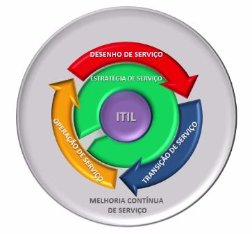

# O Ciclo de Vida dos Serviços de TI

## O que estudaremos neste módulo?

+ Visão macro do ciclo de vida de serviços da ITIL;

+ Introdução aos livros do ciclo de vida do serviço;

+ Apresentação dos processos da ITIL 2011.

## Framework ITIL 

Baseia-se em um ciclo de vida de serviço que contém 5 estágios.

 

+ **Estratégia de Serviço** - Vai relacionar o trabalho com o negócio;

+ **Desenho de Serviço** - Vai construir o serviço;

+ **Transição de Serviço** - Para fazer uma interface entre o desenho e a operação;

+ **Operação de Serviço** - Vai realizar valor para a TI e para o negócio;

+ **Melhoria contínua** - Precisa ser entendida como importante em todos ciclos de vida.

O **ciclo de vida do serviço** é uma apresentação de todas as etapas da ITIL - da concepção até sua evolução. É ele que une as 5 publicações principais do framework (Estratégia de Serviço, Desenho de Serviço, Transição do Serviço, Operação do Serviço e Melhoria Contínua).

 

## Estratégia de Serviço

É o que alinha os objetivos estratégicos de uma organização com a capacidade da TI. Esta publicação nos apresenta o gerenciamento de serviços de TI como ativo estratégico para organizações e como parte do negócio. É por meio da gestão de portfólio, que a estratégia de serviço apoia a seleção, priorização e escolha de oportunidades. Esse processo também orienta a estruturação de processos com base em padrões de atividades de negócio, objetivos, visão e necessidades do negócio. Também apresenta análises de mercado, características gerais de provedores de serviços e noções para implementação da estratégia para o serviço.

Os **Processos** inclusos na publicação da ITIL são:

+ **Gerenciamento estratégico para serviço de TI** - Esse processo é o que busca uma visão holística e busca agregar os outros processos **(não cai na prova)**;

+ **Gerenciamento de portfólio de serviço** - Irá nos apresentar noções, princípios e conceitos para organizar os serviços ao longo de seu ciclo de vida;

+ **Gerenciamento financeiro para serviços de TI** - É um processo muito importante, pois é necessário ter orçamento estabelecido, abrir mão de oportunidades, movimentar recursos e tudo isso passa pelo processo;

+ **Gerenciamento de demanda** - Análise dos padrões e das necessidades do negócio para que ele possa atender aos padrões e demandas do mercado (não cai na prova);

+ **Gerenciamento de relacionamento de negócio** - Nesse processo veremos o executivo de contas, que é o profissional que tem maior contato com o cliente e busca entender as demandas e requisitos desse cliente.

 

## Desenho de Serviço

Depois de determinada estratégia, chegou a hora de desenhar o serviço - que é designar a forma como a estratégia será posta em prática. Se na estratégia analisamos a demanda, agora iremos desenhar os serviços para atender essa demanda. O desenho de serviço não se limita a desenhar novos serviços, mas também manter os serviços já desenhados, alinhando seus processos com a melhoria contínua. Também é no Desenho de Serviço que serão apresentados princípios e técnicas para transformar a visão estratégica do serviço de TI para ativos e portfólios, criando uma documentação consistente que guarde essas técnicas.

Para que isso ocorra existem alguns **Processos**:

+ **Coordenação do desenho** - Esse processo serve para reunir todos os demais processos da área de Desenho de Serviço;

+ **Gerenciamento de nível de serviço** - É onde nós iremos acordar com o cliente o que ele entende como necessário e quais são os níveis de serviço a serem estabelecidos para o negócio;

+ **Gerenciamento do catálogo de serviço** - É como um "menu" de restaurante, no qual existe uma lista de todos os serviços prestados pela empresa que poderão ser requisitados pelo cliente em algum momento;

+ **Gerenciamento de Disponibilidade** - Está relacionado ao uptime, ou tempo de disponibilidade, é o gerenciamento do nível de disponibilidade dos serviços prestados pela empresa;

+ **Gerenciamento de segurança da informação** - É o processo responsável por desenvolver e gerenciar os mecanismos de acesso e proteção das informações da empresa, "quem acessa o quê";

+ **Gerenciamento de fornecedor** - Está diretamente relacionado aos parceiros e outros prestadores de serviços para a empresa, negociações, acordos e contratos com fornecedores passam por esse processo;

+ **Gerenciamento da capacidade** - Será a definição da capacidade do serviço de estar disponível e com ferramentas que possibilitem sua utilização;

+ **Gerenciamento de continuidade dos serviços de TI** - Por fim, o processo do gerenciamento da continuidade busca desenvolver planos de ação para que o serviço mantenha-se disponível em casos de acidentes ou grandes incidentes (blackout, alagamentos, terrorismo...).

 

Iremos estudar as últimas três fases do ciclo de vida e quais são os processos envolvidos em cada uma delas.

## Transição de Serviço
A Transição de Serviço é o que garante a implantação dos serviços respeitando a visão elaborada durante a estratégia e as regras estabelecidas para prestação dos serviços, tais quais os acordos de níveis de serviços. Na transição é quando deve-se alinhar os serviços construídos com os processos da ITIL.

 

### Processos:
Os processos que constituem a fase de Transição de Serviço são sete:

1)**Planejamento e suporte de transição** - É responsável por planejar o esforço de transição e define como ocorrerá essa mudança;

2) **Gerenciamento de mudança** - É o processo pelo qual serão elaborados os fluxos para a gestão da mudança;

3) **Gerenciamento da configuração e ativos de serviço** - É o gerenciamento dos itens presentes na empresa, arquivos, pastas, computadores e softwares;

4) **Gerenciamento de liberação e implantação** - É onde ocorre o esforço de implantação do produto já finalizado;

5) **Validação e teste de serviço** - Esse é o período em que o produto será testado (não cai na prova);

6) **Validação de mudança** - É a confirmação de que as mudanças requisitadas serão feitas(não cai na prova);

7) **Gerenciamento do conhecimento** - Por fim, é o processo que garante o conhecimento relativo ao novo produto.

 

## Operação de Serviço

É o depois: depois de planejado, desenhado e da transição do serviço. **É nesse momento que o valor é entregue**, é na operação do serviço que a central de serviços, por exemplo, vai operacionalizar o atendimento ao usuário. Aqui aprendemos como medir e controlar resultados, alcançar resultados, implementar processos e fazer a gestão operacional de toda a TI. Também é nessa etapa que estruturamos o teatro operacional de forma a atender os requisitos operacionais da organização - clientes internos e externos.

 

### Processos:
1) **Gerenciamento de evento** - É o processo responsável por garantir o monitoramento de tudo aquilo que acontece (eventos) no projeto;

2) **Gerenciamento de incidente** - É o processo que gerencia e resolve a situação em caso de evento não planejado e que deve ser tratado;

3) **Cumprimento de requisições** - Cumprir as requisições é tratar a solicitação de algum serviço feita pelo usuário;

4) **Gerenciamento de problemas** - Aqui é o momento em que deveremos resolver os problemas que surgirem no produto;

5) **Gerenciamento de acesso** - Processo alinhado com a segurança da informação responsável por permitir ou negar o acesso a elas.

 

## Funções que a publicação descreve:
Esta publicação descreve funções, que já estudamos anteriormente:

1) Central de serviços;

2) Gerenciamento técnico;

3) Gerenciamento de operações de TI;

4) Gerenciamento de aplicativos.

 

## Melhoria Contínua de Serviço (MCS)
**Atenção:** MCS deve ser aplicado do princípio ao fim do serviço!

A melhoria de serviço é contínua, ou seja, não termina - a não ser que o serviço seja descontinuado. O livro ajuda a entender como melhorar todos os processos empregados na ITIL e como aumentar o valor entregue pela TI, no geral. Garante o alinhamento das estratégias e da visão da TI para o negócio enquanto os serviços existem. Envolve práticas bem estabelecidas de gerenciamento da qualidade:

### Processo:

1) **Processo de melhoria de sete etapas** - O único processo da MCS, apesar de ser conceitualmente simples, é complexo ao ser colocado em prática. Trabalharemos ele mais a fundo durante o Módulo 8 do nosso curso.

 

## [Exercício] Processos

Aprendemos sobre os processos em ITIL® nas últimas aulas, é muito importante saber que em ITIL® para cada processo pode existir:

- [ ] A) Vários donos de serviço, mas um único dono de processo.

- [ ] B) Vários donos de processo, mas um único dono de serviço.

- [x] C) Um único dono de processo e um único dono de serviço.
  > O papel de dono do processo é responsável por assegurar que o processo é realizado de acordo com um padrão acordado e documentado e que atende aos objetivos do processo definido.

  > Já o Dono de serviço é responsável pela entrega de um serviço especifico. Para o cliente, ele é responsável pela iniciação, transição, manutenção em produção e suporte de um serviço particular.

- [ ] D) Um único dono de processo e vários donos de serviço.

 

## [Exercício] Implementação

Pessoas e Funções podem se combinar em processos. A implementação e o gerenciamento da qualidade dos serviços de TI com o objetivo de atender às necessidades de negócio, é a descrição de:

- [ ] A) Fórum de Gerenciamento de Serviço de TI (FGSti).
  > Alternativa incorreta

- [ ] B) Controle de operações de TI.
  > Alternativa incorreta

- [ ] C) Serviços de TI.
  > Alternativa incorreta

- [x] D) Gerenciamento de serviço de TI (GSTI).
  > Um papel é definido em um processo ou função. Uma pessoa ou equipe pode ter vários papéis, por exemplo, os papéis de gerente da configuração e gerente de mudança podem ser executados por uma única pessoa. E isso define o Gerenciamento de Serviço de TI.

 

## [Exercício] Ciclo de Vida

Framework ITIL baseia-se em um ciclo de vida de serviço que contém 5 estágios. O ciclo de vida do serviço é:

- [ ] A) Um modelo que fornece uma visão dos processos do serviço desde a implementação até o encerramento.

- [ ] B) Um modelo que fornece uma visão dos processos do serviço desde a concepção até sua retirada.

- [x] C) Um modelo que fornece uma visão dos estágios do serviço desde a concepção até sua retirada.
  > O modelo de Ciclo de Vida divide o gerenciamento de serviços de TI em cinco etapas. Para cada etapa há uma publicação da ITIL (um livro) recheado de processos, técnicas, papéis, recomendações, e insights em geral que servem de referência para o mercado a respeito de como gerenciar a tecnologia da informação.

- [ ] D) O que une as 4 publicações principais de ITIL® à Melhoria Contínua de Serviço.

 

## [Exercício] Os Processos

Por meio da gestão de portfólio, a estratégia de serviço apoia a seleção, priorização e escolha de oportunidades. Gerenciamento estratégico para serviços de TI e gerenciamento de portfólio de serviço são processos que compõem:

- [ ] A) Referem-se aos processos do PMBOK®.

- [ ] B) A Melhoria Contínua.

- [ ] C) O Desenho do serviço.

- [ ] D) A Estratégia de Serviço.
  > A estratégia de serviço define a perspectiva, a posição, os planos e os padrões que um provedor de serviço precisa executar para atender aos resultados de negócio de uma organização. A estratégia de serviço inclui os seguintes processos: gerenciamento estratégico para serviços de TI, gerenciamento de portfólio de serviço, gerenciamento financeiro para serviços de TI, gerenciamento de demanda e gerenciamento de relacionamento de negócio. Embora estes processos estejam associados com a estratégia de serviço, a maioria dos processos tem atividades que ocorrem em múltiplas etapas do ciclo de vida do serviço.

 

## [Exercício] Criação de Valor

Como vimos em nossas últimas aulas é verdadeiro para a criação de valor:

- [ ] A) Não envolve entendimento dos objetivos estratégicos.

- [ ] B) O entendimento dos objetivos estratégicos é o primeiro passo. Para isso é importante não deixar que características de provedores internos, implementação da estratégia e ativos de serviço influenciem na qualidade.

- [ ] C) As necessidades do cliente devem se adaptar a criação do valor.

- [x] D) O entendimento dos objetivos estratégicos é o primeiro passo e envolve o entendimento de espaço de mercado, características de provedores internos e externos, ativos e portfólio de serviço e implementação da estratégia.
  > Segundo a ITIL, o valor do serviço não está apenas nos resultados de negócio do cliente, ele também é altamente dependente da percepção pessoal do cliente. Esta percepção é influenciada diretamente pela expectativa que o mesmo cria em relação ao serviço que será prestado.

 

## [Exercício] Coordenação do Desenho

Depois de determinada uma estratégia, chegou a hora de desenhar o serviço - é o "como". Coordenação do desenho e gerenciamento de segurança de informação são processos que compõem:

- [ ] A) A Operação dos Serviços
  > Alternativa incorreta

- [ ] B) A Estratégia de Serviços
  > Alternativa incorreta

- [x] C) O Desenho de Serviços
  > Este é o estágio que irá determinar como o serviço se comportará. Aqui serão desenhados os serviços com a intenção de aumentar a entrega de valor para os clientes.

- [ ] D) A Transição de Serviços

 

## [Exercício] Pacote de Liberação

É nessa parte do ciclo que o planejamento estratégico e o desenho do serviço saem do papel e viram realidade. O estágio do ciclo de vida que constrói o pacote de liberação, testa e implanta um serviço ou mudança no ambiente de produção é conhecido como:

- [ ] A) Nenhuma das alternativas está correta.
  > Alternativa incorreta

- [ ] B) Operação do Serviço
  > Alternativa incorreta

- [ ] C) Desenho do Serviço
  > Alternativa incorreta

- [x] D) Transição de Serviços.
  > Segundo o Glossário ITIL, a Transição de Serviços é uma etapa no ciclo de vida de um serviço. Ela garante que serviços novos, modificados ou obsoletos atendam às expectativas do negócio como documentado nas etapas de estratégia de serviços e desenho de serviços do ciclo de vida. A transição de serviços inclui os seguintes processos: planejamento e suporte da transição, gerenciamento de mudança, gerenciamento de configuração e de ativo de serviços, gerenciamento de liberação e implantação, validação e teste de serviços, avaliação da mudança e gerenciamento de conhecimento. Embora estes processos estejam associados com a transição de serviços, a maioria dos processos tem atividades que ocorrem em múltiplas etapas do ciclo de vida do serviço.

 

## [Exercício] Desenho de Serviços

Se na estratégia analisamos a demanda, agora desenharemos os serviços para atender a demanda. O Desenho de Serviços inclui:

- [x] A) Processos e políticas necessários para realizar a estratégia do provedor de serviço em processos novos e na proposição de melhorias em processos e desenhos já existentes aprimorando a geração de valor aos clientes
  > Correto. O escopo deste estágio além de novos serviços, inclui também mudanças e melhorias em processos já existentes nesta etapa de desenho de serviços para aumentar ou manter o valor gerado aos clientes.

- [ ] B) Processos e políticas que facilitem a introdução de serviços nos ambientes suportados.
  > Alternativa incorreta. O escopo deste estágio não está limitado por ambientes suportados.Inclui também novos processos, mudanças e melhorias em processos já existentes nesta etapa de desenho de serviços para aumentar ou manter o valor gerado aos clientes.

- [ ] C) Normativos e instruções de trabalho de projetos.
  > Alternativa incorreta. O escopo deste estágio não está limitado a trabalho de projetos. Inclui também novos processos, mudanças e melhorias em processos já existentes nesta etapa de desenho de serviços para aumentar ou manter o valor gerado aos clientes.

- [ ] D) Processos e políticas necessários para realizar a estratégia do provedor de serviço em novos processos, sem se preocupar neste momento com melhorias em processos pré-existentes para gerar valor aos clientes
  > Alternativa incorreta.O escopo deste estágio não está limitado a novos serviços. Inclui também mudanças e melhorias em processos já existentes nesta etapa de desenho de serviços para aumentar ou manter o valor gerado aos clientes.

 

## [Exercício] Central de Serviços

Estudamos a central de serviços e sabemos que é parte importante da organização. É verdadeiro para uma central de serviços:

- [ ] A) É estudada na publicação Operação de Serviços.
  > Alternativa incorreta

- [x] B) É responsável por gerenciar incidentes, requisições de serviços e também a comunicação com os usuários. E, é estudada na publicação - Operação de Serviços.
  > O ponto único de contato entre o provedor de serviços e os usuários. Uma central de serviços típica gerencia incidentes, requisições de serviços e também a comunicação com os usuários.

- [ ] C) É responsável por gerenciar incidentes, requisições de serviços e também a comunicação com os usuários.
  > Alternativa incorreta

- [ ] D) É estudada na publicação Transição de Serviços.
  > Alternativa incorreta

 

## [Exercício] Melhoria Contínua de Serviço

O ciclo de vida dos serviços é uma apresentação de todas as etapas da ITIL. Qual das seguintes afirmações é verdadeira para Melhoria Contínua de Serviços?

- [ ] A) Representa o início do ciclo de vida do serviços, portanto, a primeira atividade a ser realizada.
  > Alternativa incorreta

- [ ] B) Precisa estar integrada apenas como estágio Desenho de Serviços, sendo que representa os princípios norteadores do gerenciamento da qualidade.
  > Alternativa incorreta

- [ ] C) Não precisa estar integrada com os demais estágios, pois representa o final do ciclo de vida do serviços.
  > Alternativa incorreta

- [ ] D) Deve estar integrada com os demais estágios, não sendo, portanto, vista como o final do ciclo de vida de serviços. 
  > A MCS é uma etapa no ciclo de vida de um serviço. Ela garante que os serviços estejam sempre alinhados com as necessidades do negócio em mudança, por meio da identificação e da implementação de melhorias para os serviços de TI que suportam os processos de negócios.

 

## [Exercício] Objetivos

A Melhoria Contínua de Serviços precisa ser entendida como importante em todos ciclos de vida. E um dos objetivos da Melhoria Contínua de Serviços é:

- [ ] A) Assegurar que os projetos da organização estejam alinhados com o portfólio de serviços.
  > Alternativa incorreta

- [ ] B) Assegurar que as necessidades de negócios estejam alinhadas com os serviços.
  > Alternativa incorreta

- [ ] C) Assegurar que os projetos da organização estejam alinhados com as necessidades do negócio.
  > Alternativa incorreta

- [x] D) Empregar o processo de melhoria em 7 etapas.
  > Segundo as publicações da ITIL, o processo de melhoria em 7 etapas é o único processo da Melhoria Contínua de Serviços. Por isso, é de suma importância para se gerenciar um serviço por meio da melhoria contínua.

 

## [Exercício] Verdadeiro ou Falso

O ciclo de vida dos serviços é uma apresentação de todas as etapas da ITIL - da concepção até sua evolução. O que não é verdadeiro sobre Melhoria Contínua de Serviços?

- [ ] A) É uma publicação que oferece diretrizes sobre como obter melhorias incrementais e melhorias em grande escala na qualidade dos serviços.
  > Alternativa incorreta

- [ ] B) Assegura que os serviços estejam alinhados com as necessidades do negócio.
  > Alternativa incorreta

- [ ] C) Faz parte das etapas no ciclo de vida de serviços.
  > Alternativa incorreta

- [x] D) É um conjunto de duas publicações, incluídas no ciclo de vida de serviços, fornecem orientação sobre como alcançar melhorias incrementais e em grande escala na qualidade de serviços.
  > A MCS é apenas uma publicação, bem curta na verdade - se comparada as demais publicações da ITIL.