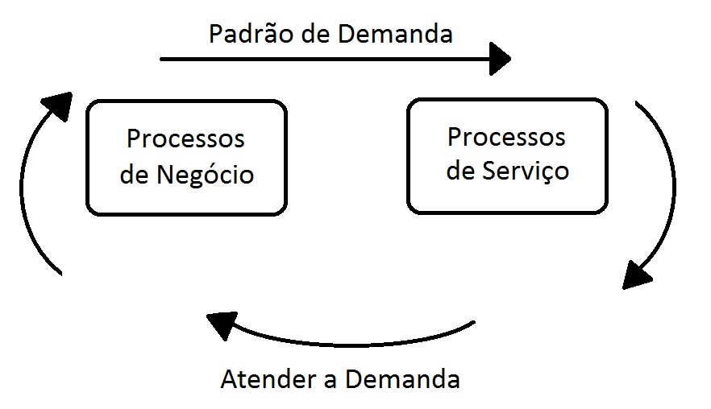

## Estratégia de Serviço

 

## Introdução a Estratégia de Serviço

O que será estudado neste módulo?

+ **Propósito, conceitos gerais e o valor da estratégia de serviço**: Ou seja, vamos entender porque é importante para o negócio estudar e aplicar os processos da área de estratégia de serviços;

+ **Conceitos e princípios principais**; Vamos conhecer os **processos da Prova de certificação ITIL Foundation** e olhar com maior profundidade o gerenciamento do portfólio de serviços, o gerenciamento financeiro da TI e o gerenciamento do relacionamento com o negócio;

+ **Ferramentas para estratégia de serviços**: A estratégia de serviço oferece uma **abordagem** desde uma perspectiva holística e estratégica para a organização.

Os serviços de TI devem ser entendidos como parte de algo maior, que é o negócio, a organização em si. Consequentemente, precisamos ter a capacidade de analisar o todo, devemos ter a chamada **visão holística**.

Para entregar um produto de qualidade é preciso aprender o que é necessidade para o **Cliente** e como o serviço pode **entregar valor** para ele. Mas não só isso, precisamos entender como a própria **equipe de TI da empresa deve estar alinhada para que a empresa**, como um todo, consiga criar um produto de tecnologia da informação que agregue valor para si mesma e para o cliente.

 

## Objetivos da Estratégia de Serviço

+ **Compreender o fluxo de valor da organização de ponta a ponta**, como a organização transforma o esforço de todos os funcionários da empresa em capital;

+ **Alinhamento estratégico entre TI e negócio**, como a área na qual trabalhamos pode auxiliar no crescimento da empresa;

+ **Entendimento e definição dos serviços a serem utilizados pelos clientes internos e externos - além da base instalada**;

+ **Organizar a TI para aproveitar oportunidades de negócios**, ou seja, estar preparado e saber analisar o negócio internamente e externamente;

+ **Alinhamento para além do valor de negócio** - estruturação financeira para serviços novos e existentes;

+ **Permitir alinhamento entre serviços, ativos e o negócio**;

+ Garantir, por meio de processos, **a realização do trabalho necessário para entregar os resultados ao negócio por meio da TI**.

 

## Aspectos da Estratégia de Serviço

1. Estabelecer uma estratégia para entrega de serviços ou Service Delivery. Nessa etapa algumas perguntas devem ser feitas, por exemplo: Como **entregar** o que o cliente precisa? **Do que** o cliente precisa? Estes são conceitos que devemos ter em mente para gerenciar entregas de serviço;

2. Definir uma estratégia para o gerenciamento de serviços. Nesse caso, deve-se perguntar: Qual é o plano de jogo? O planejamento estratégico da TI é feito por profissionais da área e realizado em razão do negócio e do que é valor para o negócio.

 

## Práticas para Estratégia de Serviço - Adoção e Implementação

+ **Colocar a TI como fator crítico de sucesso e acompanhar seu desenvolvimento**. A TI deve ser peça fundamental nas engrenagens que fazem o negócio andar;

+ **Adaptação rápida a mudanças no ambiente operacional e de negócios**. Devemos ter bom controle orçamentário, uma priorização dos serviços, um plano de jogo, um planejamento estratégico para o ano de trabalho e tudo isso para conseguir aproveitar as oportunidades e nos adaptar as mudanças do mercado;

+ **Dar condições para provedores compreenderem o que precisa ser atendido**. Para que possam, então, atender estas necessidades na forma de serviços de TI;

+ **Melhorar a capacidade comunicacional de todos os atores envolvidos no sucesso do negócio**. O que facilita o fluxo de informações entre o setor de TI e o setor de negócio;

+ **Gerenciar oportunidades e ameaças** de forma a estabelecer procedimentos para gestão de portfólio. Organizando todos os serviços que devem ser concluídos em prol da melhoria dos processos da organização.

 

## Valor

**Entregar valor** significa fazer uma entrega com qualidade, isto é, atendendo as expectativas e requisitos dos negócios estipulados pelo cliente. Para atender as expectativas é necessário conhecer os requisitos do negócio e o próprio cliente, isso deve ser feito por meio de estratégia de serviço.

O valor de serviço também está relacionado à capacidade de empoderar o cliente. Ao permitir que o cliente participe da construção do serviço e contribua com suas próprias expectativas, fazemos com que ele auxilie a entregar valor, como se ele próprio fosse uma ferramenta. Ao realizar uma entrega estamos criando valor também para a empresa, uma vez que uma entrega bem feita gera lucro para a organização e esse lucro traduz-se no próprio valor.

## Principais características do Serviço:

+ Valor só pode ser definido pelo cliente, pois é construído em cima dos requisitos trazidos por ele;

+ O cliente vai compor o quadro de serviços a partir das condições de manter esses serviços, ou seja, irá buscar os serviços de que carece em sua empresa;

+ O cliente entende valor a partir dos serviços que colaboram para que atinja objetivos específicos. O cliente só enxerga valor nos serviços oferecidos por uma empresa se eles capacitarem o cliente a atingir os resultados que busca;

+ Valores podem mudar de acordo com fatores de sucesso do negócio e com os fatores do mercado, por isso é preciso manter o contato frequente com o cliente.

> Para o cliente, serviços são soluções, não apenas a tecnologia em si.

 

## Medindo o Valor
Para medirmos o valor percebido pelo cliente, isto é, o que ele deseja ou não, devemos:

+ **Definir o cliente**;

+ **Definir o negócio do cliente** e o papel da TI para o funcionamento desse negócio;

+ Definir quais **soluções são essenciais** para o cliente e priorizar o que trará mais valor ao negócio;

+ Definir uma **relação custo/benefício** para as soluções de TI frente ao negócio, isso faz parte do que vemos em ITIL: como integrar a TI ao negócio;

+ **Estabelecer indicadores**, dados, gráficos e avaliações, a fim de acompanhar o rendimento das entregas e a satisfação do cliente.

> Para determinar o valor de serviço devemos analisar os resultados dos negócios, as preferências e percepções dos clientes.

 

## Criando Valor para o Serviço
Para criar valor para um serviço devemos estabelecer a **utilidade**, ou seja, a funcionalidade e o estar apto para o propósito. Somamos isso à garantia , que é confiança e entrega do serviço, o estar apto para o uso, que juntos devem resultar no valor do serviço. O cliente busca, na construção do serviço, uma ferramenta que ele necessite para manter e/ou expandir seus negócios, portanto, uma entrega só irá representar valor para ele, se esta for uma ferramenta que esteja funcionando bem - garantia - e que efetivamente atinja os objetivos do cliente - utilidade. Valor, para o cliente, é a capacidades de, por meio do serviço, alcançar seus objetivos.

 

Para criar valor em forma de bens ou serviços uma organização precisa de ativos. Consideram-se ativos os recursos ou habilidades que entreguem valor em forma de bens ou serviços.

## Recursos
Os recursos são: capital financeiro, infraestrutura, software, dados gerados e pessoas. É importante entender que **sem recursos não há serviços!** Mas, os recursos são mais fáceis de adquirir-se que as habilidades.

## Habilidades
As habilidades são: gestão de projetos, gestão de serviços, processos, ativos de processos, conhecimento e tudo que se possa utilizar para transformar recursos em valor. As habilidades são intangíveis e de menor oferta no mercado.

Uma **demanda** por serviço é **gerada** sempre em relação a uma atividade. Independentemente de qual seja, essas atividades são realizadas pelos **ativos de clientes**, que são os recursos e habilidades. Então, como se fosse uma grande esteira rolante, em uma ponta estão os **ativos de clientes**, que criam a demanda para os **ativos de serviço** que, por sua vez, respondem com novas ofertas. Esse ciclo em movimento é o padrão de atividade do negócio.

## Itens documentados no PAN:
O que é documentado em um Padrão de Atividade de Negócio - PAN?

O Pan gera um conjunto de documentos e informações que se deslocam da estratégia de serviço em direção ao time de desenho de serviço. Esta equipe transforma o padrão de serviço em algo para ser implementado, portanto, a semente inicia-se no PAN, que contem:

+ Classificação: PAN comercial;
+ Atributos: quando e com que frequência ocorre, qual tipo de evento, dados gerais sobre o evento;
+ Requisitos: desempenho, capacidade, nível de serviço, etc;
+ Requisitos para os ativos de serviço: nesse PAN, quem faz o que e como se aplica cada ativo?

 

Vamos aprofundar nosso conhecimento sobre o **PAN - Padrão de Atividade de Negócio**. Decidimos retomar a explicação utilizando também desenhos.

Vamos retomar um exemplo anteriormente mencionado, o evento Black Friday como necessidade do negócio. Este evento aumenta a necessidade da organização de suportar certos serviços. A partir dos anúncios e do investimento em mídia, vamos ter mais pessoas acessando o site da empresa, pessoas comentando os anúncios em redes sociais e pessoas em busca de contato comercial. Tudo isso forma os **Processos de Negócio** que representam um **padrão de demanda**. No caso da Black Friday, para atender esta demanda é preciso correlacioná-la com os **processos de serviço** como o gerenciamento de incidentes, gerenciamento de requisição serviços,etc. Assim, conseguiremos **atender a demanda** enquanto ela existir.

 

## Conceitos do PAN
Conceitos importantes do Padrão de Atividade de Negócio:

+ Processos de Negócio;
+ Processos da TI;
+ Itens de configuração/Ativos;
+ Perfis:
+ Vendedor;
+ Mídia;
+ Níveis de Serviço (SLA).

 

## Gerenciamento de Risco

O risco é algo que pode ocorrer, é uma incerteza que podemos quantificar e que pode ter impactos positivos ou negativos no serviço ou projeto. No ITIL o risco é calculado pela seguinte fórmula:

> Risco = P (probabilidade de ocorrência) x V (vulnerabilidade)

Os riscos são calculados em ativos, justamente para que seja possível quantificar os riscos existentes para cada ativo empregado nos serviços do cliente. Buscaremos analisar os riscos a partir dos **ativos**, das **ameaças** e da **vulnerabilidade**, assim, criaremos uma lista de riscos a serem trabalhados e buscaremos encontrar respostas para eles. O esquema abaixo exemplifica a forma que utilizamos para identificar e lidar com os riscos:

## Fatores nos Riscos
Ao lidar com riscos devemos levar em conta dois fatores:

+ **Avaliação de riscos**: é o procedimento de identificar riscos, fazer a quantificação de suas probabilidades de ocorrência e também mensurar seus impactos. É também planejar respostas a eles.

+ **Gerenciamento de riscos**: consiste em monitorar, controlar, aplicar respostas planejadas e mobilizar recursos para garantir que as respostas programadas funcionem. Outra tarefa é armazenar resultados e identificar riscos constantemente.

 

## [Exercício] Valor de Serviço

Vamos revisar o que vimos no curso? Entregar valor significa fazer uma entrega com qualidade. O que é verdadeiro para o valor de serviço?

- [ ] A) O cliente mede o valor de serviço de acordo com o custo que este representa para a organização.

- [x] B) O valor de serviço pode ser considerado o nível no qual o serviço atende às expectativas do cliente.
  > Através do glossário ITIL o termo Valor do Serviço é uma medida do custo total da entrega de um serviço de TI e o valor total para o negócio daquele serviço de TI. A valoração de serviço é usada para ajudar o negócio e o provedor de serviço de TI a concordar com o valor do serviço de TI. ITIL compõe grande parte do COBIT.

- [ ] C) O cliente não exerce influência na definição do valor de serviço.

- [ ] D) Apenas o provedor de serviço de TI é capaz de definir o valor de serviço.

 

## [Exercício] Funcionalidade

Entregar valor significa atender as expectativas e os requisitos dos negócios. A funcionalidade oferecida por um produto ou serviço para atender a uma necessidade específica, é a definição de:

- [ ] A) Garantia

- [x] B) Utilidade
  > Em definição geral, o termo Utilidade pode ser resumido como “o que o serviço faz”. Pode ser usada para determinar se um serviço é capaz de atender aos seus resultados requeridos ou se é “adequado ao propósito”. O valor de negócio de um serviço de TI é criado por uma combinação de utilidade e garantia.

- [ ] C) Serviço

- [ ] D) Função

 

## [Exercício] Garantia

Para criarmos valor para um serviço devemos estabelecer a utilidade dele, isso somado à garantia resultará no valor do serviço. Qual das seguintes afirmações melhor descreve garantia?

- [ ] A) É a confiança de que apenas produtos poderão atender aos requisitos pactuados.

- [x] B) É a confiança de que um produto ou serviço atenderá aos requisitos pactuados.
  > A garantia pode ser resumida em "como o serviço é entregue" e pode ser usada para determinar se um serviço é "adequado ao uso". O valor de negócio de um serviço de TI é criado por uma combinação de utilidade e garantia.

- [ ] C) É a confiança de que apenas serviços poderão atender aos requisitos pactuados.

- [ ] D) Isso pode ser feio por meio de um acordo formal, como um acordo de nível de serviço ou contrato, ou pode ser uma mensagem de marketing ou imagem de uma marca.

 

## [Exercício] Ativos

Prepare-se para mais um quizz baseado nas aulas do professor Frederico! Para criar valor em forma de bens ou serviços, uma organização precisa de ativos. Ativos de serviço podem ser:

- [ ] A) Apenas habilidades

- [x] B) Recursos ou habilidades.
  > Ativos podem ser qualquer um dos seguintes tipos: gerência, organização, processo, conhecimento, pessoas, informações, aplicativos, infraestrutura e capital financeiro.

- [ ] C) Apenas recursos

 

## [Exercício] Controlar os Riscos

Que tal falarmos em riscos? O risco é algo que pode ocorrer, uma incerteza que podemos quantificar, e que pode ter impactos positivos ou negativos no serviço ou projeto. O processo responsável por identificar, avaliar e controlar os riscos é:

- [ ] A) Avaliação dos riscos.

- [x] B) Gerenciamento de riscos.
  > Gerenciamento de Risco é o processo responsável pela identificação, avaliação e controle de riscos. O termo gerenciamento de risco é utilizado também para se referir à segunda parte do processo geral, quando após os riscos terem sido identificados e avaliados, são gerenciados, como em "avaliação e gerenciamento de risco".

- [ ] C) Realizar a análise qualitativa dos riscos.

- [ ] D) Definição dos riscos do serviço.