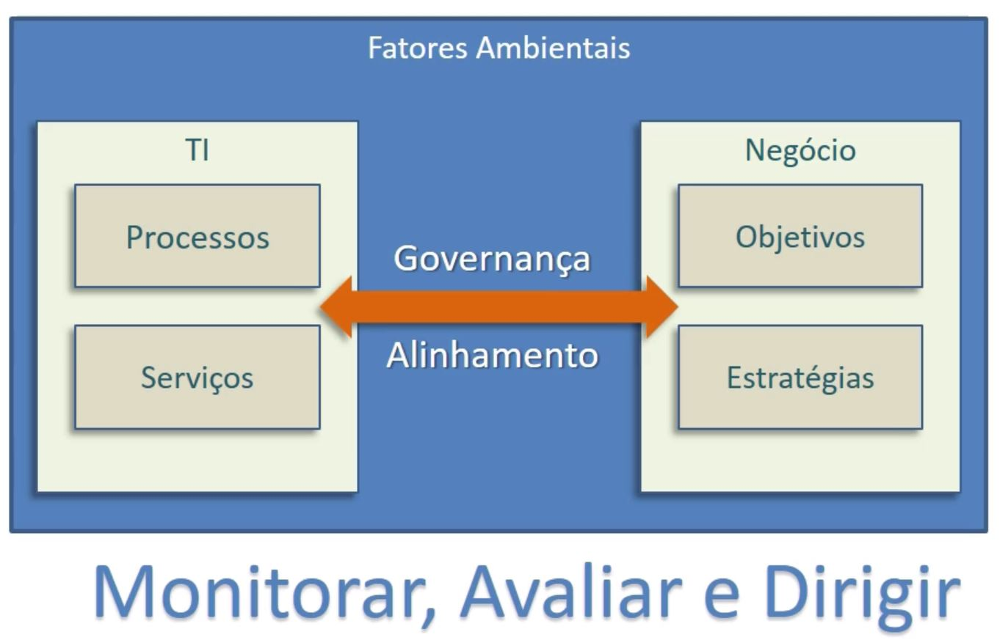

## Governança

Como garantir que investimentos em serviços de TI realmente tragam valor para o negócio?

**Definição de Governança:** *"Garantir que políticas e estratégias sejam realmente implementadas e que os processos requeridos estejam sendo corretamente seguidos. Governança inclui definir papéis e responsabilidades, medir e relatar, e tomar as ações para resolver quaisquer questões identificadas."*

Na prática, governança é colocar-se acima da TI e também acima dos Negócios. É preciso entender a governança como uma área de departamento, uma parte da organização que ajuda a empresa a encontrar o melhor caminho para seguir. É um setor que organizará as diferentes áreas do negócio, de maneira geral, como a TI, a área comercial, o atendimento, etc e que determina as prioridades para cada uma destas áreas utilizando sempre uma perspectiva holística.

É preciso considerar que a governança leva em conta fatores ambientais, ou seja, onde a empresa se situa, o mercado que ela atinge, os riscos relacionados as oportunidades e as ameaças. E também alinha os **processos e serviços** da TI com **objetivos e estratégias** do Negócio.

 

O livro **Estratégia de Serviço da ITIL**, edição de 2011, apresenta cinco processos componentes da estratégia. Porém, **Gerenciamento estratégico para serviços de TI** e **Gerenciamento da Demanda** não fazem parte do escopo do exame ITIL Foundation, por isso, veremos profundamente somente três.

 

## Processos da Estratégia de Serviço da ITIL, edição de 2011, para o exame ITIL Foundation:

+ Gerenciamento de portfólio de serviço;
+ Gerenciamento financeiro para serviço de TI;
+ Gerenciamento de relacionamento de negócio.

 

## Processo Gerenciamento de Portfólio de Serviço

**Propósitos do processo:**

Ao trabalharmos com o processo de Gerenciamento de Portfólio de Serviço devemos elencar como principais propósitos desse processo o seguinte: 1) garantir que o provedor de serviços ofereça todos os serviços necessários para que o cliente atinja seus objetivos; 2) garantir que os serviços estejam gerando valor para o cliente e pensar no porquê da existência de cada serviço; 3) acompanhar os serviços desde sua criação até seu descontinuamento e guiando-se segundo sua necessidade frente ao negócio e realinhamento estratégico contínuo.

### Objetivos:

+ Oferecer uma forma das empresas selecionarem serviços e definirem investimentos a partir da aplicação de modelos econômicos, avaliação de riscos e impactos no negócio;

+ Gerenciar o portfólio de serviços ativos, descontinuados e novos serviços;

+ Possibilitar a tomada de decisão frente a serviços e sua capacidade (ou não) de atender necessidades do negócio;

+ Controlar e acompanhar o aspecto financeiro dos serviços em todo seu ciclo de vida, do nascimento até sua descontinuação.

 

## Escopo do Processo

+ Criação de valor: **provedores de serviços internos** devem entregar valor para unidades internas e seus resultados serão vinculados a essas unidades.

+ Preocupação primária com a criação de valor: **provedores de serviços externos** definem e entregam valor a partir dos serviços providos diretamente para seus clientes.

+ Avaliação contínua dos serviços: pensar o que segue válido, o que é necessário e o que não entrega mais valor.

> Lembrando que o Portfólio de serviço é um conjunto completo de serviços que são gerenciados por um provedor de serviços.

 

### O portfólio de serviço

Ele é utilizado para gerenciar o ciclo de vida completo de todos os serviços e inclui:

+ **Funil de Serviço**, envolve os novos serviços e os que estão sendo desenvolvidos.

+ **Catálogo de Serviço**, tem relação com os serviços prontos para a implementação e também os serviços operacionais.

+ **Serviços Obsoletos**, são os que já não estão mais vivos.

A imagem a seguir exemplifica a estrutura desse sistema - do portfólio de serviço - comentado anteriormente:

 

## Processos da Estratégia de Serviço

### Propósitos:

+ **Garantir que a TI tenha dinheiro suficiente para atender as necessidades do negócio por meio de serviços**, isto é, que possa cobrir o ciclo de vida integralmente. A equipe de TI não tem como continuar a entregar o mesmo resultado se tiver seu orçamento retirado ou cortado pela metade;

+ **Balancear o custo e o valor gerado**. Garantir a relação custo/benefício;

+ **Administrar a entrega de serviços sob a perspectiva financeira**: não é preciso gastar milhões em capacidade de tráfego o ano inteiro se a demanda é sazonal, ou seja, só ocorre em certas épocas.

 

### Objetivos:
+ Estruturar o gerenciamento financeiro para os serviços de TI. Isso nos ajuda a organizar toda a equipe de TI junto com os processos;

+ Apoiar estratégias sob a ótica financeira por meio de modelos econômicos. Modelos como o ROI, Payback, Taxa Interna de Retorno e mais;

+ Administrar ativos para garantir o sucesso da organização provedora. Por exemplo, não vale a pena investir em um servidor próprio quando poderiamos utilizar um serviço de nuvem;

+ Gerenciamento financeiro de ponta-a-ponta: quem gastou, quando gastou, o que é custo, o que é despesa, etc;

+ Criar e executar políticas financeiras: Como gerir o orçamento da TI? Quando comprar? Quando vender? Onde aplicar? Estas políticas financeiras estão relacionadas a organização e vão direcionar a TI quanto aos aspectos financeiros dos serviços de TI;

+ Gerenciar financeiramente cada serviço: é preciso ter um portfólio de serviços que conste todos os serviços e atividades financeiras da empresa. Dessa forma poderemos acompanhar mensalmente tudo o que está sendo gasto e, assim, organizar estrategicamente estes serviços;

+ Orçamentação dos serviços de TI - Qual é o budget da TI para o próximo ano? Para a próxima competência? Analisando o orçamento, podemos determinar quanto teremos para gastar e a partir da determinação, faremos a priorização;

+ Para provedores externos, auxilia a determinar políticas de faturamento, cobrança e gestão financeira de clientes. Quando oferecemos o serviço de TI para o mercado, devemos ter uma estrutura que determine como faremos para cobrar pelos serviços prestados ao cliente, como faremos o faturamento, como administraremos o dinheiro que está entrando, como vamos pagar os custos da nossa própria empresa, etc.

 

## Escopo do processo

+ **Planejamento orçamentário** é responsável, como o próprio nome diz, por planejar e controlar os gastos, que são as despesas e custos no geral. É dependente de uma boa comunicação interna, de reuniões e do alinhamento adequado entre a TI e o negócio. O orçamento deve refletir investimentos voltados para o sucesso da organização e para satisfação de seus clientes.

+ **Contabilidade** é o registro de patrimônio, das entradas, das saídas e das consequências relacionadas a eventos de natureza econômica e financeira. Esta etapa do processo deve ser realizada por um profissional da área de contabilidade, ligado as finanças.

+ **Cobrança:** dentro do ITIL, dependendo do tipo de provedor, é importante que exista uma estrutura financeira de apoio e também preços e controles para clientes e usuários de mercado. Mesmo no caso de clientes internos, é importante registrar entradas e saídas. A nota de serviço interna é comum em muitas empresas, neste exemplo estamos considerando empresas grandes e maduras no mercado de trabalho. E, nestas situações, é importante que haja o registro, pois as entregas de valor feitas pela equipe de TI geralmente ultrapassam o valor que elas custaram para a empresa.

> Gerenciar serviços de TI não é apenas pensar no aspecto técnico, mas também se ter visão holística.