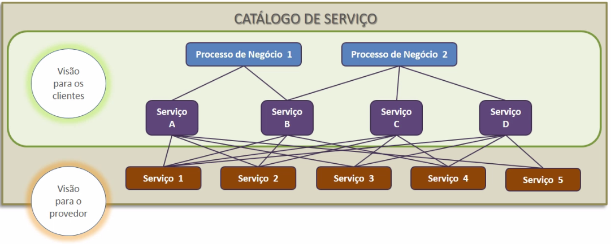

# Propósito do Estágio

Neste módulo vamos estudar o **propósito do estágio** e os objetivos e benefícios do Desenho de Serviço. Também abordaremos os **conceitos e princípios fundamentais do Desenho de Serviço e estudaremos processos envolvidos nele** . Todos caem na prova de certificação da ITIL Foundation.

## Propósitos do Desenho de Serviço

+ Desenhar serviços e políticas de TI requeridas para realizar a estratégia estabelecida para a organização. Como já estudado, uma empresa pode ter picos de vendas que devem ser divididos em serviços, que são desenhados nesta etapa do processo;

+ Permitir uma boa implementação e implantação dos serviços desenhados, a ideia é que o serviço seja desenhado e construído de forma que a única coisa que falte em um estágio posterior é a sua implantação;

+ Satisfazer as necessidades do cliente, dos usuários e atender a capacidade financeira do cliente. Este desenho deve ser feito levando em conta os aspectos financeiros elencados na etapa de **estratégia de serviço de gerenciamento financeiro da TI**, estudada anteriormente.

## Objetivo do Desenho de Serviço

Desenhar serviços de TI que **atendam as necessidades dos clientes** e usuários de forma a garantir **pouca ou nenhuma necessidade de mudanças após implementação**, salvo em casos de melhoria contínua. Para isso, é muito importante entendermos o que o cliente precisa, para podermos desenhar um plano de serviço completo e que não precise de conserto. **Não podemos utilizar o plano de melhoria contínua como desculpa para um serviço falho e incompleto.**

Também faz parte do escopo do Desenho de Serviço as práticas estabelecidas no mercado para melhorarem resultados, pois elas vão auxiliar a oferecer os melhores resultados aos clientes, tanto internos quanto externos. É importante que todos os serviços que produzirmos entreguem valor tanto para o negócio e quanto para nossos clientes.

> Com o desenho de serviço é possível entregar as soluções que o negócio requer com a finalidade de atingir sucesso nas operações.

## Benefícios do Desenho de Serviço

+ **Reduzir o custo total de propriedade**. Quando desenhamos um serviço, é preciso pensar em quanto tempo precisamos de internet, por exemplo, o dia inteiro, somente um turno ou somente por alguns dias da semana? E mais, qual é o consumo de energia elétrica dos computadores da empresa? Quanto espaço precisamos para comportar toda a equipe de trabalho? Tudo isso são custos e que podem ser diminuídos com um bom Desenho de Serviço;

+ **Ampliar a qualidade do serviço**. Ao estudar as necessidades do negócio podemos criar mais valor para nosso serviço por meio da aplicação dos processos que aprenderemos ao longo do curso;

+ **Melhorar a entrega do serviço**. Podemos, ao organizar nossos recursos e soluções, entregar mais serviços. Assim, reduzimos o custo, ampliamos a qualidade e entregamos o serviço com maior valor para o cliente;

+ **Reduzir o esforço de transição de serviços novos e alterados**. Sempre que algum processo precisa ser alterado ou refeito, temos que voltar para o desenho de serviço. Então, se conseguirmos evitar isso ao máximo acabamos entregando um serviço de maior qualidade para nossos clientes;

+ **Melhorar a eficiência e eficácia da TI**, onde: Eficiência é utilizar a capacidade máxima produtiva disponível na empresa e eficácia consiste na entrega de resultados.

+ **Garantir um bom alinhamento entre TI e Negócio**, quanto mais pensarmos em melhorar o negócio, mas damos valor para a TI.

 

A seguir será abordado os conceitos mais importantes ao falarmos de "Desenho de Serviço". Também estudaremos os **quatro Ps** que precisam ser considerados para um bom desenho de serviço, são eles: **Pessoas, Processos, Produtos e Parceiros.** Vamos entender o que é a "visão holística" e como ela deve ser desenvolvida ao olharmos para o processo como um todo. Lembrando que a visão holística consiste em sair do "micro" e olhar e entender o "macro" para depois voltar a olhar o "micro".

 

## Pessoas

O primeiro P refere-se a pessoas, pois, sem uma equipe, isto é, sem pessoas, é impossível colocar todo o resto em prática. As pessoas serão vinculadas aos produtos e processos.

 

## Produtos

Os produtos são as máquinas, as linhas de comunicação e os softwares e estão diretamente ligados às pessoas, pois as equipes trabalham e necessitam dos produtos para a formação dos processos.

 

## Parceiros

Além das pessoas que trabalham também faz-se necessário estabelecer parceiros, que são os fornecedores. Por exemplo, desde o contrato de softwares de serviço até os serviços de internet, enfim, todo o tipo de apoio externo que é necessário para o desenvolvimento do serviço.

 

## Processos

Os processos são uma parte essencial do desenho de serviço, pois, com o domínio deles podemos otimizar produtos e parceiros para entregarmos mais resultado aos clientes.

 

## 5 Aspectos do Desenho de Serviço

Uma abordagem integrada para as atividades de desenho de serviço deve ser adotada. Dessa forma, deve-se cobrir de maneira holística o desenho a fim de integrar pessoas, processos, produtos e parceiros com os demais elementos que constituem o negócio. Portanto, os cinco aspectos do Desenho de Serviço são:

1. **Soluções** que considerem os requisitos do negócio, os recursos, as habilidades e o que for necessário para o sucesso da operação.

2. **Arquiteturas de TI e de Serviços** para garantir que todo novo serviço necessário possa ser desenhado.

3. **Sistemas de informação de gerenciamento e ferramentas**, principalmente, o portfólio de serviços com o qual será feita uma seleção dos serviços.

4. **Processos** que capacitem o time a desenhar novos serviços os quais serão catalogados a partir de uma perspectiva holística.

5. **Ferramentas de Acompanhamento** que possibilitem a equipe a acompanhar os serviços atuais e também a infraestrutura de TI.

 

## Pacote de desenho de serviço (PDS)

Segundo o glossário ITIL o pacote de desenho de serviço "é um documento ou conjunto de documentos que definem todos os aspectos de um serviço e orientam tudo que deve ser feito quanto ao serviço ao longo de todos os estágios do ciclo de vida do mesmo."

O **Pacote de Desenho de Serviço** - PDS é obrigatoriamente elaborado no ciclo de vida do desenho de serviço para cada novo serviço, mudança ou descontinuação do serviço. Por exemplo, ao montarmos uma planilha do Excel com uma lista de serviços que são oferecidos aos clientes deveremos incluir, para cada item da lista, um pacote de serviço vinculado. Isso se dá pela necessidade, em caso de modificação nos serviços prestados, de garantir que as modificações sejam benéficas.

O PDS vai do **desenho de serviço** para a **transcrição de serviço** e, por fim, para a **operação**. Ele contém detalhes importantes para manter-se em contínua melhoria. É no manual operacional do serviço que encontraremos desde critérios para mudanças, até razões pelas quais elas ocorrem. Além disso, o conteúdo do PDS pode incluir **requisitos de negócio, requisitos de segurança do serviço, requisitos para fins de auditoria, requisitos operacionais, Requisitos de interface, detalhamento da operação do serviço, detalhamento da transcrição do serviço e o detalhamento da melhoria contínua**.

## Processos do Desenho de Serviço da ITIL 

O primeiro processo que veremos é o de **Coordenação de desenho**, ele serve para unir todos os outros processos e permitir que o time consiga integrar os outros processos da área. Também estudaremos o **gerenciamento do catálogo de serviço** que é o manejamento desse menu de serviços oferecidos aos clientes.

O **nível de serviço** e seu gerenciamento é mais um processo do desenho de serviço, por meio dele serão verificados os níveis considerados normais para o serviço.

O **Gerenciamento da capacidade** é o processo que vai permitir o controle dos meios necessários para a produção, como ter o número de computadores necessários para que os membros da equipe possam trabalhar.

A **coordenação de disponibilidade** determina fatores como o tempo que um site fica no ar ou qual a necessidade de energia elétrica para realizar "X" operação.

Veremos também o processo **gerenciamento de segurança da informação** e seus aspectos mais importantes, como a confidencialidade e permissões de acesso.

Mais um processo presente no PDS é o de **gerenciamento de continuidade de serviço de TI** responsável por impedir a interrupção da prestação dos serviços, e por último, temos o **gerenciamento de fornecedor**.

## Coordenação de Desenho 

### Propósitos:
+ Garantir que os objetivos do desenho de serviço, conforme estabelecidos para a organização, sejam atingidos. Iremos desenhar e coordenar serviços e a partir disso organizar o esforço necessário para colocá-los em prática levando em consideração os fatores ambientais da empresa e suas especificidades.

+ É com esse processo que todos os demais processos irão se unificar e alinhar, garantindo a aplicação adequada dos processos necessários para desenhar cada serviço.

 

### Objetivos:
+ Garantir o desenho adequado de serviços considerando os 4Ps(pessoas, produtos, parceiros e processos), considerando os aspectos do desenho de serviço e o alinhamento das arquiteturas junto dos demais processos.

+ Coordenar todas as atividades de desenho de serviços, desde novos serviços até aqueles que precisam de melhorias e/ou mudanças.

+ Planejar e coordenar os recursos e habilidades necessárias para desenhar serviços novos, modificados, em descontinuação e/ou melhorados.

+ Elaborar pacotes de desenho do serviço (PDSs) de acordo com as políticas de cada organização.

+ Garantir que tudo o que for desenhado seja feito de acordo com as políticas para transição e para operação de serviços. Além de desenhar novos serviço é preciso que eles estejam em alinhamento com os já existentes.

+ Imbuir os serviços com aspectos que cubram os critérios de qualidade estabelecidos previamente pela organização, incorporem o desenho de serviço e as noções de qualidade da organização. -Um esforço de melhoria contínua deve perpassar todos os estágios do ciclo de vida para garantir os efetivos resultados da melhoria.

+ Padronizar o esforço de desenho de serviços e o **Pacote de Desenho de Serviço**, mas caso a empresa não esteja trabalhando com o ITIL é a partir da padronização dos esforços ela poderá desenvolver um framework próprio.

 

## Escopo do processo
Envolve **todas as soluções de serviço que estejam em desenho** (novos ou em melhoria). Novos desenhos podem ser geridos por meio de **projetos**, dependendo da estrutura da organização. É o mesmo caso para a implantação dos serviços, em outros casos, veremos os desenhos como fruto de esforços de **mudança**.

## Catálogo de Serviço

O processo **Catálogo de Serviço** é o tema que falaremos nesta aula, ele é como um menu de serviços ou uma lista de compras no qual estão destacados os serviços à disposição do cliente.

 

### Propósitos:
+ Oferecer e sustentar uma **única matriz de informações** a respeito de todos os serviços ativos e também aqueles que estão transicionados para **operação - serviços em período de observação**. Por exemplo, ao construir um projeto para um novo serviço é preciso criar o pacote de desenho de serviço e depois disso ele deve ser levado para a operação, posto em prática. Esse serviço ainda não está 100% funcional e por isso deve ser mantido sob os cuidados do gerenciamento do catálogo de serviços.

 

### Objetivos

+ Gerenciar o "menu" de serviços: O catálogo precisa ser gerido tanto quanto cada serviço. Ele também precisa de uma gerência própria e esse processo pode ser confundido com o portfólio dos serviços, pois ele está dentro do próprio portfólio (o portfólio seria o todo e o catálogo apenas uma parte desse todo).

+ Garantir que o **catálogo de serviços** esteja atualizado e que ele contenha informações sobre todos os serviços que estão em operação. O catálogo pode também, conter informações sobre disponibilidade de recursos para prestação de serviços e a disponibilidade do serviço como um todo. Pode ser feito por meio de ferramentas como diagramas e usando também o próprio Excel.

+ Garantir a disponibilidade do próprio catálogo: qualquer um que possa demandar algum tipo de serviço deverá ter acesso ao catálogo no qual eles (os serviços) se encontram.

 

### Escopo:

O escopo do Catálogo de Serviço consiste em **fornecer e manter informações sobre todos os serviços que estão sendo transicionados** ou que já estão em operação. Assim como oferecer também o detalhamento dos serviços disponíveis no catálogo de serviços, sua disponibilidade, status e até mesmo detalhes referentes ao **pacote de desenho de serviços**.

 

### Pacote e Catálogo de serviço

Segundo a definição do glossário ITIL, "um **pacote de serviço** pode ser resultado de uma combinação entre serviços principais, serviços de apoio e serviços intensificadores". O **catálogo de serviço** é "um banco de dados ou documento com informações sobre os serviços de TI, incluindo aqueles disponíveis para operacionalização", ou seja, ele é a parte do portfólio de serviços que pode ser apresentada aos clientes e, ainda, servir como apoio para venda, oferta e realização de serviços.

Abaixo encontra-se um exemplo visual da estrutura do catálogo de serviços, incluindo a visão do cliente e a do provedor:

 

 

## [Exercício] Desenho de Serviço

Vamos estudar? Está relacionado ao alinhamento dos serviços de TI com os requisitos de negócio. O principal objetivo do Desenho de Serviço é:

- [ ] A) Desenhar um serviço de TI único e inédito, mas que pode ser melhorado durante o ciclo de vida.

- [ ] B) Desenhar o melhor serviço de TI da organização até o momento.

- [ ] C) Facilitar a introdução de serviços nos ambientes suportados.

- [x] D) Desenhar um serviço de TI com o máximo de eficácia, de modo que seja requerido o mínimo de melhoria durante seu ciclo de vida.
  > É no desenho que iremos desenhar de fato os processos de Gestão em TI: Gerenciamento de Incidentes, Problemas, Gerenciamento de Portfólio e Catálogo de Serviços entre outros

 

## [Exercício] Requisitos do Negócio

Desenhar serviços de TI que atendam as necessidades dos clientes e usuários de forma a garantir pouca ou nenhuma necessidade de mudanças após implementação. No estágio Desenho de Serviço, os requisitos do negócio:

- [ ] A) Ainda não são considerados, sendo consideradas apenas as necessidades iniciais dos usuários, clientes e provedores.

- [ ] B) Precisam ser desconsiderados.

- [x] C) Precisam ser atendidos.
  > Por ser nesse estágio em que serão desenhados o Gerenciamento de Incidentes, Problemas, Gerenciamento de Portfólio e Catálogo de Serviços entre outros, é fundamental que os requisitos estejam bem definidos e entendidos.

- [ ] D) Ainda não são considerados, sendo consideradas apenas as necessidades iniciais dos usuários.

 

## [Exercício] Aspectos de um Serviço

Responde essa! Documento ou conjunto de documentos que definem todos os aspectos de um serviço, bem como seus requisitos, para cada estágio subsequente do ciclo de vida, é a descrição de:

- [ ] A) Business case

- [ ] B) Termo de abertura de serviço.

- [x] C) Pacote de serviço
  > Conjunto de documentos que definem todos os aspectos de um serviço, bem como seus requisitos, para cada estágio subsequente do ciclo de vida, é a descrição de Pacote de serviço.

- [ ] Contrato de serviço