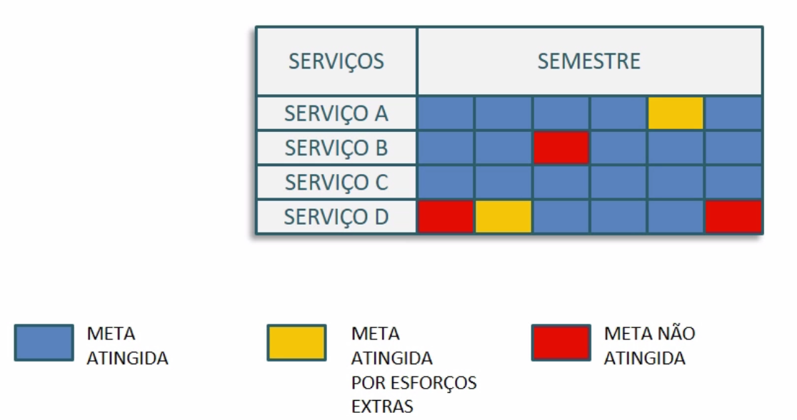

# Processos de Gerenciamento

 

## Gerenciamento de Nível de Serviço (GNS)

O Processo: **Gerenciamento de Nível de Serviço (GNS)** tem início durante o planejamento do serviço e o mesmo se estende por toda vida útil do serviço até sua descontinuação.

 

### Propósitos:

+ Garantir que os **serviços de TI** que estão em operação ou que estão sendo desenhados sejam entregues dentro das **metas acordadas**. Por exemplo, ao firmarmos uma sociedade e definirmos que montaremos uma empresa nós vamos buscar no mercado o nível médio de serviço. Vamos verificar que o tempo de disponibilidade costuma ser de 99.9%. Então, precisaremos garantir que a nova empresa cumpra essa meta. Esse é o papel do gerenciamento do nível de serviço: garantir que os serviços sejam entregues e dentro das metas acordadas.

+ Empregar, por meio do GNS, um ciclo **perpétuo de negociação** que inclui revisão e tomada de ações (PDCA). O contato com o cliente nos permite entender qual ciclo de serviço é o que o cliente atribui maior valor.

 

### Objetivos:

+ Negociar, documentar, acordar, acompanhar, reportar e revisar o nível de serviço de TI. O gerente vai estar frequentemente em contato com o cliente, por isso ele será o responsável pelo processo de negociar e avaliar o nível do próprio serviço de TI com base nos requisitos estipulados pelo cliente.

+ Ampliar a capacidade de comunicação e o relacionamento entre a TI, o negócio e o cliente.

+ Estabelecer metas específicas e mensuráveis que sejam oferecidas para todos os serviços de TI, ou seja, todo o serviço de TI deverá ter uma meta acordada que seja mensurável e principalmente, clara!

+ Acompanhar o serviço ao longo de seu ciclo de vida e garantir que ele satisfaça o cliente e os requisitos do negócio.

+ Alinhar expectativas quanto aos níveis de serviço em desenho, transição e operação. Como vimos anteriormente, esse processo nasce no desenho de serviço, mas se expande entre a transição, a operação e a melhoria contínua.

+ Permitir a melhoria contínua dos serviços, mesmo que os níveis satisfaçam os clientes "hoje", pois o futuro é sempre uma incógnita. É necessário manter-se atento às necessidades dos clientes, mas também ao que vem acontecendo no mercado, por exemplo, ao cenário do mercado, e dessa maneira prever o que precisa ser feito mais adiante.

 

### Escopo do processo

Faz parte do escopo do processo fornecer um **ponto** de contato para clientes frente aos **níveis de serviço acordados** e também gerenciar as expectativas do cliente em função dos requisitos de negócio por meio de acordos para garantir que a **qualidade do serviço** entregue pelo provedor de serviço seja alta. Ainda, elaborar e assinar **requisitos de nível de serviço** (RSN) para os serviços que estão em desenho, transição e/ou em operação.

 

### Acordos de Nível de Serviço

Os Acordos de nível de serviço (ANSs) são acordos firmados com clientes e provedores **externos** e, por isso, são sustentados por Acordo de Nível Operacional (ANO), que é um acordo **interno**, dentro da própria organização e Contratos de Apoio (CA) que são acordos entre os fornecedores e os provedores do serviço. Esses acordos devem conter os requisitos de cada cliente em relação à disponibilidade do serviço prestado pela empresa. Por sua vez a empresa deve buscar manter os serviços disponíveis tanto quanto foi a taxa acordada com os clientes.

 

### Requisitos de Nível de Serviço (RNS)

Levando em conta o glossário da ITIL, entendemos os requisitos de nível de serviço como "requisitos do cliente frente um aspecto do serviço de TI. Os requisitos de nível de serviço são vinculados a objetivos de negócio e utilizados para negociar metas de nível de serviço".

Os RNSs precisam ser elicitados para todos os serviços, incluindo os já em operação, também devem constar no PDS ou deve-se gerar uma atualização no mesmo. Além de possuírem vínculo maior com a garantia de operação e entregas de negócio.

 

### Acordo de Nível de Serviço (ANS)

"Acordo entre um provedor de serviços e um cliente. Este acordo descreve o serviço de TI, documenta metas de nível de serviço e específica as responsabilidades do provedor e do cliente."

O ANS é um dos pilares da relação cliente-provedor e por conta disso deve ser elaborado de forma clara e compreensível por todas as partes. Ele precisa conter metas claras, atingíveis e mensuráveis. O ANS, que também é conhecido **pela sigla SLA** (**Service Level Agreement**), deve ser elaborado a partir do catálogo de serviços e precisa garantir que todos os serviços atendam as necessidades do cliente.

**Formas de estruturar ANSs:**

ANS com base em serviços: nesse caso, o ANS cobre um serviço para todos os clientes que estão relacionados a esse serviço;
ANS com base no cliente: é voltado para um cliente ou um grupo de clientes específicos;
ANS multiníveis: pode ser entendido também como ANS em camadas, a coorporativa, os clientes, o apoio, etc. Para se estruturar pode reunir os dois tipos de ANS anteriores.

 

### Acordo de Nível Operacional (ANO)

É o "Acordo entre um provedor e outra parte dentro da mesma organização. Ele apoia a entrega de serviços a clientes internos e define os produtos ou serviços a serem fornecidos e as responsabilidades de todas as partes".

 

### Contrato de Apoio (CA)

O contrato de apoio é o "contrato entre provedor de serviços e terceiro. O terceiro fornece produtos/serviços que são necessários para a prestação de um serviço da TI para o cliente. O contrato de apoio estabelece metas e responsabilidades que são requeridas para atender o nível de serviço acordado em um ou mais ANSs ou ANOs"

**Os itens de um Contrato de Apoio (CA) são:**

1. Descrição do serviço a ser prestado e seus requisitos;
2. Acordo de nível de serviço do fornecedor, caso exista;
3. Critérios de segurança;
4. Detalhes gerais do acordo;
5. Matriz RACI (Responsible, Accountable, Consult, Inform).

 

### Relatórios de Serviço

Os **relatórios de serviço** são fundamentais no gerenciamento do nível dos próprios serviços. Eles oferecem uma perspectiva ampla para o **gerente de nível de serviço** e devem apresentar **detalhes de desempenho** em relação a todas as metas de **ANS**, assim como mostrar tendências frente ao serviço.

Também existe um gráfico chamado de **MANS** (Monitoramento de Acordo de Nível de Serviço) que serve de apoio para o trabalho de g**erenciamento de nível de serviço**, como mostrado no exemplo abaixo:

 

 

> As reuniões periódicas de acompanhamento dos relatórios são chamadas de "Book do Serviço"

 

### Plano de Melhoria de Serviço (PMS)

É "Um plano para orientar melhorias em um processo ou serviço de TI". Os PMSs devem ser elaborados após a constatação de problemas ou gargalos na prestação dos serviços. Com base em serviços que não atingiram metas ou novas metas é preciso buscar o aprimoramento do serviço.

 

### Atividade Críticas
São **atividades críticas** no processo de gerenciamento de serviço:

+ Revisar acordos de forma geral - ANSs, ANOs e CAs;
+ Apoiar na gestão de fornecedores (processo que veremos nas próximas atividades);
+ Elaborar acordos e contratos;
+ Registrar e gerenciar reclamações e elogios.

## Processo Gerenciamento de Disponibilidade

Nesta aula veremos o Processo Gerenciamento de Disponibilidade. De acordo com o glossário da ITIL a "disponibilidade é a capacidade do serviço, componente ou item de configuração desempenharem suas funções acordadas quando necessário".

 

### Propósitos:

+ **Garantir que o nível de disponibilidade** dos serviços esteja dentro daquilo que foi acordado para com o(s) cliente(s). Caso algum serviço esteja indisponível, isso acarretará em problemas para os negócios e para os clientes.

+ O **gerenciamento de disponibilidade** é um esforço que busca estudar tudo o que envolve a disponibilidade de um serviço, não apenas sustentar essa disponibilidade, mas também **entender e atender as necessidades dos clientes em relação ao negócio**.

 

### Objetivos:

+ Atuar frente a incidentes ou problemas ligados a disponibilidade, já que o processo inclui a lista com os requisitos de disponibilidade. Uma vez que o sistema esteja operando esse processo, ele irá colaborar com a busca da restauração da disponibilidade do serviço.

+ Gerenciar a disponibilidade por meio de orientações e de comunicação frente aos Donos de Serviços e Processos, para isso é preciso estabelecer um canal aberto de comunicação entre o gerente da disponibilidade e o Dono do Serviço.

+ Verificar a disponibilidade dos serviços e se ela está de acordo com os níveis previamente estabelecidos nos acordo feitos com os clientes.

+ Elaborar o **PD**, ou Plano de Disponibilidade, para que seja desenvolvida uma forma de sustentar a disponibilidade requisitada. A elaboração da forma pretende fazer com que o que foi acordado com o cliente mantenha-se em funcionamento.

 

### Escopo do processo

Inclui serviços e contratos de apoio tanto de fornecedores externos quanto de parceiros, assim como o planejamento, a construção, o acompanhamento e o gerenciamento da disponibilidade dos serviços e sua melhoria contínua.

Tudo o que possa impactar a disponibilidade de um serviço, fatores externos e internos, deve ser estudado pelo **gerenciamento da disponibilidade**.

O gerenciamento de disponibilidade é feito nas esferas da **disponibilidade de serviço** (disponibilidade global de um serviço, independente do motivo - MACRO) e na **disponibilidade de componente** (disponibilidade de componentes específicos, ou de um único componente - MICRO).

> Geralmente a disponibilidade é calculada em um percentual cuja fórmula é baseado no tempo de serviço e na (in)disponibilidade.

Além disso, o gerenciamento de disponibilidade também acompanha fortemente os seguintes itens: **confiabilidade, sustentabilidade e a função de negócio vital (FNV)**.

 

### Confiabilidade

A confiabilidade define-se como: "Confiabilidade é uma medida na qual um serviço de TI ou outro item de configuração pode executar sua função acordada sem interrupção ao longo de um período de tempo". Ou seja, na prática podemos criar um índice do tempo que o serviço fica disponível sem que ocorra algum incidente. Tal índice é chamado de Tempo Médio de Serviço (TMS) e pode ser relacionado diretamente às falhas Tempo Médio Entre Falhas (TMEF) ou aos incidentes Tempo Médio Entre Incidentes de Serviço (TMEIS).

 

### Sustentabilidade

A sustentabilidade define-se como: "Sustentabilidade é uma medida de quão rapidamente um serviço ou item de configuração pode ser restaurado após uma falha". Ela frequentemente é medida e reportada como **Tempo Médio para Restaurar o Serviço** (TMRS).

 

### Função de Negócio Vital (FNV)
  
A Função de negócio vital - FNV é: "uma parte de processo crítica para o sucesso do negócio de uma organização", pois é o que gera valor e o entrega para a empresa. Em caso de indisponibilidade da FNV teremos uma queda na arrecadação da empresa, que fica impossibilitada de operar sem ter seu corebusiness disponível.

 

## Processo: Gerenciamento de Capacidade

Vamos abordar o **Processo: Gerenciamento de Capacidade**. Esse processo é similar e complementar ao processo de **gerenciamento de serviço**, portanto, nesta aula veremos a estrutura do processo e o porquê dessa similaridade com o outro processo já estudado.

 

### Propósito do processo:
  
+ Garantir que os serviços de TI **atendam aos requisitos** relacionados a **capacidade e ao desempenho acordados**. Um exemplo de capacidade é ter o conhecimento de qual o número de acessos de um website e quantos acessos ele precisa suportar.

 

### Objetivos:

+ Elaborar um Plano de Capacidade (**PC)**.

+ Acompanhar os esforços de gerenciamento de relacionamento do negócio para oferecer um direcionamento quanto a capacidade.

+ Apoiar a operação dos serviços e na restauração/resolução/solução de contorno dos serviços quando incidentes forem relacionados à capacidade de serviços.

+ Prover condições de melhoria contínua frente a capacidade dos serviços de TI e infraestrutura, de forma geral, isso significa estudar as formas de reduzir custos, por exemplo.

 

### Escopo do processo

O escopo do processo leva em consideração todos os recursos que forem precisos para oferecer ao cliente os serviços de TI previamente acordados. Assim como ele envolve o emprego de áreas físicas para instalação de servidores, alocação de máquinas de trabalho também envolve tudo o que for software, hardware e recursos de forma geral (inclusive os recursos humanos).

 

### Subprocessos do gerenciamento de capacidade

+ Gerenciamento de capacidade de negócio: entender o porquê e o quanto o negócio precisa da TI. O gerenciamento de capacidade de negócio está vinculado a questões estratégicas (ao Padrão de Atividade de Negócio, **PAN**);

+ Gerenciamento de capacidade de serviço: desempenho de serviços frente a capacidade estabelecida para o futuro do negócio, tem relação com a sustentação do negócio;

+ Gerenciamento de capacidade de componentes: é o gerenciamento de componentes - e não dos serviços - apesar de estar relacionado com os serviços.

> A principal entrega do processo é o **Plano de Capacidade**.

O Plano de Capacidade pode conter:

+ Requisitos de negócios;
+ Escopo do processo;
+ Tecnologias, recursos, ativos, formas de relatórios;
+ Direcionamento para melhorias;
+ Custos de aquisição e manutenção.

 

## Processo: Gerenciamento de Continuidade de Serviço de TI

O **Processo: Gerenciamento de Continuidade de Serviço de TI** é o que mantém planos e o que prevê formas de recuperação de serviços frente a desastres, como: incêndios, tornados, enchentes, tempestades, terrorismo ou blackouts.

 

### Propósitos:

- Apoiar o **Plano de Continuidade do negócio (BCP)** da empresa. O **BCP** não é feito pela área da TI, mas sim pela área de negócio para atender os objetivos e processos do negócio. Com base nesse plano será criado o plano de **Gerenciamento de Continuidade de Serviço de TI** que tem o mesmo objetivo, mas é específico para a área.

- **Gerenciar riscos** que possam afetar os serviços de TI gravemente. Riscos como a indisponibilidade de recursos frente a secas, alagamentos ou blackouts deverão ser levados em conta na construção do plano de gerenciamento.

- Em casos de eventos graves é necessário garantir um **nível mínimo de serviços**, para a TI, aquilo que irá suprir as necessidades vitais do negócio. Por exemplo, definir o que fazer para manter o nível mínimo em caso de um alagamento.

 

### Objetivos

- Elaborar um **plano de continuidade** para os serviços de TI. 

- Avaliar continuamente os riscos vinculados aos serviços de TI e sua continuidade.

- Avaliar impacto de determinados eventos para o negócio, ou seja, entender qual seria o impacto para o negócio se deixássemos de oferecer o serviço por 24 horas, por exemplo.

- Não apenas planejar a continuidade dos serviços, mas garantir que esse plano tenha sustentação. O plano precisa ser efetivamente funcional e possível de ser posto em prática. Se não, independentemente da qualidade do plano ele torna-se inválido.

- Manter o plano de continuidade atualizado frente as mudanças na organização e na TI, para que ele ainda assim, com as mudanças, possa ser colocado em prática.

 

### Escopo do Processo

O escopo do processo é voltado para lidar com desastres no negócio e na TI (*Major Incidents*). O processo abarca tudo que sustenta o negócio do ponto de vista dos serviços e da TI, mas incidentes corriqueiros não entram no escopo dele. 

Também faz parte do escopo do processo a construção de uma estratégia para a **continuidade dos serviços** em caso de incidentes graves e a validação dos **planos de continuidade de serviços e da TI**.

 

### Análise de impacto no negócio (AIN)

- Quais serviços de TI são críticos para o sucesso ou operação contínua do negócio?

- Avaliar quais serviços estão vinculados a obrigações contratuais e/ou legais de uma empresa. Como no caso de um hospital que fica sem luz impossibilitando o atendimento dos pacientes, é necessário pensar na continuidade da oferta dos serviços.

- Conhecer o impacto da indisponibilidade dos serviços, entender qual será o prejuízo para a empresa contratante caso o serviço fique fora do ar.

- Avaliar o impacto de riscos graves ao negócio e validar cenários utilizando simulações para determinar se o plano ou o cenário é factível.

- Determinar o tempo que a organização pode tolerar sem o serviço, o tempo para recuperação daquele serviço e planos de contorno para a falta de serviços.

- Definir o nível mínimo de serviços para a sustentação do negócio e viabilizar formas de manter esse nível, mesmo em situações críticas.

 

### Avaliação de riscos

A **ocorrência de um risco** deve ser estimada, assim como devem existir respostas planejadas. O **planejamento da gestão dos riscos** pode ser o gatilho do **planejamento da continuidade**. Avaliando os riscos torna-se possível determinar o **grau de exposição** de uma organização e a **gravidade** de cada risco.

 

## Processo: Gerenciamento da Segurança da Informação

Vamos abordar o Processo: Gerenciamento da Segurança da Informação, seus propósitos, objetivos e escopo:

 

### Propósitos do processo

- Fazer o relacionamento entre os **requisitos de segurança do negócio para com a TI**. Questionar-se: o que precisa ser protegido? Quais são as informações sigilosas? Os *assets*?

- A **disponibilidade, confidencialidade e integridade** das informações precisam ser estabelecidas de acordo com os **requisitos do negócio**. É preciso de critérios para definir quem pode acessar qual tipo de informação dentro da empresa.

 

### Objetivo

- **Blindar** o principal ativo de uma organização: **a informação**, mas esse não é o único! Ativos físicos precisam de segurança também, nem tudo fica guardado na nuvem. Por isso, ainda faz-se necessário proteger máquinas, arquivos e recursos físicos em geral que contenham informações importantes para o negócio.

 

### Para **gerenciar a segurança da informação** é preciso atender alguns critérios:

- **Confidencialidade:** é a determinação de quem tem o direito de acessar uma informação específica e só quem tem esse direito é que pode acessá-la ou receber atualizações referentes à ela.
- **Integridade:** É uma informação que encontra-se blindada contra modificações não autorizadas, apenas quem tem acesso ao registro da informação pôde fazer alguma alteração na mesma.
-  **Disponibilidade:** Informações disponíveis de acordo com a necessidade, saber "quando" determinada informação será necessária e entregar essa informação de forma rápida.
- **Autenticidade e não-repúdio:**a confirmação de identidade de um usuário (senha, por exemplo) garante a autenticidade.

 

### Escopo do processo

O gerenciamento de segurança da informação deve **ser o processo centralizador** para tudo que envolva a segurança da TI como o acesso à pastas, arquivos e máquinas que contenham a informação.

É importante considerar nesse processo alguns pontos-chave:

- As Políticas de segurança da organização e do cliente de sua empresa: ou seja, como será estabelecida a segurança da informação sem conhecer as políticas internas da organização?
- Como a organização trata da segurança de seus ativos, qual é a cultura em termos de segurança dessa organização?
- Estratégias de negócio e blindagem para o sucesso, definição da forma como se dará  a segurança das informações ao mesmo tempo que possibilite um fácil acesso a quem for habilitado;
- Leis para segurança da informação (comum no setor bancário);
- Itens devem ser elencados de acordo com os serviço ou acordos operacionais (disponibilidade e critérios de segurança). Por exemplo, se uma pessoa em específico terá acesso a uma informação sigilosa, isso deverá estar listado nos acordos feitos previamente.

 

### Política de segurança da informação

O resultado da aplicação dos itens anteriores é a construção de um documento, este documento deve englobar tudo o que for referente a **segurança para serviços de TI** e **informações do negócio**. É também a principal saída do processo, nela deve conter:

- Objetivos do documento (Políticas de Segurança);
- Política para utilização dos ativos, o que pode ser feitos nesse ativos e por quem (PCs, máquinas...);
- Política de controle de acesso a informações, quais são os critérios definidos para acessá-las (pastas, contas);
- Política de controle de senhas (como criar uma senha? ela pode ser compartilhada com terceiros? qual é o requisito de caracteres dessa senha?);
- Políticas de uso de e-mail e da internet de forma geral;
- Política de desativação, quando um funcionário é desativado, como é feito o desligamento dele em relação ao acesso às informações confidenciais (senhas, e-mails...). 

 

## Processo Gerenciamento de Fornecedo

Nesta etapa iremos falar um pouco mais sobre o processo Gerenciamento de Fornecedor, que é um dos processos que constitui o Desenho de Serviço. Entenderemos seus propósitos, objetivos e o escopo do processo.

 

### Propósitos do processo

- Aumentar o valor do negócio e o valor da TI por meio da gestão estratégica de fornecedores, ou seja, dos parceiros.

- Atender os requisitos de negócio por meio de fornecedores buscando otimização de custos. Por exemplo, para tocar o projeto precisamos de internet, qual é o plano de internet mais barato? Como podemos buscar o melhor custo-benefício ao terceirizarmos serviços que nossa empresa não fornece?

- Garantir o cumprimento de acordos com fornecedores com ênfase nos parceiros da TI, nos contratos de apoio e SLAs dos fornecedores. É por meio do processo Gerenciamento de Fornecedor que os acordos devem ser cumpridos.

 

### Objetivos

- Gerir a relação com os fornecedores enquanto seus serviços estiverem sendo prestados ou produtos utilizados, tanto pelo time de TI quanto pela equipe como um todo.

-  Acordar metas, gerenciar contratos e acordos ao longo de todo o ciclo de vida com parceiros.

- Alinhar fornecedores, fazendo deles parceiros, com a estratégia do negócio e seus requisitos. Devemos lembrar que nem todo fornecedor é nosso parceiro e, por isso, devemos fazer esse esforço.

- Garantir o bom desempenho dos parceiros. Além de alinhar os fornecedores e transformá-los em parceiros é preciso controlar as atividades e certificar-se de que esses parceiros estão fazendo um bom trabalho.

- Criar e manter um sistema de gerenciamento de informação frente aos fornecedores. Utilizando o exemplo da equipe responsável pela área de compras, eles têm registros de suas atividades, mas ao trabalhar com fornecedores e gerenciá-los na TI é preciso buscar, seja na própria empresa ou no mercado, opções para sempre melhorar o gerenciamento dos fornecedores.

  

### Escopo do processo

**Todos os fornecedores e contratos** de apoio devem ser organizados por esse processo independentemente da área! O gerenciamento de fornecedores inclui as seguintes práticas:

- Criação de regras para seleção de fornecedores e até mesmo políticas para sua gestão: Como serão selecionados, como serão contratados, como se dará o acompanhamento de prestações de serviço?
- Gerir a relação por meio de requisições de propostas, avaliação de fornecedores e escolha com base em critérios previamente estabelecidos com base no tipo de negócio e nas necessidades da área da TI.
- Criar categorias de fornecedores para sua adequada gestão, incluindo a categorização dentro de um sistema maior, como um sistema de gerenciamento de informações de fornecedores.
- Renovação de contratos, caso ela seja necessária.
- Garantir a entrega dos serviços ou produtos fornecidos por meio de adequada gestão de aquisições (Por exemplo:  compras, quando existirem ou apoio jurídico, ou seja, basicamente tudo aquilo que for negociado com fornecedores).
- Melhoria contínua de serviços considerando a melhoria dentro dos fornecedores. A melhoria em relação as entregas dos fornecedores irá aumentar o valor das entregas da TI.
- Gerenciamento de questões e reivindicações. As vezes algum fornecedor não concorda com algo que foi decidido, disputas em geral serão geridas por meio desse processo.

 

### Categorias de fornecedores

É possível avaliar e categorizar fornecedores e, assim, criar políticas para sua gestão de acordo com as categorias criadas. Estão listadas abaixo as categorias básicas
citadas pela ITIL:

- **Fornecedor de commodities**: é responsável por fornecer o material básico, como suprimentos. Possuem baixo impacto (risco) e baixo valor (importância) para o negócio.

- **Fornecedor operacional**: é o fornecedor voltado mais diretamente para as operações de TI, possui médio/alto impacto (risco) e médio/alto valor (importância).

- **Fornecedor tático**: trabalha com questões pontuais e específicas do projeto, como o fornecimento de cartuchos e atendimento *in loco*. Possui médio/alto impacto (risco) e médio/alto valor (importância).

- **Fornecedor estratégico**: é o que tem maior relevância para o negócio, por exemplo, o fornecedor responsável pelo sistema de vendas da sua empresa, possui alto impacto (risco), assim como alto valor (importância).

 

## [Exercício] Acrônimo TSA

Com base nas últimas aulas, você pode responder a nossa próxima questão. Qual das seguintes alternativas descreve corretamente o significado do acrônimo TSA?

- [ ] A) Tempo de Situações Atrasadas, que é utilizado para cálculos informais de disponibilidade.

- [ ] B) Produzir lista de riscos identificados baseados no termo de abertura e em requisições de mudança é um objetivo do processo Coordenação de serviço.

- [ ] C) Tempo de Serviço Acordado, que é utilizado para produzir a lista de riscos identificados baseados no termo de abertura.

- [ ] D) Tempo de Serviço Acordado, que é o mesmo que horário de serviço, normalmente utilizado em cálculos formais de disponibilidade.
  > Este é bem auto-explicativo, como nos dizem as publicações da ITIL, TSA é um acrônimo para Tempo de Serviço Acordado.

 

## [Exercício] Coordenação do desenho

Estamos estudando vários processos nas nossas últimas aulas. Coordenação de desenho é o processo responsável por:

- [ ] A) Planejar e coordenar os recursos e habilidades necessários para desenhar serviços novos ou alterados, além de garantir um desenho eficiente dos serviços de TI, dentro da Transição de Serviços.
  > Incorreta.

- [x] B) Coordenar todas as atividades de desenho de serviço, seus processos e recursos, além de assegurar a consistência e eficácia do desenho de serviços de TI.
  > O Pacote de Desenho de Serviço é um documento que define todos os aspectos de um serviço de TI, são estruturados com os requisitos em cada fase do seu ciclo de vida. A cada novo serviço de TI, mudança importante ou obsolescência de serviço de TI, é feito um pacote de desenho de serviço.

- [ ] C) Coordenar todas as atividades de desenho de serviço, seus processos e recursos, mas não se envolver na garantia de consistência e eficácia do desenho de serviços de TI, dentro da Operação de Serviços.
  > Incorreta.

- [ ] D) Planejar e coordenar os recursos e habilidades necessários para desenhar serviços novos ou alterados, dentro da Estratégia de Serviços.
  > Incorreta.

 

## [Exercício] Catálogo de Serviços

O catálogo de serviços é parte do portfólio de serviço e contém informações sobre certos tipos de serviço de TI. Quais são estes serviços?

- [x] A) Todos.
  > O processo responsável pela coordenação de todas as atividades de desenho de serviço, seus processos e recursos. A coordenação de desenho garante o desenho consistente e eficaz de serviços de TI novos ou alterados, sistemas de informação de gerenciamento de serviço, arquiteturas, tecnologia, processos, informações e métricas.

- [ ] B) Serviços para o provedor de serviço e serviços para clientes externo.

- [ ] C) Serviços para o cliente e serviços para a organização.

- [ ] D) Todos os clientes.

 

## [Exercício] Gerenciamento de Nível de Serviço

Já falamos bastante sobre processos nas aulas. Esse processo tem início no planejamento do serviço e se estende por toda vida útil desse serviço, até sua descontinuação. É um dos objetivos do processo Gerenciamento de nível de serviço:

- [x] A) Assegurar que todos os acordos de nível de serviço atingíveis sejam alcançados.
  > É incumbido ao Gerenciamento de nível de serviço (GNS) a melhoria do relacionamento e a comunicação com o negócio e o cliente. O GNS monitora e reporta os níveis de serviço, mantém revisões de serviço regulares com os clientes e identifica melhorias requeridas

- [ ] B) Assegurar que todos os acordos de nível de serviço atingíveis sejam ignorados.

- [ ] C) Melhorar a comunicação com o negócio no menor tempo possível.

- [ ] D) Fornecer e melhorar o relacionamento com o negócio e o cliente.

 

## [Exercício] Acrônimo PMS

Estudamos o PMS nas nossas últimas aulas. O acrônimo PMS e refere ao:

- [ ] A) Plano de melhoria de serviço.
  > O acrônimo PMS se refere ao plano de melhoria de serviço. O PMS é um plano formal para implementar melhorias a um processo ou serviço de TI, segundo o Glossário ITIL.

- [ ] B) Plano de mudança de serviço.

- [ ] C) Plano de melhoria de sistemas.

- [ ] D) Plano de modificação de serviço.