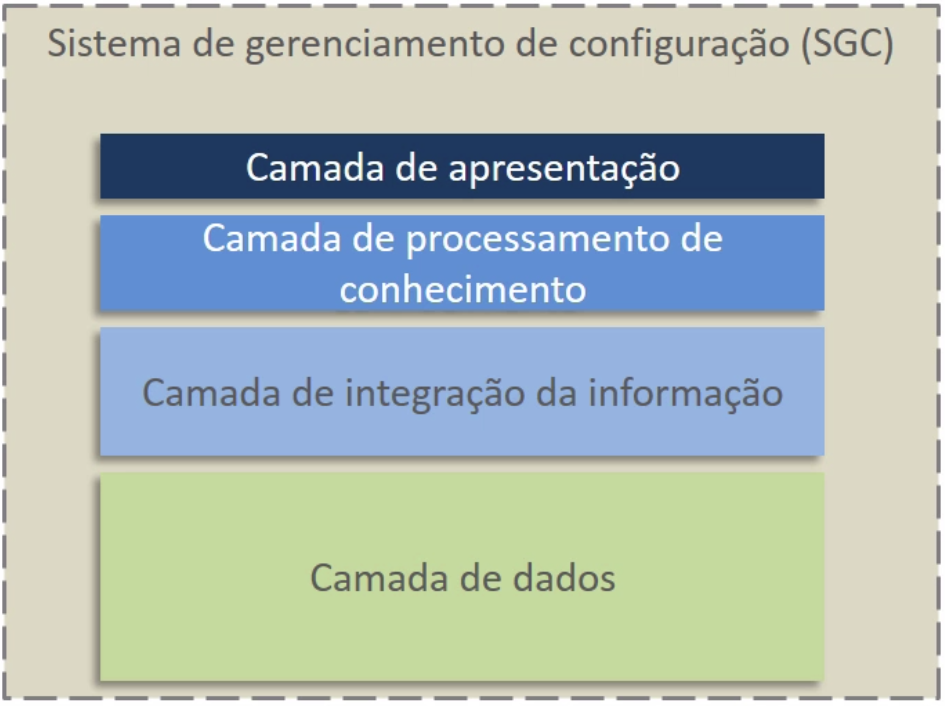
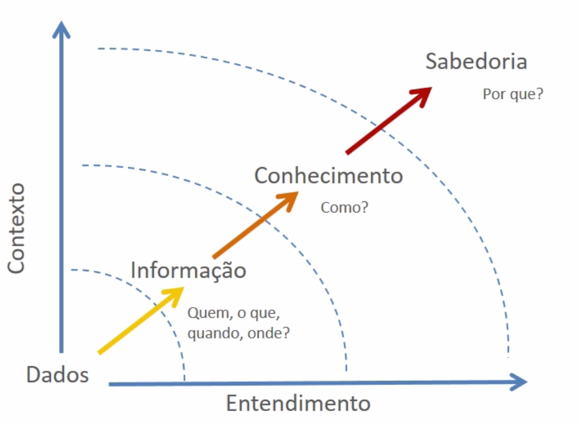

# Gerenciamento de processos de suporte de transição e ativos de serviço

 

## Transição de Serviço

Começaremos o módulo estudando os propósitos da transição e o valor por ela agregado ao ciclo de vida dos serviços. Veremos também os processo relacionadas ao tema, seus propósitos, objetivos e escopo, além de dicas e direcionamentos da prova Foundation.

Um dos **objetivos** da Transição de Serviço é **garantir que os serviços ofereçam resultados** de acordo com seus **desenhos de serviço**  -  tanto serviços novos quanto serviços modificados. Para colocar em prática e realizar o propósito da transição iremos **gerenciar mudanças** ao longo do **ciclo de vida dos serviços** e buscar garantir que elas entreguem o valor esperado. É preciso estudar também o gerenciamento de **riscos**, pois mudanças podem acarretar riscos.

Veremos, ainda, como implementar e implantar serviços de acordo com o **desenho de serviço** - novo ou modificado - e a **gerenciar o conhecimento** de forma que ele possa ser empregado sempre que necessário, seja agregando informações sobre máquinas seja sobre processos.

O Escopo da Transição de Serviço trata da transição de serviços, novos ou modificados, para a operação de TI. Isso inclui a construção, testes e até mesmo a retirada operacional de um serviço (descontinuação). O que também ajuda a realizar os objetivos do negócio. Por meio do gerenciamento dos riscos, mudanças e conhecimento (além dos demais processos) é possível manter a operação saudável.

A transição proporciona, em termos de **valor agregado ao negócio**, uma diminuição de riscos e aumento da flexibilidade do negócio:** Gerir mudanças se traduz em  maior adaptação e menor resistência**. A transição também permite a administração centralizada dos ativos de TI, possibilitando a otimização dos ativos e a redução geral dos custos.

Além disso, a **Transição** é um solo fértil para o bom **gerenciamento de projetos**. Cada nova transição pode ser um projeto e a maior parte dos projetos nasce da transição, pois existem mais mudanças em serviços existentes do que em novos serviços. Por último, ela **suaviza a transição de novos serviços**, proporciona melhoria contínua e funciona como um filtro para o desenho de serviços.

 

## Processos da Transição de Serviço

Trabalharemos os **processos da Transição de Serviço**, especialmente, o livro **Transição de Serviço** da ITIL, edição de 2011 que aborda 7 processos. A "Validação e teste de Serviço" e "Avaliação de mudança" **não fazem parte do escopo do exame ITIL Foundation** então daremos maior foco para os outros 5 que serão cobrados na prova, são eles:

1. Planejamento e suporte da transição;

2. Gerenciamento de configuração e de ativos de serviço;

3. Gerenciamento de conhecimento;

4. Gerenciamento da mudança;

5. Gerenciamento de liberação e implantação.

 

## Planejamento e suporte de transição

Iremos abordar o processo **Planejamento e suporte de transição**, que é o primeiro processo da fase de **transição do Ciclo de Vida do Serviço**.

### Propósitos

- O primeiro propósito desse processo é o de ser guarda-chuva de todos os demais para o estágio de **transição dos serviços**, esse é o processo responsável por dar o "ponta-pé" inicial nos esforços de transição e criar um cenário favorável para a aplicação dos processos seguintes.
- Também deve alinhar os recursos e as habilidades disponíveis para garantir o sucesso da aplicação dos demais processos dessa etapa.

### Objetivos

- Estabelecer uma **linha de base para o gerenciamento dos recursos** , é preciso, diante do desenho dos serviços, empregar os recursos corretamente em atividades de transição. É nesse momento que serão definidos itens cruciais para o bom desenvolvimento da transição como a operacionalização desse serviço, a definição da equipe, dos ativos e dos recursos disponíveis para esse processo;
- **Organizar a transição de serviços** mediante o acompanhamento do funil de serviços, que gerencia o portfólio de serviços, o catálogo de serviços e todo o novo serviço que for desenvolvido, para sua adequada transição de desenho para operação;
- **Gerenciar e empregar mudanças** para transformar requisições de mudança em qualidade para o cliente e manter os serviços válidos, buscamos manter a disponibilidade de serviços saudável e que a TI siga entregando valor ao cliente, por isso, essas mudanças não devem afetar os serviços já existentes e isso será assegurado por esse processo;
- Criar sistemas de **gerenciamento do conhecimento** para garantir que a informação certa possa ser utilizada por todos quando necessário. Isso pode ser feito por meio de um portal ou banco de dados com informações, o que garante para os funcionários maior autonomia. Para que isso ocorra alguém deve se responsabilizar pelo procedimento;
- Estabelecer **procedimentos** para a aplicação dos processos de **transição de serviços**, definir "quem faz o que" e como serão os esforços para o funcionamento da transição;
- Gerenciamento dos **riscos*: definir a forma de trabalhar com riscos dentro da organização durante o período de transição;
- Ampliar a capacidade de entrega de resultado dos esforços de **transição de serviços**.

### Escopo do Processo

Fazem parte do escopo desse processo a implementação de políticas para a **transição de serviços** e a criação de um fluxo para o **gerenciamento de mudanças** que seja alinhado com os processos de **transição**. Também faz parte do processo **coordenar todos os esforços de transição**, não apenas de um projeto específico, isto é, organizar os esforços em geral.

Devemos criar orçamentos e delegar recursos para esforços específicos e também pensar na **gestão do portfólio de projetos**. Devido às semelhanças na forma de atuação do processos, o último item do escopo é garantir a **melhoria contínua** para os processos de **transição de serviço**.

 

## Gerenciamento de configuração e de ativos de serviço

Vamos abordar o processo de **Gerenciamento de configuração e de ativos de serviço**, seu propósitos, objetivos e o escopo desse processo.

### Propósitos do processo

O processo tem como propósitos:

- Controlar todos os **ativos da TI** vinculados a entrega de **serviços de TI**, esses ativos incluiem tanto *sotwares* quanto *hardwares*. Por meio desse processo vamos pensar em todos os ativos da TI e na forma que iremos emprega-los para gerenciá-los.
- Manter os **ativos de TI** atualizados e manter as informações sobre eles sempre disponíveis, ou seja, criar um banco de dados no qual está listado os conjuntos de ativos, informações sobre eles e a relação entre eles.

### Objetivos

- Identificar, registrar, controlar e acompanhar ativos ao longo do seu ciclo de vida. Os ativos podem ser os **itens de configuração**, conhecidos como ICs, eles são os ativos que estão de alguma forma relacionados ou elencados em um banco de dados.
- Monitorar os **ICs** para garantir a integridade deles. Por exemplo, descobrir aplicativos piratas ou prejudiciais. O gerenciamento de ativos, além de listar os itens também é responsável por manter e monitorar sua integridade e bom funcionamento.
- Liberar ativos para quem eles devem ser liberados e isso está relacionado à segurança da informação. Portanto, acompanhar os equipamentos ao longo do seu ciclo de vida desde seu desenvolvimento até sua descontinuação.
- Informar as partes interessadas nos serviços quais ativos e configurações devem ser considerados para transição e sucesso operacional.

### Escopo do processo

O escopo do processo inclui a **gestão dos ICs** ao longo de seu ciclo de vida. O **controle dos ICs** e ativos deve ser feito de forma ampla e irrestrita, inclusive, **considerando ativos de fornecedores**. Vamos imaginar que sua empresa terceirize os processos de impressão, então, todas as impressoras são de fornecedores, apesar disso você ainda será responsável por controlar e gerenciar esses equipamentos e o acesso a eles dentro de sua empresa. 

###Item de configuração (IC)

Como **exemplo de IC** temos o hardware, o software, as pessoas e os documentos de forma geral e até mesmo os processos e modelos de documentos. Os dados dos ICs são registrados no **SGC** (Sistema de Gerenciamento de Configuração) e mantidos lá até depois da remoção ou descontinuação de um IC. Alguns outros exemplos de tipos de ICs são:

- **ICs de interface**: são os itens relacionados à configuração, mais ligados a *softwares* e a aplicativos;
- **ICs internos**: são referentes à infraestrutura da TI, ao próprio funcionamento da equipe e dos sistemas de Tecnologia de Informação;
- **ICs da organização**: eles podem ser os processos e ativos de processos disponíveis em forma física ou virtual na empresa;
- **ICs de serviço**: eles podem ser quaisquer elementos atrelados a algum serviço prestado pela empresa.

### Modelo de serviços

Os Modelos de Serviços são a organização visual de todos os ICs por meio de sua categorização. Os ICs podem ser agrupados conforme uma organização individual deles ou baseado em conceitos estipulados por nós. É mostrada uma categorização, um modelo de serviço,  no item anterior.

### Linha de base

**Linha de base** de configuração é o status e a estrutura de um conjunto de ativos. Pode ser feito antes de uma transição para garantir um ponto de retorno. Portanto, a linha de base é um grande *backup* que deve ser feito antes de ser aplicada alguma mudança, para que, dessa forma, exista um ponto de retorno caso seja preciso reverter a mudança.

### Sistema de gerenciamento de configuração (SGC)

É um conjunto de ferramentas, normas e padrões estabelecidos para a organização dos **ICs**. Com o Sistema de gerenciamento de configuração - SGS é possível vincular **ICs** , **incidentes** e **problemas** e também alimentar todos os **processos de gestão dos serviços de TI**. Também é por meio do SGS que podemos gerenciar mudanças, por exemplo.

Nesta imagem vemos um apanhado geral da estrutura do SGC:

 

 

### Biblioteca de mídia definitiva (BMD)

É o local de armazenamento físico (software). Segundo o glossário ITIL é "uma ou mais localidades em que versões definitivas e autorizadas de todos os itens de configuração de software são armazenadas de maneira segura. **A biblioteca de mídia definitiva também pode conter itens de configuração associados, como licenças e documentações**".

A Biblioteca de mídia definitiva- BDM armazenas os ICs físicos enquanto o SGC armazena as **informações** sobre os ICs.

 

## [Exercício] Transição de Serviço

O propósito do estágio de Transição de Serviço é garantir que os serviços ofereçam resultados de acordo com o desenho de serviço deles. São processos da Transição de Serviço:

- [ ] A) Panejamento de custos e gerenciamento de mudanças.

- [x] B) Planejamento e suporte da transição e gerenciamento de configuração e de ativo de serviço.
  > A transição de serviço garante que serviços novos, modificados ou obsoletos atendam às expectativas do negócio como documentado nas etapas de estratégia de serviço e desenho de serviço do ciclo de vida.
- [ ] C) Gerenciamento de conhecimento e Estratégia de serviço.
- [ ] D) Validação e teste de serviço e gerenciamento do engajamento das partes interessadas.

Planejamento e suporte da transição e gerenciamento de configuração e de ativo de serviço.

 

## [Exercício] Planejar os Processos

Como estudamos na última aula, o processo responsável por planejar todos os processos de transição de serviços e coordenação dos recursos necessários, é conhecido como:

- [x] A) Planejamento e suporte de transição.
  > É o processo responsável pelo planejamento de todos os processos de transição de serviços e coordenação dos recursos que eles requerem.

- [ ] B) Gerenciamento da configuração.

- [ ] C) Gerenciamento de mudanças.

- [ ] D) Validação de serviço.

Planejamento e suporte de transição.

 

## [Exercício] Serviço de TI Novo

O processo que avalia formalmente um serviço de TI novo ou alterado, para assegurar que os riscos tenham sido devidamente gerenciados, além de ser o guarda-chuva de todos os demais processos para o estágio de transição dos serviços é conhecido como:

- [ ] A) Gerenciamento de Riscos
  > Pode ser aplicado na transição de serviços, mas não numa visão de guarda-chuvas do estágio, pois ele sozinho não cobre alguns aspectos

- [ ] B) Avaliação da configuração.
  > Pode ser aplicado na transição de serviços, mas não numa visão de guarda-chuvas do estágio, pois ele sozinho não cobre alguns aspectos

- [x] C) Gerenciamento de mudança.
  > Isso o gerenciamento de mudança tem a responsabilidade pelo controle do ciclo de vida de todas as mudanças, as quais numa visão de guarda-chuva de transição de serviços podem envolver também, por exemplo, o tratamento de riscos, bem como o gerenciamento de liberação e implantação o responsável por planejar, programar e controlar a construção, teste e implantações de liberações. É responsável também por entregar novas funcionalidades exigidas pelo negócio enquanto protege a integridade dos serviços existentes.

- [ ] D) Gerenciamento da configuração.
  > Pode ser aplicado na transição de serviços, mas não numa visão de guarda-chuvas do estágio, pois ele sozinho não cobre alguns aspectos

  O gerenciamento integrado das mudanças, pode sim ser usado como um grande guarda-chuva durante o estágio de transição de serviços

 

## [Exercício] Linha de Base

Tendo em vista tudo que aprendemos nas últimas aulas, qual alternativa melhor descreve a utilidade de uma linha de base de configuração?

- [ ] A) Pode ser utilizada como um ponto de partida para medir o efeito de um plano de melhoria do serviço.

- [x] B) Pode ser utilizada como um plano de retorno, para permitir que a infraestrutura de TI seja restaurada para uma configuração anterior conhecida, caso uma mudança ou liberação falhar.
  > Uma linha de base da configuração é usada como base para futuras construções, liberações e mudanças. Esse é o motivo de ser capturada antes da realização de mudanças

- [ ] C) Pode ser utilizada para medir mudanças no desempenho durante todo o ciclo de vida de um serviço de TI.

- [ ] D) Pode ser utilizada como um plano alternativo, caso o serviço seja descontinuado.

Pode ser utilizada como um plano de retorno, para permitir que a infraestrutura de TI seja restaurada para uma configuração anterior conhecida, caso uma mudança ou liberação falhar.

 

## [Exercício] Ferramentas

Controlar todos os ativos da TI vinculados a entrega de serviços de TI. Apresentar dados sobre todos os itens de configuração e os seus relacionamentos é uma das ferramentas utilizadas no:

- [x] A) Sistema de gerenciamento de configuração.
  > O Sistema de Gerenciamento de Configuração (SGC) também pode incluir informações sobre incidentes, problemas, erros conhecidos, mudanças e liberações. O SGC é mantido pelo gerenciamento de configuração e ativo de serviço e é usado por todos os demais processos do gerenciamento de serviço de TI.

- [ ] B) Sistema de governança de configuração.

- [ ] C) Sistema de gerenciamento de continuidade de serviço.

- [ ] D) Sistema de governança corporativa.

Sistema de gerenciamento de configuração.

 

## Gerenciamento de Conhecimento

Iremos estudar o processo Gerenciamento de Conhecimento, seus propósitos, objetivos e escopo.

 

### Propósitos:

- Armazenar e analisar dados, refletir, aprender e **compartilhar o conhecimento** para que todos possam tomar decisões**. Trata também do gerenciamento de serviços de forma progressiva**. O gerenciamento do conhecimento não serve apenas para uma pessoa ou para ser guardado, o **conhecimento deve ser compartilhado**.
- **Eliminar a necessidade de re-aprendizado** gerada pela ausência do gerenciamento do conhecimento. O que acontece quando o "*Mandrake*" (aquele colaborador que é o "sabe-tudo") sai da empresa? Muitas vezes o conhecimento se perde. O gerenciamento do conhecimento permite que a  informação e conhecimentos tornem-se um ativo da empresa, assim, mesmo que "*Mandrake*" saia da empresa o conhecimento não irá se perder.

 

### Objetivos

- Reduzir o custo do serviço **a partir da distribuição do conhecimento e da facilidade de acesso ao serviço**. Por exemplo, o analista de TI atende o telefone e precisa buscar um determinado conhecimento existente para resolver o problema do cliente, quanto mais fácil é esse acesso, mais satisfeito o cliente ficará.
- Fazer com que todos tenha acesso ao conhecimento necessário, em outras palavras: Divulgação do conhecimento dentro da empresa.
- Criar e manter um **sistema do gerenciamento do conhecimento de serviços (SGCS)**.

 

### Escopo do processo

É escopo do processo **estar presente em todo o ciclo de vida do serviço** para que ele possa garantir a aplicação adequada dos demais processos. Por exemplo, um documento de processo formal é a **gestão do conhecimento**.

#### **FORA DO ESCOPO**:

Não está dentro do escopo do processo o detalhismo profundo quanto aos itens de configuração. Um Item de configuração é um Item de configuração e precisa ser cadastrado, porém isso não é escopo do gerenciamento do conhecimento! Mas o cruzamento de dados sim.

O gráfico abaixo pode cair em sua prova, ele resume e apresenta de forma visual tudo o que trabalhamos nessa aula e mostra as "camadas" do conhecimento existentes na empresa: 

 

 

## Gerenciamento de Mudança

Iremos agora estudar a fundo o processo **Gerenciamento de Mudança**.

### Propósito do processo

- **Mudanças** são a única imutabilidade na vida e nos serviços. Tudo muda, por isso esse processo é tão importante. Adicionar novos serviços, modificar serviços ou descontinuar serviços. Tudo é mudança e, portanto, devem ser gerenciadas, para que esse instabilidade não afete de forma negativa o serviço prestado ao cliente.
- **Garantir que os serviços sejam adequados à realidade do negócio** ao longo do seu ciclo da vida, que tragam valor para o negócio. Modificar as ferramentas que já são ultrapassadas e que não trazem mais tanto valor ao negócio.

### Razões para controlar as mudanças

- Otimizar ativos de serviços, como no exempo de um *software* que já não é mais utilizado;
- Controle geral da infraestrutura, ao olhar o modelo de relacionamento utilizado poderemos, a partir disso, fazer mudanças;
- Registro de mudanças, as mudanças feitas ou solicitadas deverão constar em um registro para que tenhamos acesso ao seu *backup*;
- Autorização de mudanças, definir quem pode e quem não pode requisitar mudanças;
- Acompanhamento de mudanças;
- Melhoria contínua & adaptação.

### Gatilhos das mudanças

Mudanças são variadas e surgem a todo momento, citamos aqui alguns exemplos de mudanças mais comuns:

- Mudanças vinculadas ao negócio;
- Mudanças advindas de melhoria contínua;
- Mudanças derivadas de incidentes/problemas;
- Mudança para adequações gerais.

### Objetivos

- Atender os requisitos de negócio para os serviços e mantê-los úteis sem impactar negativamente a operação mantendo a operação saudável e os serviços disponíveis para o cliente;
- **Manter um registro de mudanças**, histórico, razões, aprovações, debates a respeito das mudanças e vinculação das mudanças a serviços  e itens de configuração. Criar e manter, por meio do processo, um registro dessas mudanças que nos permita acompanhar o andamento e o resultado das mudanças, não apenas uma listagem do que foi feito, mas também o registro da efetividade dessa mudança no serviço;
- **Manter o sistema de gerenciamento das configurações atualizado** a partir de cada mudança deve ser feito o registro correto desta, permitindo assim, a atualização do **sistema de gerenciamento do conhecimento**.
- Aproveitar **oportunidades** e diminuir o impacto de **riscos negativos**. Ao percebermos que um risco está para se manifestar devemos empregar uma mudança visando evitar esse risco identificado.

### Escopo do processo

Controlar toda e qualquer mudança na configuração, topografia, serviços, componentes e até mesmo métricas, papéis, arquiteturas e ainda outros, não devemos apenas construir um fluxo de mudanças, mas sim um registro detalhado que deve ser acompanhado e gerenciado por alguém. Se o desenho do serviço for mudar a partir de uma requisição de mudança validada, então o pacote de desenho de serviço deve ser alterado também.

### Conceitos

- **Mudança**: acréscimo, modificação ou descontinuação/desuso de qualquer ativo, serviço ou componente de serviço.
- **Requisição de mudança**: documento que apresenta motivos, razões e detalhes das mudanças. Existindo um processo formal, qualquer parte pode requisitar.
- **Registro de mudança**: não só dados quanto a requisição, mas informações a respeito da mudança em seu ciclo de vida, da requisição até a aprovação ou rejeição.

### Tipos de mudança de serviço:

**Mudança normal** é qualquer mudança que não seja padrão ou emergencial, nesse caso seguiremos o fluxo normal do gerenciamento de mudanças que será estabelecido no processo. Ela costuma ser classificada como **importantes, significativas ou de menor importância**, pode ser ligada a alteração de um software ou modificar algum serviço.

Um exemplo de **mudança padrão** é mudar a senha do atendimento eletrônico do banco, por exemplo. São mudanças comuns pré-estabelecidas, documentadas em seu passo-a-passo formal. Podem ser entendidas como serviços.

A **mudança emergencial** é reservada apenas para mudanças altamente críticas que precisam ser implementadas o mais rápido possível. Requer a formação de Comitê Consultivo de Mudança, mas não de forma obrigatória. Idelamente, deve ser convocado um Comitê de Mudança Emergencial ou um Comitê para Crises ligado a continuidade do negócio e dos serviços.

### Proposta de mudança

Uma proposta pode ser feita por qualquer parte interessada, mas não é uma requisição, são uma espécie de caso de negócio para a mudança proposta. Não é algo definido, mas sim uma sugestão de mudança que costuma partir de alguma das partes interessadas e que visa melhorar o projeto.

### Modelo de mudança

Idealmente, deve existir um **fluxo para o gerenciamento de mudanças**. Pode ser simples, mas deve existir.

### Planejamento de remediação

Melhor prevenir do que remediar, mas se for necessário **remediar** precisamos saber como fazer e isso será possível por meio da **linha de base dos ICs**! A forma com que voltaremos a trabalhar com a linha de base dos ICs será definida pelo planejamento, por isso ele é muito importante.

### Comitê Consultivo de Mudança (CCM)

Auxilia gestores de serviço e de mudanças, de forma geral, a tomarem decisões. Devem ser entendidos como conselheiros. Mudanças mais graves podem requerer aprovação de clientes, diretores e outras partes interessadas. Idealmente são profissionais seniores que compõem o comitê.

### Comitê Consultivo de Mudanças Emergenciais (CCME)

Se não for possível reunir todos os conselheiros do comitê consultivo de mudanças, então devem ser determinados membros para mudanças emergenciais. Podem existir configurações distintas de um **CCME** com base em categorias de mudanças.