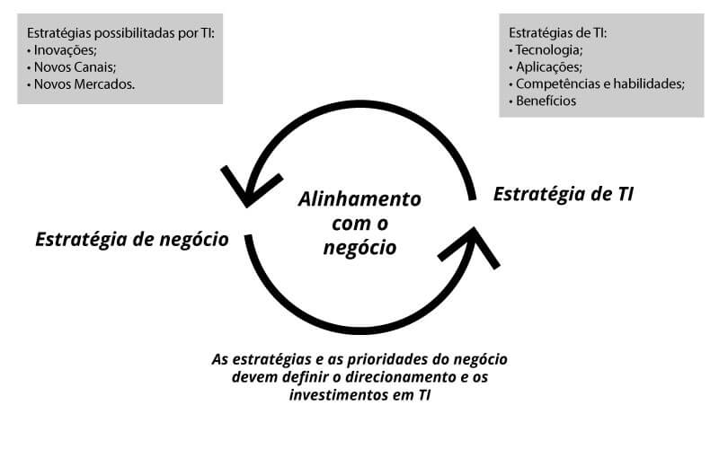
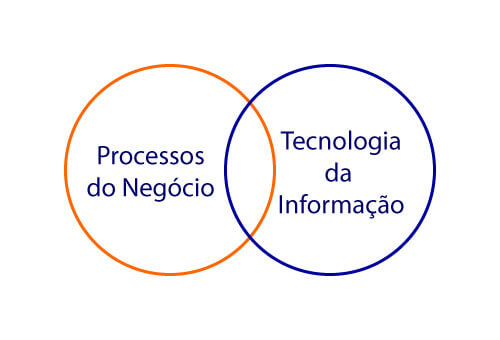
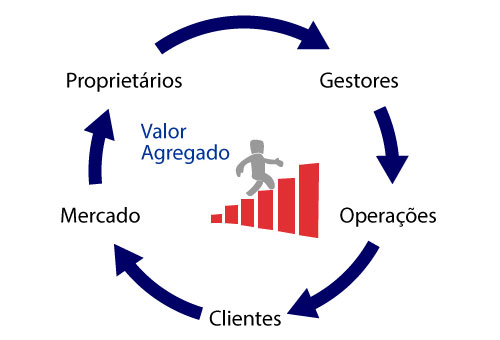

# Gestão de Serviços de TI

- [1. Gestão de Serviços de TI](#1-gest%C3%A3o-de-servi%C3%A7os-de-ti)
- [1.1 Qual é o papel da TI no negócio?](#11-qual-é-o-papel-da-ti-no-negócio)
- [1.2 Cenário de Gestão Empresarial](#12-cenário-de-gestão-empresarial)
- [1.3 Problemas na Gestão Atual](#13-problemas-na-gestão-atual)
- [1.4 Gerenciamento de Serviços de TI](#14-gerenciamento-de-serviços-de-ti)
- [1.5 Frameworks do Mercado](#15-frameworks-do-mercado)
- [1.6 Visão Geral da ITIL](#16-visão-geral-da-itil)

## 1 Gestão de Serviços de TI

Segundo o livro "Estratégia de Serviços", publicado pela Axelos, um serviço: 
"É um meio de entregar valor para os clientes, facilitando o atingimento de seus objetivos sem expô-los aos custos e riscos associados".

Desta forma, é através dos serviços que os provedores de serviços são capazes de auxiliar seus clientes a melhorar a performance de seu mercado, prover maior governança e reduzir o impacto de restrições de negócio.
   

Os serviços de TI são direcionados para clientes que, através destes serviços, irão atender as necessidades dos seus próprios clientes. Ou seja, os serviços de TI são um meio para nossos clientes alcançarem seus objetivos de forma mais rápida e eficaz.

Seguindo esta perspectiva, os serviços de TI precisam trazer consigo o que é chamado de "Valor Agregado", que se resume na definição dos benefícios percebidos pelos clientes e que complementam os serviços oferecidos.

Em 2003, o editor da Harvard Business School Press, Nicholas Carr, representou a tecnologia da informação como um serviço de "Commodity" caso, durante sua entrega, a visão de valor agregado não for definida. 

Preço é aquilo que você paga pelo serviço ou produto, valor agregado é aquilo que você se beneficia pelo que o produto ou serviço oferece.  

## 1.1 Qual é o papel da TI no negócio?

Fornecer soluções inovadoras que atendam às necessidades do cliente, utilizando de práticas e tecnologias que propiciem um melhor valor agregado, diminuindo os riscos e otimizando os custos.

Boas práticas de mercado podemos citar a ITIL

Sempre foque no valor agregado!  

## 1.2 Cenário de Gestão Empresarial 

* **Proprietários** definem os planos estratégicos
* **Gestores** garantem que os desejos e expectativas dos proprietários sejam concretizados
* **Operações** desenvolvem os produtos e serviços
* **Clientes** recebem produtos e serviços de valor agregado
* **Mercado** é influenciado constante pelas necessidades e desejos de clientes

   

## 1.3 Problemas na Gestão Atual

* Planejamento estratégico x operacional 
  * Maquinário e equipe qualificada
* Falta de definição de papeis e responsabilidade
* Processos desalinhados com objetivos
* Produtos e serviços de baixa qualidade
  * Qualidade tem que ser entregue a qualquer custo
  
## 1.4 Gerenciamento de Serviços de TI

_"Um conjunto de habilidades organizacionais especializadas, para prover valor aos clientes na forma de serviços."_

_"As pessoas querem um buraco de 1/4 de polegada não uma broca de 1/4 de polegada."_

                                                  Prof T. Levitt, Havard Business School

A ideia é ter ferramentas para gerenciar os processos para entregar um melhor serviço ou produto. Atendendo as necessidades usando as melhores práticas do mercado.

## 1.5 Frameworks do Mercado

Boas práticas podem ser descritas como "a melhor abordagem identificada para uma situação, baseada na observação de organizações eficazes em circunstâncias de negócio similares"

COBIT
* Modelo de negócios e de gestão global para governança e gestão de TI corporativa
* A ideia é ter um controle estratégico sobre os objetivos

ISO 20.000
* Primeira norma editada pela ISO que versa sobre gerenciamento de qualidade de serviços de TI
* Normativa 

Six Sigma 
* Conjunto de práticas para melhorar sistematicamente os processos ao eliminar defeitos
* Foi concebida no começo da década de 1980 pela Motorola 

ITIL V3
* Conjunto de boas práticas para serem aplicadas na infraestrutura, operação e gerenciamento de serviços de tecnologia da informação (ITSM)

## 1.6 Visão Geral da ITIL

Primeiro, precisamos corrigir uma questão: ITIL NÂO é uma metodologia, mas sim, um conjunto de recomendações baseadas em boas práticas de gerenciamento de serviços de TI (Framework).

A ITIL surgiu na década de 1980, no Reino Unido. Seu intuito era apoiar o governo britânico na crescente dependência do governo em TI, principalmente sobre padronização de práticas.

** Imagem Ilustrativa aqui **

Desde sua primeira versão, a ITIL expandiu seus horizontes em diversos países e contextos. Com o passar dos anos, a ITIL V1, com seus 31 livros, passou para a ITIL V2 com 7 livros (Service Delivery & Service Support) até a sua última versão, a ITIL V3, com 5 livros.

Está última aborda o conceito do ciclo de vida do serviço, desde sua concepção até o processo de melhoria e desativação deste serviço.

** Imagem Ilustrativa aqui **

A ITIL gira em torno de cinco fases:
* Estratégia de serviços
  * Focada no espaço de mercado (quais serviços vou oferecer e para quem? por que cobrarei mais caro? Como quero ser visto no mercado 
* Desenho de serviços
  * Aborda a construção dos processos, quais processos serão utilizados
* Transição de serviços
  * Gestão de mudanças, como será feito a implantação de determinado serviço
* Operação de serviços
  * Tipos de incidentes: prioridades, prazos, modelos disponíveis 
* Melhoria de serviços
  * Colher as informações para alcançar determinada melhoria

Há outras publicações relacionadas, porém, representadas como publicações "complementares".

