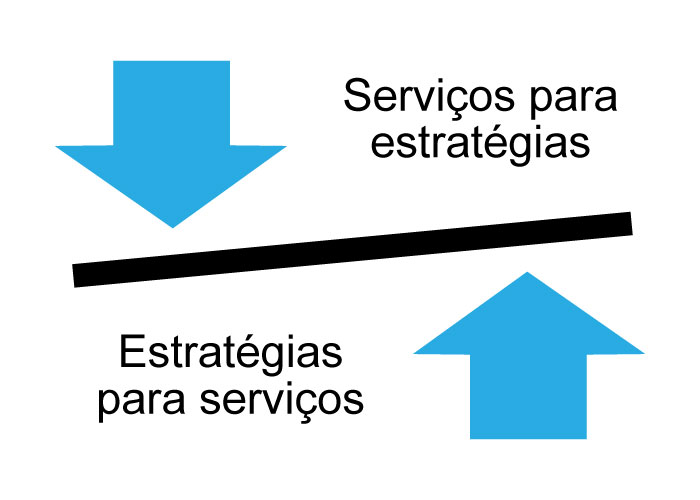
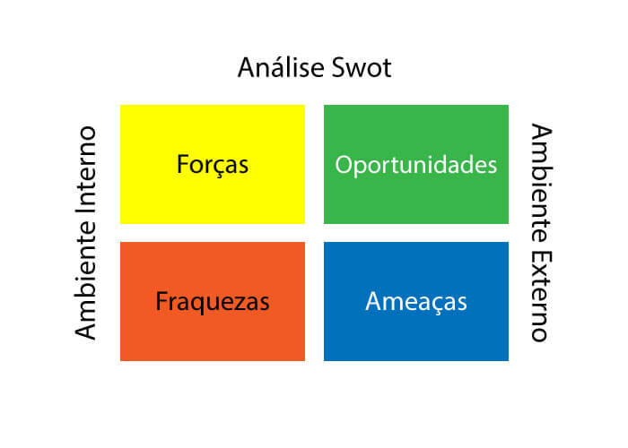

# Gerenciamento da Estratégia para os Serviços de TI

**Sumário is here**

## 3 Gerenciamento da Estratégia para os Serviços de TI

Ao conceber um serviço, toda organização necessita perceber que serviços podem ter a seguinte representação:

## 3.1 | 4 Ps da Estratégia

**Perspectiva:** descreve a filosofia de interação do provedor de serviços com o cliente, orientando como os serviços serão entregues

**Posição:** descreve a imagem que o provedor passará para os clientes (organização de atendimento básico, inovadora, redutor de custos, alta qualidade, etc)

**Plano:** descreve como a TI passará do As Is (estado atual) para o To Be (estado posterior), ou seja, como o provedor atenderá as necessidades dos clientes

**Padrões:** descreve as ações que um provedor se organiza para alcançar seus objetivos, tratando de processos, hierarquias e até serviços

## 3.2 Gerenciamento da estratégia para os serviços de TI Parte II

### Objetivo

Definir e manter os 4 Ps da estratégia (perspectiva, posição, plano e padrões) e articular com a estratégia do negócio como o provedor de serviços de TI irá garantir atendimento dos objetivos do negócio.

Este processo auxilia a organização e a estabelecer os objetivos do serviço, o espaço de mercado e o caminho para atender aos objetivos estratégicos.

### Entradas
* Planos Estratégicos da empresa
* Relatórios de acompanhamento de objetivos (Está alcançando os objetivos?)
* Auditorias internas e externas (Propiciando métricas para visualizar se o serviço está entregando as metas)

### Saídas
* Planejamento estratégico para os serviços de TI
* Priorização de investimento para o gerenciamento de portfólio
* Planos de execução da estratégia

## 3.3 Gerenciamento do Portfólio de serviços

### Objetivo

Garantir que o provedor de serviços de TI tenha um mix de serviços para balancear investimentos possibilitando atender aos objetivos do negócio.

Deve fornecer à organização mecanismos que possibilitem:
* Decidir quais serviços fornecer, os retornos e alinhamento com os objetivos
* Controlar quais serviços são fornecidos, sob quais condições e níveis investimento
* Manter rastreabilidade sobre os investimentos em serviços, quais são inviáveis e quais devem ser aprimorados

O gerenciamento do portfólio é um documento contendo os serviços gerenciados pelo provedor de serviços através do ciclo de vida do serviço. Possui três componentes: 
* **Funil de serviços:** lista contendo os serviços que estão sendo considerados ou em desenvolvimento, porém não foram disponibilizados para clientes.
* **Catálogo de serviços:** documento ou base de dados disponibilizada aos clientes para visualizar os serviços em operação.
* **Serviços obsoletos:** são serviços que saíram do catálogo de serviços. Por decisões estratégicas, foi removido da produção e o provedor não o fornece mais.

### Entradas 
* Dados financeiros dos serviços
* Requisitos dos clientes
* Planos de melhoria dos serviços
* Planos estratégicos dos serviços de TI

### Saídas
* Portfólio atualizado
* Contratos de serviços atualizados
* Status dos serviços atualizado

## 3.4 Gerenciamento Financeiro para os serviços de TI

### Objetivo
Garantir o nível apropriado de fundos / recursos para desenhar, desenvolver e entregar serviços para alcançar os objetivos da organização.

A organização de TI, juntamente com as outras áreas da organização, está envolvida com o processo de gerenciamento financeiro da empresa, impactando em custos e provendo receitas e valor agregado. Sob esta ótica, o gerenciamento financeiro para os serviços de TI é responsável por gerenciar áreas como **orçamento, contabilidade e cobrança** dos serviços.

O processo de gerenciamento financeiro possui um papel chave na organização, já que permite ao provedor quantificar, em termos financeiros, o valor da TI e como contribui para o negócio, deixando evidentes as oportunidades de negócio que o serviço propicia. 

Nesta Abordagem, o processo traz os seguintes benefícios:
* Maior assertividade na tomada de decisão
* Agilidade nas mudanças estratégicas 
* Melhor controle das finanças sobre TI
* Tangibiliza o valor dos serviços de TI 

### Entradas
* Dados dos custos dos serviços de TI, indicadores financeiros, ROI, vindos dos outros processos (Incidentes, exemplo: falha de segurança, erros no processo) 
* Políticas, normas e regulamentos definidos por órgãos internos e corpo diretivo

### Saídas
* Valoração financeira dos serviços de TI
* Análises e relatórios financeiros dos serviços
* Relatórios e auditoria de conformidade (SOX)

## 3.5 Gerenciamento da Demanda

### Objetivo

Entender, antecipar e influenciar a demanda dos clientes para os serviços e trabalhar junto ao gerenciamento da capacidade para garantir que o provedor atenda às necessidades dos clientes enquanto atende às suas.

É através deste processo que a organização será capaz de medir o uso da TI pelos clientes. Quando gerenciada pobremente, a demanda é um fator de risco forte demais para a organização.

A qualidade dos serviços pode depender diretamente na forma como a demanda pelo serviço é atendida.

A atuação conjunta dos processos de gerenciamento da demanda e gerenciamento da capacidade se faz necessária, pois a demanda por um serviço somente será atendida dentro de uma capacidade assertiva.

**Alta demanda x baixa capacidade:** cliente insatisfeito, nível de serviço abaixo do acordado, times desmotivados

**Baixa demanda x alta capacidade:** alto custo para o negócio, desperdício de recursos, ócio organizacional 

A organização deve garantir que os **Padrões de Atividades de Negócio** sejam analisados e compreendidos para atender as demandas.

**Padrão de Atividade de Negócio** deve compreender as fontes de aumento de demanda na organização, tais como:
* Aumento do número de usuários
* Aumento do volume de transações de serviços
* Crescimento da oferta

O gerenciamento da demanda avalia as mudanças na TI, acompanhando os **Perfis de Usuário**, isto é, todos os elementos que consomem os serviços de TI, como pessoas, processos de negócio e aplicações.

### Entradas
* Iniciativas de criação de novos serviços ou melhorias nos serviços de TI
* Informação sobre os serviços advindas do gerenciamento de portfólio
* Validações ou padrões para modelos de serviço

### Saídas
* Definição e documentação de Perfis de Usuário e Padrões de Atividade de Negócios
* Padrões de Atividade de Negócio
* Políticas para lidar com aumentos e/ou diminuição da utilização dos serviços

## 3.6 Gerenciamento do Relacionamento com o Negócio

### Objetivo
O relacionamento com o negócio trabalha sob duas óticas de objetivos:
* Estabelecer e manter uma relação de negócios entre provedor de serviços e clientes baseando-se na compreensão dos clientes e as necessidades de negócio.
* Identificar prontamente as necessidades atuais e futuras dos clientes e garantir que provedor de serviços é capaz de suprir tais necessidades 

Apesar dos outros processos da ITIL se preocuparem com as necessidades e satisfação do cliente, seu principal foco é na qualidade dos serviços entregues. Já o Relacionamento com o Negócio, lida com questões estratégicas, alinhamento expectativas e valor.

É através da gestão da expectativa (resultados e objetivos do negócio) e da satisfação (a forma como os clientes são atendidos em relação às necessidades) que este processo é capaz de antecipar as necessidades dos clientes, provendo um suporte mais "comercial" ao cliente.

Junto com outros processos da ITIL, o processo de Relacionamento com o Negócio pode identificar as seguintes situações:
* Iniciar as atividades do funil junto aos clientes
* Revisar junto com o Gerenciamento de Nível de Serviços os SLAs (Acordos de Nível de serviços)
* Identificar demandas e prospectar soluções (Reuniões)
* Planejar custos e investimentos em serviços, focando na ROI

## Entradas
* Requerimentos dos clientes (Qual a solução?)
* Estratégia de negócio 
* Portfólio de serviços
* Padrões da Atividade de Negócio

## Saídas 
* Expectativas e necessidades identificadas
* Portfólio de clientes atualizado
* Planejamento para novos serviços