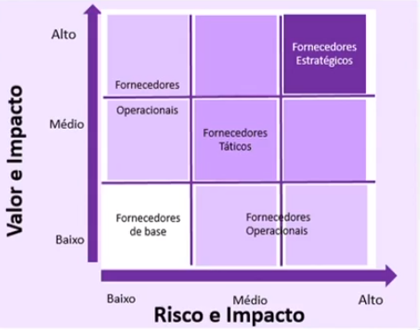

# 4 Desenho de serviços

- [4.1 Coordenação de desenho](#41-coordenação-de-desenho)
- [4.2 Gerenciamento do Catálogo de Serviço](#42-gerenciamento-do-catálogo-de-serviço)
- [4.3 Gerenciamento de Nível de Serviços](#43-gerenciamento-de-nível-de-serviços)
- [4.4 Gerenciamento de disponibilidade](#44-gerenciamento-da-disponibilidade)
- [4.5 Gerenciamento da Capacidade](#45-gerenciamento-da-capacidade)
- [4.6 Gerenciamento de Continuidade do Serviço](#46-gerenciamento-de-continuidade-do-serviço)
- [4.7 Gerenciamento da Segurança da Informação](#47-gerenciamento-da-segurança-da-informação)
- [4.8 Gerenciamento de Fornecedores](#48-gerenciamento-de-fornecedores)

Após receber o Pacote de Serviços, contendo todos os requisitos, critérios e metas estratégicas da fase de Estratégia de Serviços, deve-se considerar que a "transição" de um serviço vindo do Funil de Serviços para o Catálogo de Serviços não é uma atividade isolada mas deve considerar o impacto do serviço em todos os processos da ITIL.

Uma das principais saídas do estágio de Desenho de Serviços é o desenho de soluções de serviços que atendem às necessidades de negócio.

### Cinco aspectos do Desenho

Para planejar e executar o desenho dos serviços, há 5 aspectos a serem considerados: 

* **Soluções de serviços:** requisitos originados do Pacotes de Serviço. Cada requisito é analisado e decomposto em desenhos de soluções.
* **Sistema e ferramentas de gerenciamento de informação:** ferramentas necessárias para a gestão dos serviços.
* **Arquiteturas tecnológicas:** componentes de TI para atender ao desenho de solução.
* **Processos requeridos:** processo, atividades, papeis necessários na gestão do ciclo de vida.
* **Métricas:** medições definidas para garantir que a entrega do valor e da solução elaborada.

É essencial que sistemas e serviços de TI sejam desenhados, planejados, implementados e gerenciados de forma adequada.Sob este nível de pressão, há a tentação de pegar "atalhos" no fluxo, sem pensar em **Pessoas, Processos, Produtos e Parceiros**.  
Os 4Ps são as quatro áreas que devem ser consideradas ao implantar processos de gerenciamento de Serviço de TI.
Além dos 4Ps, a fase do Desenho de Serviços devem garantir que outras óticas foram assumidas e abordadas, como: 
* Atualizações no Portfólio
* SLR revertidos em SLAs e modelados para o serviço
* Infraestrutura, controle de capacidade e disponibilidade, etc
  

## 4.1 Coordenação de desenho

### Objetivo

Garantir que os objetivos e metas do Desenho de Serviço sejam, alcançados, fornecendo e mantendo um único ponto de coordenação e controle para todas as atividades dos processos dentro do estágio. 
Deve garantir a comunicação e colaboração entre as atividades dos processos, definir documentos, políticas e padrões que auxiliem na otimização e construção do serviço.

É através da Coordenação que este ciclo recebe os Pacotes de Serviços e encaminha os processos atualizados e construídos para a Transição de Serviço, através do **Pacote de Desenho de Serviços**.

### Coordenação de desenho

É neste processo que todos os requisitos dos clientes são avaliados e planejados para processos como Nível de Serviço e Disponibilidade, provendo às áreas todos os recursos, priorizações, documentos e garantindo que o valor do negócio esteja em cada Desenho de Solução.

Para cada novo serviço - ou modificação - é gerado um Pacote de Desenho, que descreve todas as características do serviço, como: 

* Modelo de liberação e configuração
* Níveis de serviço
* Políticas de segurança e continuidade 
* Planos de capacidade e disponibilidade

### Entradas
Contratos de serviço do ciclo de Estratégia
Pacotes de Serviço e Pacotes de Nível de Serviço
Análise de impacto no negócio
Portfólio de Serviço

### Saídas
Pacotes de Desenho de Serviço para o ciclo de Transição 
Modelos de arquitetura tecnológica da empresa
Atualização do Portfólio de Serviço

  
## 4.2 Gerenciamento do Catálogo de Serviço

### Objetivo 
Fornecer e manter uma única fonte de informações consistentes de todos os serviços operacionais e os que estão em preparação para entrar em produção, garantindo sua disponibilidade para todos os envolvidos.

O catálogo de serviços precisa garantir que todas as informações contidas nele reflitam os detalhes atuais dos serviços, como:

* Status
* Interfaces e suas dependências
* Disponibilidade
* Acordos
* Quaisquer outros detalhes de um serviço

Há dois tipos de serviços que poder ser descritos em catálogo de serviços:
* **Serviços para clientes (principais:** serviços visíveis para os clientes no catálogo de serviços. São serviços que atendem diretamente às necessidades dos clientes e seus processos de negócio.
* **Serviços de suporte (apoio):** são serviços "sob o capô" dos serviços do negócio. Normalmente, não estão visíveis para o cliente, porém são essenciais para a entrega do serviço.

Para todas as mudanças em um serviço de TI, o catálogo de serviço precisa ser atualizado, pois é o documento que centraliza os dados de um serviço que está operando em um cliente.
Se as interfaces entre processos não estão sendo corretamente gerenciadas, o catálogo pode ser comprometido e ser desconsiderado como um documento único.

### Entradas
* Informações dos serviços vindas do Portfólio de Serviços
* Análise de impacto no negócio 
* Preços, modelos de cobrança e outros detalhes do Gerenciamento Financeiro

### Saídas 
* Atualizações no status ou detalhes no Portfólio de Serviços
* Catálogo de serviços atualizado e disponibilizado
  

## 4.3 Gerenciamento de Nível de Serviços

### Objetivo
Deve garantir que todos os serviços de TI planejados são entregues com base em determinadas metas. Isso é possível através de constantes ciclos de **negociação, acordos, monitoramentos e revisões sobre os indicadores.**

É durante este processo que os documentos de Acordos dos Serviços são criados, sejam eles:
* Acordos de Nível de Serviço (e seus variados tipos)
* Acordos de Nível Operacional
* Contratos de Apoio

Um dos pontos chave deste processo é o Portfólio de Serviços, pois provê todas as informações necessárias para desenhar as metas dos serviços de TI, os acordos e negocia-los junto ao cliente.

Além do portfólio, o Gerenciamento de Nível de Serviços trabalha diretamente com o **Relacionamento com o Negócio**, devido ao grande impacto dos acordos com o cliente.

É importante citar que este processo não negocia: 
* Requerimentos funcionais / não funcionais 
* Apenas prazos de entregas de chamados e incidentes (SLA é bem mais que isso)
* Níveis de serviço de fornecedores 
* Processos operacionais do serviço

Os níveis de serviço podem ter, como base, as exigências atuais voltadas a utilidade e garantia.

### Entradas
* Pacotes de Nível de Serviços e outras informações da Estratégia de Serviços
* Informações de mudanças do Gerenciamento de Mudanças
* Relatórios sobre qualidade e metas dos serviços
* Portfólio e catálogo de serviços

### Saídas
* Relatórios periódicos com os detalhes dos serviços 
* Documentos criados e atualizados: 
  * SLA, OLA, CA, SLR 
  * Revisões mensais sobre as metas do serviço
  

## 4.4 Gerenciamento da Disponibilidade

### Objetivo
Garantir que os níveis de disponibilidade entregues atendam às necessidades de disponibilidade acordadas no Acordo de Nível de Serviço (SLA).

O conceito de disponibilidade pode ser definido como ***"a habilidade de um serviço ou um componente de TI em desempenhar a sua função acordada quando necessário*.***

Isso significa que os critérios de disponibilidade dos serviços não são definidos pela TI em si, mas pelos requisitos do negócio e acordados no SLA.

O gerenciamento da disponibilidade define, analisa, planeja, mede e melhora todos os aspectos de disponibilidade de serviços de TI, garantindo que processos, infraestrutura, papeis, etc., foram apropriadamente planejados

É possível visualizar a disponibilidade sob dois aspectos: 
* **Disponibilidade de serviço:** envolve os aspectos disponibilidade / indisponibilidade do serviço ou potencial impacto da disponibilidade de componentes.
* **Disponibilidade de componente:** envolve todos os aspectos da disponibilidade / indisponibilidade apenas do componente.

É parte do escopo deste processo realizar o monitoramento e reporte da disponibilidade de **serviços e componentes**. Portanto, há a necessidade acompanhar alguns fatores: 
* **Taxa de disponibilidade:** medida pelo porcentual entre a disponibilidade acordada e o tempo de indisponibilidade ocorrida no tempo medido.
* **Confiabilidade:** medida pelo tempo que um serviço pode permanecer sem interrupções. Pode ser extraída pelo MTBF ( Mean Time Between Failures)
* **Sustentabilidade:** medida pela velocidade com a qual um serviço pode ser restaurando após uma falha. Pode ser extraída pelo MTRS (Mean Time to Restore Services).

### Entradas 
* Análises de Impacto no Negócio das Funções Vitais de Negócio
* Avaliações prévias de riscos de falhas do serviço
* Níveis de serviço do Gerenciamento de Nível de Serviço
* Informações de relacionamento de serviço e componentes do Gerenciamento de Configuração

### Saídas
* Plano de disponibilidade para melhorias proativas e planejamento do serviço
* Relatório da disponibilidade, confiabilidade e sustentabilidade de serviços e componentes

  
## 4.5 Gerenciamento da Capacidade

### Objetivo 
Garantir que haja capacidade de TI adequada, a custo justificado, para atender e estar alinhada com as necessidades atuais e futuras do negócio, conforme acordado.

Deve gerenciar: 
* A capacidade certa
* No lugar certo
* No momento certo
* Para o cliente certo 
* No custo certo

Durante a sua execução, o gerenciamento de capacidade precisa englobar todos os aspectos de capacidade, incluindo **pessoas, software, hardware e áreas / ambientes de tecnologia.**

Aliado ao processo de **Gerenciamento da Demanda**, o gerenciamento da capacidade precisa entender a quantidade, volumes e velocidades do serviços de negócio para garantir a capacidade adequada ao serviço.

É de suma importância que este processo siga o processo da demanda sobre serviços, para que possa atender à necessidade conforme elas surgem.

Nessa perspectiva, o processo garante a avaliação e realinhamentos contínuos de acordo com a variação das necessidades do cliente, monitorando a forma como os clientes influenciam a demanda, usam os serviços e reportam seus incidentes e problemas 

Há 3 possíveis visões para representar o gerenciamento da capacidade: 

* **Capacidade do negócio:** traduz os requerimentos do negócio em requerimentos de serviços e capacidade de TI
* **Capacidade de serviço:** planeja, gerencia e controla a performance fim-a-fim da capacidade dos serviços de TI para garantir as metas de performance acordadas.
* **Capacidade do componente:** gerencia, controla e prevê a utilização e a performance de um componente individual de TI.

### Entradas
* Planos de TI do ciclo de Estratégia de Serviço
* Requerimentos do negócio oriundos do ciclo da estratégia dos serviços
* Informações sobre requisições de mudança

### Saídas
* Planos de capacidade para a tomada de decisão
* Relatórios de previsões de qualidade de TI para todos os outros processos
* Alertas de monitoramento de capacidade para a Central de Serviço
  

## 4.6 Gerenciamento de continuidade do serviço

### Objetivo
Suportar o processo de Gerenciamento de Continuidade do Negócio garantindo que, através da gestão dos riscos que podem afetar seriamente os serviços de TI, o provedor de serviços pode fornecer níveis de serviço mínimos para garantir a continuidade do negócio.

É importante mencionar que este processo não resolve os incidentes e problemas durante falhas de serviço, mas auxilia na capacidade da organização em antecipar-se com os riscos de falha e se preparar para estes eventos.

Através das análises de riscos de impacto no negócio (BIA), o gerenciamento de continuidade auxilia o negócio: 

* Se preparar para possíveis falhas
* Medir e mitigar o impacto das falhas no negócio
* Prover planos de recuperação e continuidade para os serviços de TI

Tudo isso fornece entradas para a criação do **Plano de Continuidade**, que irá fornecer ao negócio e times do serviço de TI as diretrizes para continuar com o serviço.
Outro documento importante é o **Plano de Recuperação**.

### Entradas
* Planos financeiros, estratégias de negócio e qualquer informação relevante sobre os requisitos
* Planos e estratégias de continuidade do negócio 
* Detalhes de SLA e SLRs dos serviços
* Detalhes do catálogo de serviços e do gerenciamento de capacidade

### Saídas
* Políticas de continuidade revisadas
* Planos de continuidade e restauração criados e revisados
* Avaliação de risco e Análises de Impacto de Negócio sobre os serviços

  

## 4.7 Gerenciamento da segurança da informação

### Objetivo

Alinhar a segurança da TI com a segurança do negócio e garantir que a confidencialidade, integridade e disponibilidade dos ativos da organização, informação, dados e serviços de TI atendam às necessidades acordadas.

É um processo que se incorpora na governança da organização, provendo a direção estratégica para segurança em TI e garante objetivos associados à informação.

Sabe-se atualmente que segurança da informação é um fator decisivo na organização e não está restrita somente à TI. Por isso, a necessidade de criar políticas e procedimentos, atualizados e simples, porém, objetivos e completos, para que os colaboradores possam garantir a segurança da organização.

Com isso em mente, algumas atividades do processo são:
* Criar as políticas de segurança da organização 
* Compreender e garantir as necessidades atuais e futuras voltadas à segurança
* Controle e documentação dos acessos de provedores e parceiros aos sistemas corporativos 
* Gestão de todos os riscos e brechas de seguranças da informação

O processo de Segurança da informação tem a informação como segura quando: 
* Está disponível para ser acessada quando requerida (Disponibilidade)
* É acessada pelas pessoas que possuem a devida autorização (Confidencialidade)
* É real e está correta, conforme a necessidade (Integridade)

Segurança da Informação está intensamento ligada com **Gerenciamento de Continuidade, Gerenciamento de Nível de Serviço e Catálogo de Serviço**, pois é através deles que é possível determinar quais serviços e suas características farão parte do processo, qual o nível de serviço acordado e os riscos associados, tanto para continuidade quanto para medidas para tratativa de incidentes de segurança.

### Entradas
* Estratégia de governança corporativa, regulamentações e leis vigentes 
* Avaliação de riscos dos processos de **Disponibilidade e Continuidade**
* Níveis de serviço do **Gerenciamento de Nível de Serviço**
* Dados de parceiros e fornecedores para controle

### Saídas 
* Políticas de segurança da informação para as áreas da organização
* Relatórios de auditoria de segurança
* Controles e classificações de segurança para auxiliar o processo da gestão
  

## 4.8 Gerenciamento de Fornecedores

### Objetivo
Obter valor sobre o investimento dos fornecedores contratados e fornecer níveis de qualidade nos serviços de TI ao negócio, ao garantir que todos os contratos e acordos realizados junto a fornecedores **externos** atendam às necessidades e compromissos contratuais.

É importante perceber que, neste processo, há valores e compromissos legais, que devem ser cumpridos pelo fornecedor.

Apesar do **Gerenciamento de Nível de Serviços** não definir SLAs para os fornecedores, este processo precisa receber a qualidade dos indicadores do fornecedores, mostrando se este: 
* Traz a melhor relação de custo-benefício
* Esteja alinhado com as necessidades do negócio, assim como o **Contrato de Apoio**

É neste processo que os contratos com fornecedores são **negociados, acordados, gerenciados e encerrados/renovados**

### Entradas 
* Entradas do Negócio, Plano Financeiro e Portfólio de serviços
* Estratégia dos fornecedores
* Performance dos fornecedores coletadas da Operação e Transição de serviços

### Saídas
* Banco de Dados de Fornecedores e Contratos provendo informações completas e atualizadas sobre os contratos
* Contratos formalizados e efetivados/desativados com o fornecedor

