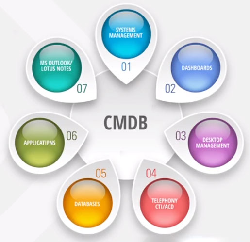
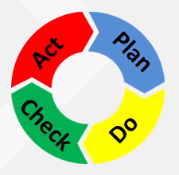

# 5 Transição de Serviços

* Planejamento e suporte à transição
* Gerenciamento de mudanças
* Gerenciamento de configuração e ativos
* Gerenciamento da liberação e implantação de serviços
* Gerenciamento do conhecimento
* Teste e validação de serviço
* Avaliação da mudança

Foi visto até o momento que os requisitos do negócio, suas necessidades e metas, assim como o planejamento da estratégia para a entrega de valor dos serviços de TI são realizados no ciclo de **Estratégia de Serviços.** 
No ciclo de **Desenho de Serviços**, são definidos arquiteturas, processos, políticas e documentação para atender aos requisitos e necessidades identificados e validados.

Após todo esse caminho, o ciclo de **Transição de Serviços** toma a frente, recebendo o **Pacote de Desenho de Serviço** com os detalhes dos processos desenhados e definidos.

Sendo assim esta fase do gerenciamento de serviço precisa garantir e gerenciar as habilidades e recursos necessários para: 
* Avaliar;
* Construir;
* Testar;
* Implantar novos serviços ou modificações em serviços de TI

Neste ciclo é importante manter uma série de práticas que possam sustentar a implantação e operacionalização dos serviços de TI, garantindo que os requerimentos do negócio, modelos e processos definidos e validados anteriormente sejam executados conforme acordado.

Sendo assim, a Transição de Serviço é também associada como um ciclo de planejamento do projeto de implantação dos serviços que serão suportados posteriormente no ciclo da Operação de Serviços.

  

## 5.1 Planejamento e Suporte à Transição

### Objetivo

Fornecer uma visão holística de planejamento para todas as transições de serviço e coordenar os recursos associados à sua execução.

O planejamento e suporte à transição deve coordenar atividades entre projetos, fornecedores e times do serviço, quando necessário, propiciando canais de comunicação mais adequado e o acesso aos recursos necessários para o projeto.

É neste processo que as preparações para realizar a implantação são construídas, criando **planos de implantação, planos de liberação,** cobrindo todo o fluxo de uma mudança iniciada.

De certa forma, podemos representar este processo como "ensaio" para a mudança, garantindo que os procedimentos e informações, necessários para a entrega de um serviço, estejam disponíveis.

### Entradas
* Propostas de mudanças para avaliação
* Mudanças autorizadas/aprovação para construção
* Pacote de Desenho de serviço, contendo: 
  * Definição do Pacote de liberação
  * Planos de teste
  * Planos de liberação
  * Critérios de Aceitação de Serviço (SAC)

### saídas
* Estratégia de transição e seu orçamento
* Planos de Transição de Serviço

  

## 5.2 Gerenciamento de Mudanças

### Objetivo

Controlar o ciclo de vida de todas as mudanças, através de métodos e procedimentos padronizados e eficientes, possibilitando que mudanças benéficas sejam realizadas com o menor impacto no negócio.

Por definição, uma mudança significa: 
***"Toda inclusão, modificação ou remoção de um serviço autorizado, planejado e suportado e/ou de seus componentes e documentação associada".***

Recursos e componentes de TI estão sujeitos a mudanças constantemente. Seja em funcionalidades, abrangência ou caraterísticas no atendimento, todo serviço pode ou, muitas vezes, DEVE passar por mudanças.

Mudanças podem ocorrer por diversos motivos, como:
* Solicitações de novos serviços
* Identificação de falhas nos serviços de TI
* Alterações/melhorias significativas nos serviços de TI

Com isso, este processo precisa garantir que toda mudança seja avaliada, pensando nos riscos, custos e impactos da mudança. Toda mudança precisa, durante esta avaliação passar pelos **7Rs do Gerenciamento de mudanças:** 
* **RAISED:** quem SOLICITOU a mudança?
* **REASON:** qual é o MOTIVO para a mudança?
* **RETURN:** qual o RETORNO esperado para a mudança?
* **RISK:** quais são os RISCOS envolvidos na mudança?
* **RESOURCES:** que RECURSOS são requeridos para entregar a mudança?
* **RESPONSIBLE:** quem é RESPONSÁVEL por construir, testar e implementar a mudança?
* **RELANTIONSHIP:** qual é a RELAÇÃO  entre essa mudança e outras mudanças?

### Tipos de Mudança
Atualmente, há três tipos essenciais de mudanças consideradas pela ITIL:

Padrão | Normal | Emergencial
------------ | ------------- | -------------
Mudança pré-aprovada de baixo risco/impacto | Solicitações formais de mudança, com RDM, que devem passar pelo CCM | Devem ser realizadas assim que possível, passando pelo CCME
Não é obrigatório criar uma RDM, mas é indicado para rastreabilidade | Toda Mudança que não é emergencial ou padrão | Normalmente usadas para reparar falhas em serviços

Sob a perspectiva deste processo, há alguns termos de suma importância:
* **Proposta de Mudança:** documento que descreve todos os detalhes, benefícios, riscos etc.; para a mudança ser avaliada.
* **Requisição de mudança:** formalização da mudança (RDM)
* **Comitê Consultivo de Mudanças (CCM):** grupo de pessoas que auxiliam o Gerente de Mudanças na avaliação, priorização e planejamento das mudanças.
* **Comitê Consultivo de Mudanças Emergenciais (CCME):** subconjunto do CCM que toma decisões sobre mudanças Emergenciais de alto impacto no negócio.

### Entradas
* Requisições ou proposta de mudança solicitadas pelo cliente ou provedor
* Políticas e planos de transição, testes, liberação e implementação do processo de Planejamento e Suporte à Transição
* Informações de serviços e seus ativos do Catálogo de Serviços e Gerenciamento de Configuração

### Saídas
* Requisições/Propostas aprovadas ou rejeitadas e suas instruções de trabalho para os provedores executarem as mudanças
* Atualização e alteração de serviços e suas características
* Relatórios de Avaliação de Mudança

  

## 5.3 Gerenciamento de Configuração e ativos de serviço

### Objetivo 
Garantir que os ativos necessários para entregar serviços sejam apropriadamente controlados, e que haja informação disponível, precisa e confiável sobre os ativos requeridos para a entrega dos serviços e configurações e seus relacionamentos entre eles estejam devidamente controlados.

Durante o dia a dia de um serviço, diversas informações permeiam?
* Registros de incidentes
* Procedimentos e criação de documentos
* Relacionamentos de requisições de serviços e problemas
* Mudanças e atualizações de versão de software

Como já sabemos, todo serviço possui "ativos de serviço" para a sua operação diária, construção e execução de processos. Com isso, há vários desses ativos que precisam ser gerenciados, como **servidores, licenças de software, documentação, acordos.** Isso os torna um tipo diferente de ativo de serviço chamado **Item de Configuração.**

**Itens de Configuração** são todos os componentes físicos ou lógicos, com identificação única, úteis para a entrega do serviço de TI.

Uma ferramenta de extrema importância para este processo é o **Sistema de Gerenciamento de Configuração.**

Contém registro dos relacionamentos ICs, incidentes, mudanças, **Biblioteca de Definitiva de Mídia, o Banco de Dados de Gerenciamento de Configuração** e outros.

### Entradas
* Desenhos, planos e informações de configuração do **Pacote de Desenho de Serviço**
* Requisições de mudança do processo de **Gerenciamento de Mudanças**
* Informações de configuração das ferramentas e sistemas usados na operação

### Saídas
* Atualizações de dados de configuração
* Registros atualizados de ativos e itens de configuração
* Relatórios de status e de auditoria dos itens de configuração

  

## 5.4 Gerenciamento de liberação e implantação

### Objetivo
Planejar e controlar a construção, teste e implantação das liberações (releases), além de garantir a entrega de novas funcionalidades pelo negócio enquanto protege a integridade dos serviços já existentes.

Precisamos entender que uma **liberação* é uma requisição de Mudança construída, testada e aprovada, que garanta a qualidade das liberações através da validação, planejamento e teste, para garantir que sua implantação em produção não cause impactos no negócio.

**Unidade de liberação -** descreve uma parte de um serviço ou infraestrutura de TI que é liberado de acordo com a Política de Liberação da empresa. Sua composição pode variar com o seu tipo, componente, objetivo ou impacto no negócio.

**Pacote de liberação -** pode ser representado com uma única unidade de liberação ou várias unidades estruturadas. Descreve a entrega de várias unidades, de acordo com o serviço.

Há também um conceito muito importante neste processo, que é o **Modelo de liberação**. O pacote de desenho de serviços traz requisitos para implantação de novos serviços ou serviços modificados, mas não especifica **como** a implantação deve acontecer.
Para isso existem algumas abordagens: 
* **Big bang:** o serviço é liberado para todos os usuários com uma única operação
* **Em fases:** o serviço é liberado para uma parte dos usuários ou região específica. É importante citar aqui que, neste tipo de liberação, podemos usar uma abordagem ***Push*** ou ***Pull.***
* **Manual:** liberações físicas, através de intervenção humana
* **Automática:** usada para liberações em grande escala, com impacto e risco controlados

### Entradas
* Requisição de mudança aprovada 
* Contratos de serviço do Gerenciamento de Portfólio
* Pacotes de desenho de serviço do ciclo Desenho do Serviço

### Saídas
* Serviços e componentes de TI novos, modificados ou removidos no ambiente de produção
* Comunicados de liberação para o ciclo de **Operação de Serviços**
* Informações para atualização do Sistemas de Gerenciamento de Configuração

  

## 5.5 Teste e validação do serviço

### Objetivo
Garantir que um serviço de TI novo ou modificado, foi construído de acordo com as especificações desenhadas e vai atender às necessidades do negócio.

O conceito que mais se evidencia quando falamos sobre este processo é um conceito já muito bem estabelecido no mercado de TI: **Quality Assurance**.

**Lembre-se a qualidade de um serviço transmite a percepção do cliente sobre o provedor e seus serviços**

Falhas em serviços, seja por erro humano, software ou hardware, pode trazer impactos catastróficos para uma organização. Perda de dinheiro, tempo, reputação, clientes, são apenas exemplos das consequências, caso um serviço ou projeto seja entregue aquém dos níveis de qualidade aceitáveis para o negócio.

Este processo suporte diretamente o **Gerenciamento de liberação e implantação**, auxiliando na validação da **Política de Qualidade dos Serviços:**

* Nível de Excelência esperado
* Melhor valor pelo capital investido
* Conformidade com Planos, Políticas e Requerimentos
* Atendimento ou superação das expectativas

Nesta visão, para garantir que o serviço seja testado e validado, de acordo com os requisitos, precisamos criar: 
* **Estratégicas de teste** para traduzir os critérios de aceite e requerimentos do Desenho em modelos e critérios de aceite de teste.
* **Planos de teste** para estruturar a estratégia, além de definir as práticas, objetivos e times envolvidos no teste (cliente, usuários, equipes, terceiros)
* **Técnicas de teste e tipos de teste** para definir qual as abrangências e tipos de testes usados, tais como: 
* Teste de usabilidade
* Teste de acessibilidade
* Teste de segurança
* Teste de escalabilidade
* Entre outros

### Entradas
* Desenhos, planos e informações de configuração do Pacote de Desenho de Serviço
* Planos de Liberação do **Gerenciamento de Liberação e Implantação**
* Requisições de Mudança do **Gerenciamento de Mudanças**

### Saídas
* Baseline do ambiente de teste para o **Gerenciamento de Configuração**
* Relatórios de testes, critérios de aceite

  

## 5.6 Avaliação da Mudança

### Objetivo 
Fornecer mecanismos consistentes e padronizados para avaliar o desempenho de uma mudança em um serviço, comparando a performance atual com a performance planejada.

Apenas para relembrar, toda mudança precisa ser:
* Autorizada pelo **Gerenciamento de Mudanças** para sua execução;
* Seus ativos registrados e alinhados com a configuração pelo **Gerenciamento da configuração**;
* Construída e liberada pelo **Gerenciamento de Liberação e Implantação**; 
* Testada e validada pelo processo de **Teste e Validação do Serviço**;

É neste ponto que o provedor e a equipe responsável por "dar vida" ao serviço vão determinar os resultados do serviços construído, avaliando se a sua performance atende às expectativas.

Por isso, a Avaliação de Mudanças usa o ciclo **PDCA** para garantir consistência durante as avaliações, emitindo relatórios de teste, riscos, desvios, dentre outros.

É importante entender que todas estas atividades, principalmente a **liberação, teste e avaliação**, podem  acontecer de forma cíclica, necessitando novos testes e avaliações a cada nova entrega em produção.

### Entradas 
* Pacotes de Desenho de Serviço
* Requisição de Mudanças
* Resultados de Testes

### Saídas
* Relatórios de Avaliação de Mudança

  

## 5.7 Gerenciamento do Conhecimento

### Objetivo
Compartilhar perspectiva, ideias, experiências e informação, para garantir que estejam disponíveis no local certo e na hora certa, melhorando as decisões e a eficiência ao evitar a redescoberta de conhecimento.

A habilidade de entregar serviços de qualidade depende da habilidade dos envolvidos, uma responsabilidade que recai sobre, principalmente, o entendimento e o **conhecimento** que têm sobre a situação, incluindo: 
* Informações de stakeholders e suas expectativas
* Recursos disponíveis
* Detalhes sobre o serviço

Outro conceito importantíssimo neste processo é a **estrutura Dados-Informação-Conhecimento-Sabedoria**. Dentro da ITIL, esta estrutura é descrita da seguinte forma:
* **Dados:** um conjunto discreto de fatos. A maioria das organizações acumula uma quantia enorme de dados, em estruturas complexas de bancos de dados, até mesmo como serviços. 
Neste aspecto, este processo deve **capturar dados precisos, identificar dados relevantes, manter sua integridade e analisa-los, sintetiza-los e então transformá-los em...**
* **Informação:**  obtida através da contextualização dos dados. Informação normalmente é armazenada em conteúdos semiestruturados, como mídias, documentos. Neste aspecto, deve-se gerenciar seu conteúdo de forma que facilite a captura, busca, localização, reuso e aprender através de experiências para obter...
* **Conhecimento:** composto de experiências tácitas, ideias, insights, valores e julgamentos dos indivíduos e principalmente, das suas interações. Analisando informações e somando estes elementos, adquirimos um novo **conhecimento**, facilitando tomada de decisão, o suo da informação. Com isso, obtemos e alcançamos...
* **Sabedoria:**  usa o conhecimento para criar valores através de decisões corretas, contextualizadas e bem embasadas. Sabedoria envolve ter consciência contextual e bom senso para fazer o melhor julgamento em situações adequadas.

### Entradas
Todo conhecimento, informação e dados usados pelo provedor de serviços, assim como dados do negócio.

### Saídas
Todo o conhecimento necessário para a tomada de decisões e gerenciar os serviços de TI mantidos no **Sistema de Gerenciamento do Conhecimento do Serviço**.

