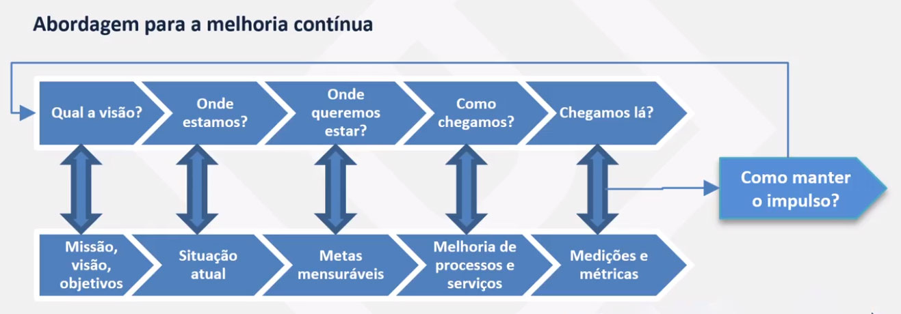
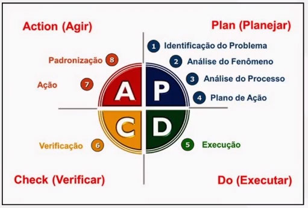
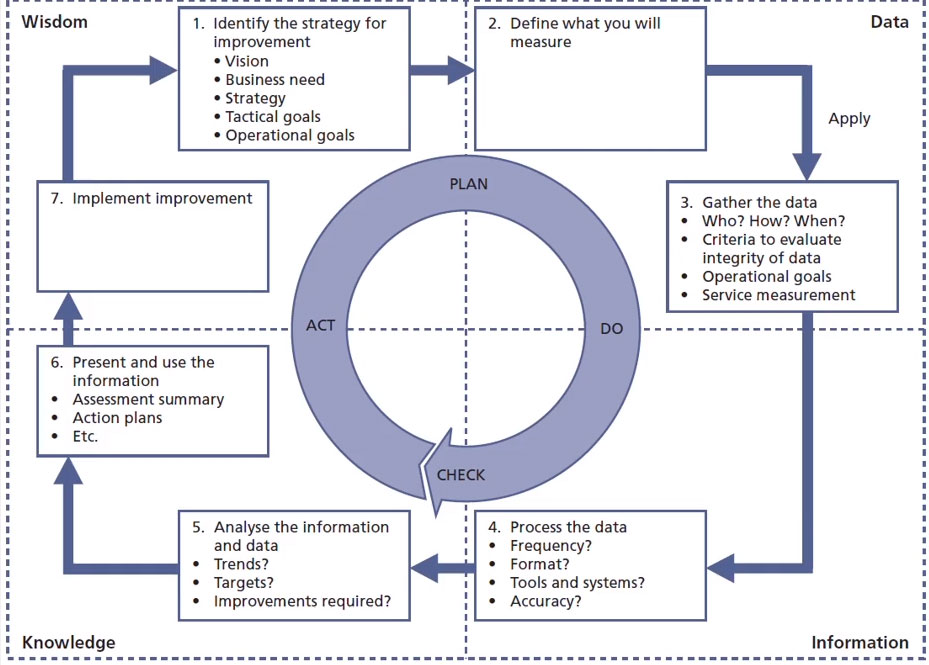

# 7 Melhoria de Serviços

* PDCA e melhoria contínua 
* Plano de melhoria 
* Melhora em 7 passos

Durante todo o seu ciclo de vida, um serviço pode se deparar com diversos pontos de melhoria. Seja em processos, ferramentas, documentação ou automatização, há a necessidade constante de tornar o serviço, conforme a filosofia **Kaizen**, "hoje melhor que ontem e amanhã melhor que hoje".

Assim, a **Melhoria de Serviços** precisa focar no aumento contínuo da eficiência, maximizando a eficácia e otimizando os custoso dos serviços e os processos relacionados ao Gerenciamento de Serviços.

Para que tais resultados sejam possíveis, é preciso garantir que **oportunidade de melhoria** sejam detectadas através de todo o ciclo de vida do serviço.

## 7.1 Abordagem para a melhoria contínua

## 7.2 Ciclo de Deming

Criado por Water Shewhart e popularizado por Willian Deming, o ciclo PDCA é um método iterativo de 4 passos, focado na qualidade e melhoria contínua de processos. Os passos são:

**Planejar:** Objetivos e planos para melhoria
**Executar:** execução do plano
**Verificar** análise e inspeção dos processos
**Agir:** definição de planos de ação e para melhorias futuras

## 7.3 Melhoria em 7 passos

### Objetivo
Definir e gerenciar os passos necessários para identificar, definir, coletar, processar, analisar, apresentar e implementar as melhorias.

O foco deste processo é identificar as oportunidades de melhoria, auxiliando na identificação e análises dos serviços e/ou processos que precisam ser medidos e melhorados para que as melhorias implantadas possam ser comparadas com o estado anterior e assim demonstrar as reduções de custo e aumento de eficácia tidas como objetivos.

Neste processo, os 7 passos para a melhoria contínua se arrumem às descrições abaixo: 

* identificar a estratégia para a melhoria
* Definir o que será medido
* Coletar os dados
* Processar os dados
* Analisar as informações
* Apresentar e usar a informação
* implementar as melhorias

